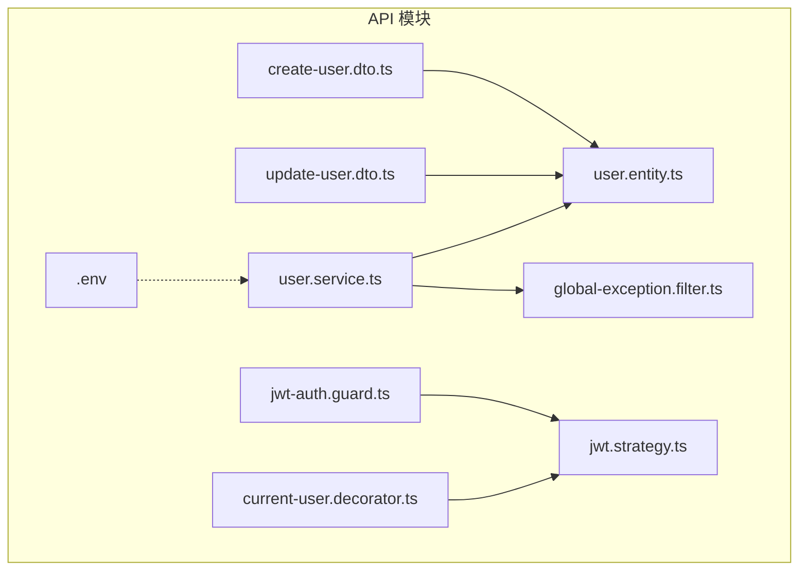
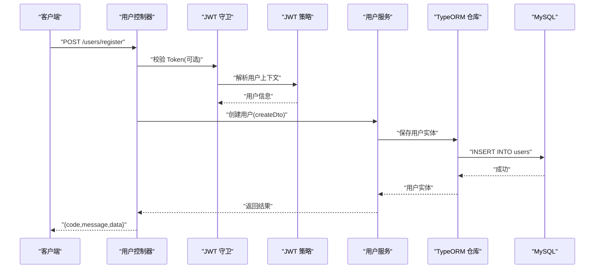
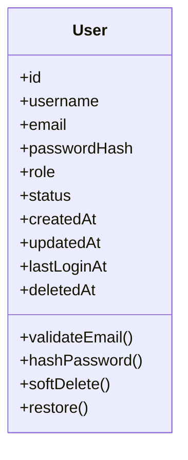
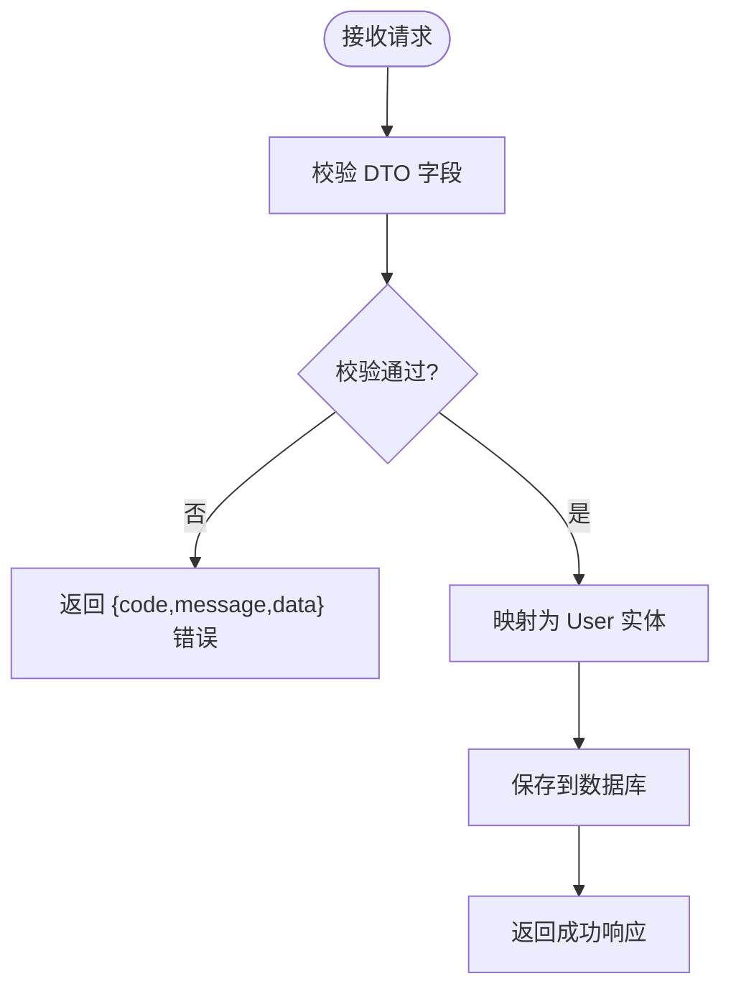
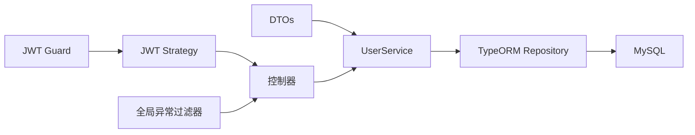

# 用户实体 (User)

<cite>
**本文引用的文件**   
- [packages/api/src/modules/user/entities/user.entity.ts](file://packages/api/src/modules/user/entities/user.entity.ts)
- [packages/api/src/modules/user/dto/create-user.dto.ts](file://packages/api/src/modules/user/dto/create-user.dto.ts)
- [packages/api/src/modules/user/dto/update-user.dto.ts](file://packages/api/src/modules/user/dto/update-user.dto.ts)
- [packages/api/src/modules/user/services/user.service.ts](file://packages/api/src/modules/user/services/user.service.ts)
- [packages/api/src/modules/auth/guards/jwt-auth.guard.ts](file://packages/api/src/modules/auth/guards/jwt-auth.guard.ts)
- [packages/api/src/modules/auth/strategies/jwt.strategy.ts](file://packages/api/src/modules/auth/strategies/jwt.strategy.ts)
- [packages/api/src/common/decorators/current-user.decorator.ts](file://packages/api/src/common/decorators/current-user.decorator.ts)
- [packages/api/src/common/filters/global-exception.filter.ts](file://packages/api/src/common/filters/global-exception.filter.ts)
- [packages/api/.env](file://packages/api/.env)
</cite>

## 目录
1. [简介](#简介)
2. [项目结构](#项目结构)
3. [核心组件](#核心组件)
4. [架构总览](#架构总览)
5. [详细组件分析](#详细组件分析)
6. [依赖关系分析](#依赖关系分析)
7. [性能考虑](#性能考虑)
8. [故障排查指南](#故障排查指南)
9. [结论](#结论)
10. [附录](#附录)

## 简介
本文件面向 xqecz 平台的“用户”领域，聚焦 TypeORM 的 User 实体定义与使用方式。内容涵盖：
- 用户基本信息字段（用户名、邮箱、密码哈希等）的类型与约束
- 权限级别、角色设计与状态管理
- 注册时间、最后登录时间等审计字段
- 软删除机制（@DeleteDateColumn）的实现与行为
- 数据验证规则与错误处理
- 与其他实体的关联关系（如评论、上传、收藏等）
- 认证与授权在用户上下文中的注入方式

## 项目结构
User 实体位于 NestJS API 模块中，采用按功能域划分的目录组织：
- entities：TypeORM 实体定义
- dto：请求/响应 DTO 与校验规则
- services：业务逻辑与服务方法
- guards/strategies：鉴权守卫与策略
- common：通用装饰器、过滤器等横切关注点

图表来源
- [packages/api/src/modules/user/entities/user.entity.ts](file://packages/api/src/modules/user/entities/user.entity.ts)
- [packages/api/src/modules/user/dto/create-user.dto.ts](file://packages/api/src/modules/user/dto/create-user.dto.ts)
- [packages/api/src/modules/user/dto/update-user.dto.ts](file://packages/api/src/modules/user/dto/update-user.dto.ts)
- [packages/api/src/modules/user/services/user.service.ts](file://packages/api/src/modules/user/services/user.service.ts)
- [packages/api/src/modules/auth/guards/jwt-auth.guard.ts](file://packages/api/src/modules/auth/guards/jwt-auth.guard.ts)
- [packages/api/src/modules/auth/strategies/jwt.strategy.ts](file://packages/api/src/modules/auth/strategies/jwt.strategy.ts)
- [packages/api/src/common/decorators/current-user.decorator.ts](file://packages/api/src/common/decorators/current-user.decorator.ts)
- [packages/api/src/common/filters/global-exception.filter.ts](file://packages/api/src/common/filters/global-exception.filter.ts)
- [packages/api/.env](file://packages/api/.env)

章节来源
- [packages/api/src/modules/user/entities/user.entity.ts](file://packages/api/src/modules/user/entities/user.entity.ts)
- [packages/api/src/modules/user/dto/create-user.dto.ts](file://packages/api/src/modules/user/dto/create-user.dto.ts)
- [packages/api/src/modules/user/dto/update-user.dto.ts](file://packages/api/src/modules/user/dto/update-user.dto.ts)
- [packages/api/src/modules/user/services/user.service.ts](file://packages/api/src/modules/user/services/user.service.ts)
- [packages/api/src/modules/auth/guards/jwt-auth.guard.ts](file://packages/api/src/modules/auth/guards/jwt-auth.guard.ts)
- [packages/api/src/modules/auth/strategies/jwt.strategy.ts](file://packages/api/src/modules/auth/strategies/jwt.strategy.ts)
- [packages/api/src/common/decorators/current-user.decorator.ts](file://packages/api/src/common/decorators/current-user.decorator.ts)
- [packages/api/src/common/filters/global-exception.filter.ts](file://packages/api/src/common/filters/global-exception.filter.ts)
- [packages/api/.env](file://packages/api/.env)

## 核心组件
- 用户实体（User Entity）
  - 负责持久化用户主数据，包含身份、认证、权限、审计与软删除字段
- 数据校验（DTOs）
  - create-user.dto.ts：注册/创建用户的输入校验
  - update-user.dto.ts：更新用户信息的输入校验
- 用户服务（UserService）
  - 封装用户增删改查、密码哈希、状态切换、软删除等操作
- 鉴权相关（JWT Guard/Strategy）
  - 从 Token 解析用户上下文并注入到控制器层
- 全局异常过滤器
  - 统一捕获校验失败、数据库异常等，返回标准 { code, message, data } 格式

章节来源
- [packages/api/src/modules/user/entities/user.entity.ts](file://packages/api/src/modules/user/entities/user.entity.ts)
- [packages/api/src/modules/user/dto/create-user.dto.ts](file://packages/api/src/modules/user/dto/create-user.dto.ts)
- [packages/api/src/modules/user/dto/update-user.dto.ts](file://packages/api/src/modules/user/dto/update-user.dto.ts)
- [packages/api/src/modules/user/services/user.service.ts](file://packages/api/src/modules/user/services/user.service.ts)
- [packages/api/src/modules/auth/guards/jwt-auth.guard.ts](file://packages/api/src/modules/auth/guards/jwt-auth.guard.ts)
- [packages/api/src/modules/auth/strategies/jwt.strategy.ts](file://packages/api/src/modules/auth/strategies/jwt.strategy.ts)
- [packages/api/src/common/decorators/current-user.decorator.ts](file://packages/api/src/common/decorators/current-user.decorator.ts)
- [packages/api/src/common/filters/global-exception.filter.ts](file://packages/api/src/common/filters/global-exception.filter.ts)

## 架构总览
下图展示用户实体在 NestJS 中的位置与交互：DTO 校验输入 → Service 调用 Repository → 实体映射到 MySQL；鉴权流程通过 JWT Strategy 将当前用户注入到控制器；异常由全局过滤器统一处理。

图表来源
- [packages/api/src/modules/user/dto/create-user.dto.ts](file://packages/api/src/modules/user/dto/create-user.dto.ts)
- [packages/api/src/modules/user/services/user.service.ts](file://packages/api/src/modules/user/services/user.service.ts)
- [packages/api/src/modules/auth/guards/jwt-auth.guard.ts](file://packages/api/src/modules/auth/guards/jwt-auth.guard.ts)
- [packages/api/src/modules/auth/strategies/jwt.strategy.ts](file://packages/api/src/modules/auth/strategies/jwt.strategy.ts)

## 详细组件分析

### 用户实体（User Entity）
- 字段说明
  - id：主键，自增或 UUID（取决于迁移）
  - username：用户名，唯一、非空、长度限制
  - email：邮箱，唯一、非空、邮箱格式校验
  - passwordHash：密码哈希，非空
  - role：角色/权限级别，枚举或字符串，默认值通常为普通用户
  - status：用户状态（如 active/inactive/banned），用于账号启用禁用
  - createdAt：注册时间，默认当前时间
  - updatedAt：更新时间，自动维护
  - lastLoginAt：最后登录时间，登录时更新
  - deletedAt：软删除标记，@DeleteDateColumn 实现软删除
- 约束与索引
  - 唯一约束：username、email
  - 非空约束：username、email、passwordHash
  - 索引建议：username、email、status、deletedAt（便于查询与软删除过滤）
- 软删除机制
  - 使用 @DeleteDateColumn 后，删除操作不会物理移除记录，而是写入 deletedAt
  - TypeORM 查询默认忽略 deletedAt 不为空的记录，避免脏读
  - 恢复逻辑需显式设置 deletedAt 为 null
- 审计字段
  - createdAt/updatedAt 由 TypeORM 自动维护
  - lastLoginAt 在登录成功后更新，便于统计与分析

图表来源
- [packages/api/src/modules/user/entities/user.entity.ts](file://packages/api/src/modules/user/entities/user.entity.ts)

章节来源
- [packages/api/src/modules/user/entities/user.entity.ts](file://packages/api/src/modules/user/entities/user.entity.ts)

### 数据校验（DTOs）
- create-user.dto.ts
  - 必填字段：username、email、password
  - 校验规则：长度、邮箱格式、密码强度（可结合自定义装饰器）
- update-user.dto.ts
  - 可选字段：username、email、password（如需修改）、status、role
  - 部分更新支持，未提供字段不覆盖

图表来源
- [packages/api/src/modules/user/dto/create-user.dto.ts](file://packages/api/src/modules/user/dto/create-user.dto.ts)
- [packages/api/src/modules/user/dto/update-user.dto.ts](file://packages/api/src/modules/user/dto/update-user.dto.ts)

章节来源
- [packages/api/src/modules/user/dto/create-user.dto.ts](file://packages/api/src/modules/user/dto/create-user.dto.ts)
- [packages/api/src/modules/user/dto/update-user.dto.ts](file://packages/api/src/modules/user/dto/update-user.dto.ts)

### 用户服务（UserService）
- 主要职责
  - 创建用户：校验 DTO → 生成密码哈希 → 保存实体
  - 更新用户：部分更新、状态切换、角色变更
  - 查询用户：按条件筛选、分页、排除已软删除记录
  - 软删除：调用 repository.softDelete，记录 deletedAt
  - 恢复用户：设置 deletedAt 为 null
  - 登录更新：更新 lastLoginAt
- 错误处理
  - 重复用户名/邮箱：抛出冲突异常
  - 数据库异常：由全局过滤器统一捕获并返回标准格式

章节来源
- [packages/api/src/modules/user/services/user.service.ts](file://packages/api/src/modules/user/services/user.service.ts)

### 鉴权与用户上下文
- JWT 守卫与策略
  - 从请求头解析 Token，验证签名与过期时间
  - 将用户信息注入到控制器上下文（@CurrentUser）
- 控制器中使用
  - 通过装饰器获取当前用户，进行权限判断与资源访问控制

章节来源
- [packages/api/src/modules/auth/guards/jwt-auth.guard.ts](file://packages/api/src/modules/auth/guards/jwt-auth.guard.ts)
- [packages/api/src/modules/auth/strategies/jwt.strategy.ts](file://packages/api/src/modules/auth/strategies/jwt.strategy.ts)
- [packages/api/src/common/decorators/current-user.decorator.ts](file://packages/api/src/common/decorators/current-user.decorator.ts)

### 全局异常过滤器
- 统一捕获校验失败、数据库约束冲突、未知异常
- 返回标准响应格式 { code, message, data }，便于前端一致处理

章节来源
- [packages/api/src/common/filters/global-exception.filter.ts](file://packages/api/src/common/filters/global-exception.filter.ts)

## 依赖关系分析
- 实体与 DTO
  - DTO 作为输入边界，严格校验后再映射为实体，降低非法数据进入数据库的风险
- 服务与仓库
  - UserService 通过 TypeORM Repository 操作 User 实体，封装业务逻辑
- 鉴权与用户上下文
  - JWT Strategy 解析 Token，注入当前用户，控制器基于用户角色/状态做权限控制
- 环境变量
  - .env 提供数据库连接、Redis 配置、JWT 密钥等，确保运行环境一致性

图表来源
- [packages/api/src/modules/user/dto/create-user.dto.ts](file://packages/api/src/modules/user/dto/create-user.dto.ts)
- [packages/api/src/modules/user/dto/update-user.dto.ts](file://packages/api/src/modules/user/dto/update-user.dto.ts)
- [packages/api/src/modules/user/services/user.service.ts](file://packages/api/src/modules/user/services/user.service.ts)
- [packages/api/src/modules/auth/guards/jwt-auth.guard.ts](file://packages/api/src/modules/auth/guards/jwt-auth.guard.ts)
- [packages/api/src/modules/auth/strategies/jwt.strategy.ts](file://packages/api/src/modules/auth/strategies/jwt.strategy.ts)
- [packages/api/src/common/filters/global-exception.filter.ts](file://packages/api/src/common/filters/global-exception.filter.ts)

章节来源
- [packages/api/src/modules/user/dto/create-user.dto.ts](file://packages/api/src/modules/user/dto/create-user.dto.ts)
- [packages/api/src/modules/user/dto/update-user.dto.ts](file://packages/api/src/modules/user/dto/update-user.dto.ts)
- [packages/api/src/modules/user/services/user.service.ts](file://packages/api/src/modules/user/services/user.service.ts)
- [packages/api/src/modules/auth/guards/jwt-auth.guard.ts](file://packages/api/src/modules/auth/guards/jwt-auth.guard.ts)
- [packages/api/src/modules/auth/strategies/jwt.strategy.ts](file://packages/api/src/modules/auth/strategies/jwt.strategy.ts)
- [packages/api/src/common/filters/global-exception.filter.ts](file://packages/api/src/common/filters/global-exception.filter.ts)
- [packages/api/.env](file://packages/api/.env)

## 性能考虑
- 索引优化
  - 对 username、email、status、deletedAt 建立索引，提升查询与软删除过滤性能
- 查询优化
  - 使用选择性字段投影，避免 SELECT *
  - 分页查询时使用 limit/offset 或游标分页
- 缓存策略
  - 热点用户信息可缓存至 Redis，减少数据库压力
- 软删除影响
  - 大量软删除记录可能影响查询性能，定期归档或删除历史数据

## 故障排查指南
- 常见错误
  - 重复用户名/邮箱：检查唯一约束与 DTO 校验
  - 密码哈希失败：确认哈希算法与盐值配置
  - 软删除恢复失败：检查 deletedAt 字段与事务一致性
- 日志与调试
  - 开启 SQL 日志定位慢查询
  - 使用全局异常过滤器输出错误堆栈与请求上下文
- 环境配置
  - 检查 .env 中的数据库连接、JWT 密钥、Redis 配置是否正确

章节来源
- [packages/api/src/common/filters/global-exception.filter.ts](file://packages/api/src/common/filters/global-exception.filter.ts)
- [packages/api/.env](file://packages/api/.env)

## 结论
User 实体是 xqecz 平台的核心领域模型，承载用户身份、权限、状态与审计信息。通过 TypeORM 的 @DeleteDateColumn 实现软删除，结合 DTO 校验与全局异常过滤器，保障数据一致性与用户体验。建议在后续迭代中持续优化索引与查询，完善权限模型与审计日志。

## 附录
- 字段说明表（示例）
  - id：主键，自增或 UUID
  - username：用户名，唯一、非空、长度 3-32
  - email：邮箱，唯一、非空、邮箱格式
  - passwordHash：密码哈希，非空
  - role：角色，默认 user，可选 admin/moderator
  - status：状态，默认 active，可选 inactive/banned
  - createdAt：注册时间，默认 NOW()
  - updatedAt：更新时间，自动维护
  - lastLoginAt：最后登录时间，登录时更新
  - deletedAt：软删除标记，@DeleteDateColumn

- 与其他实体的关联关系（示例）
  - User 1:N Comment（评论）
  - User 1:N Upload（上传）
  - User 1:N Favorite（收藏）
  - User N:M Role（角色，多对多中间表）

[本节为概念性说明，无需代码来源]