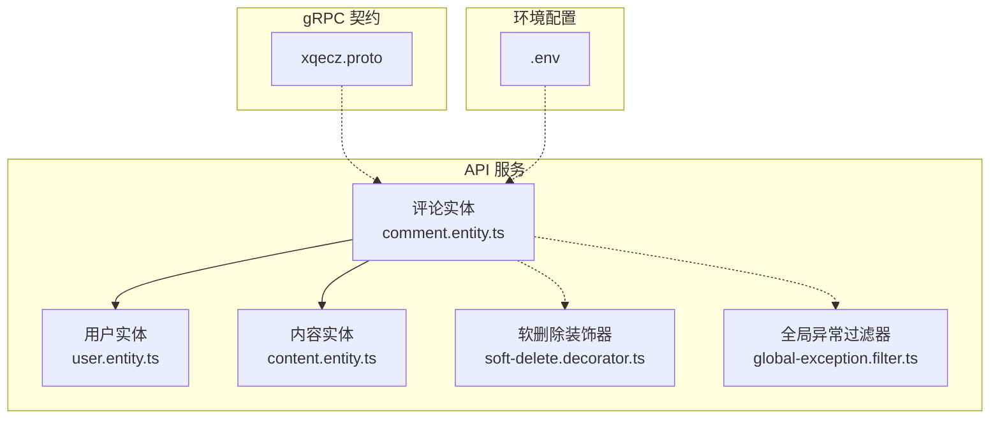
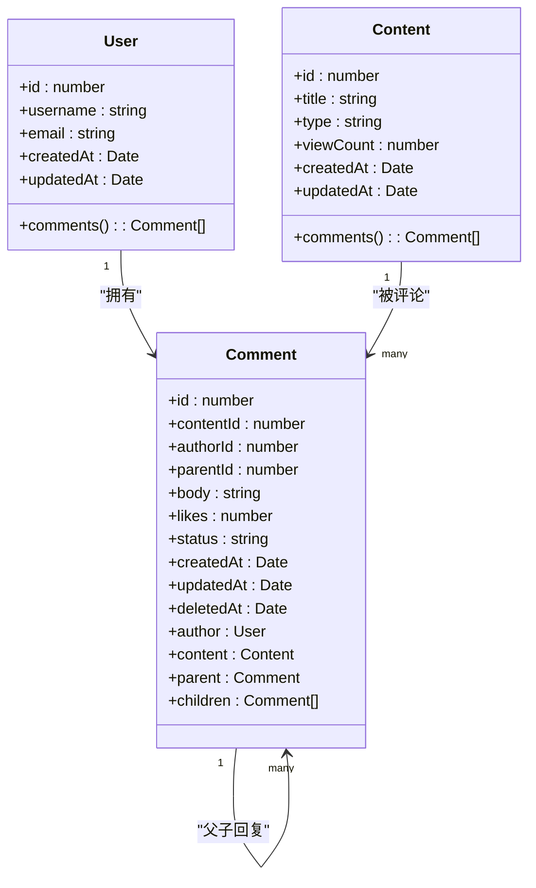
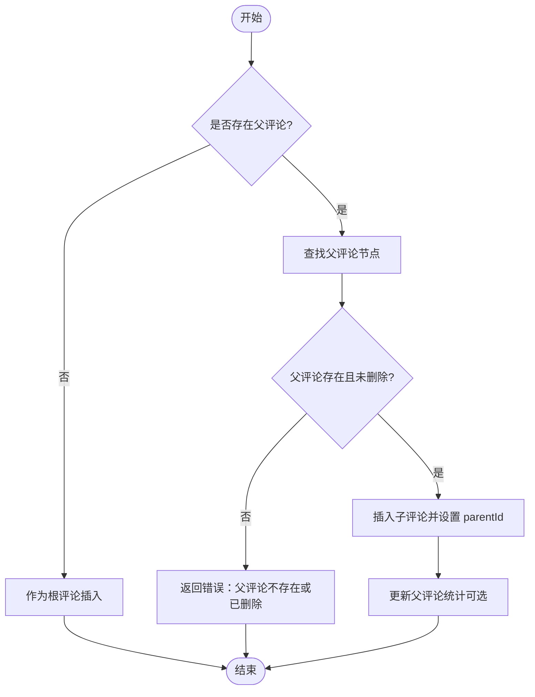
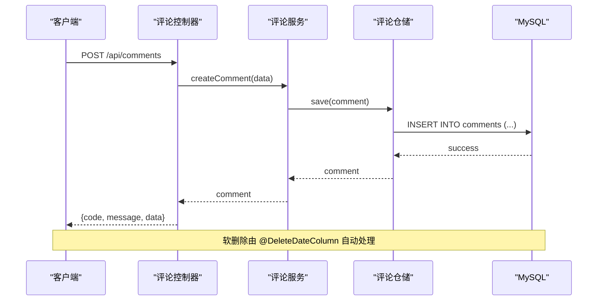
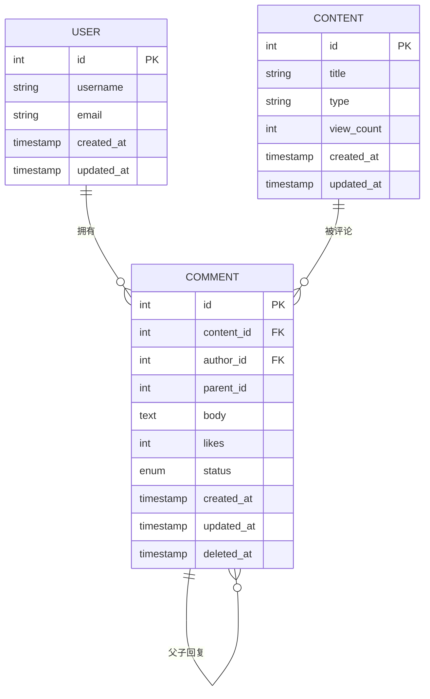
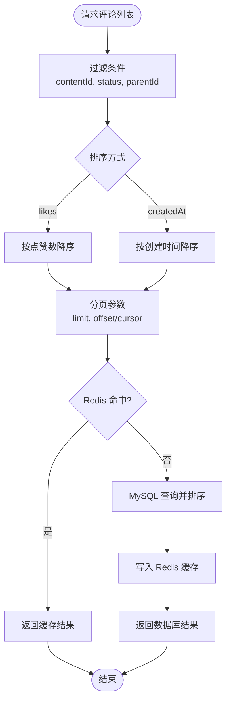
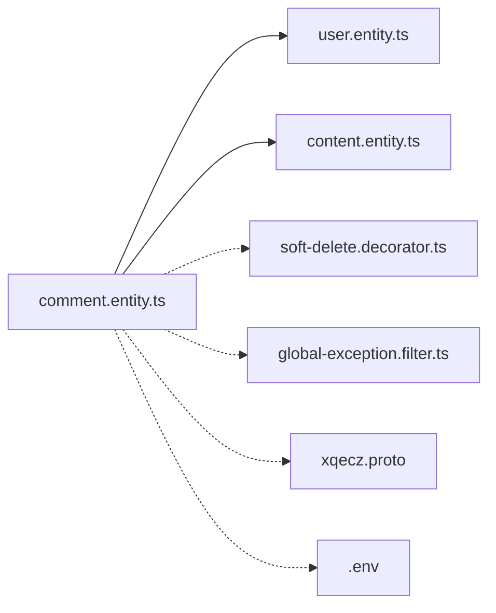

# 评论实体 (Comment)

<cite>
**本文档引用的文件**   
- [packages/api/src/modules/comment/entities/comment.entity.ts](file://packages/api/src/modules/comment/entities/comment.entity.ts)
- [packages/api/src/modules/user/entities/user.entity.ts](file://packages/api/src/modules/user/entities/user.entity.ts)
- [packages/api/src/modules/content/entities/content.entity.ts](file://packages/api/src/modules/content/entities/content.entity.ts)
- [packages/api/src/common/decorators/soft-delete.decorator.ts](file://packages/api/src/common/decorators/soft-delete.decorator.ts)
- [packages/api/src/common/filters/global-exception.filter.ts](file://packages/api/src/common/filters/global-exception.filter.ts)
- [packages/api/.env](file://packages/api/.env)
- [proto/xqecz.proto](file://proto/xqecz.proto)
</cite>

## 目录
1. [简介](#简介)
2. [项目结构](#项目结构)
3. [核心组件](#核心组件)
4. [架构总览](#架构总览)
5. [详细组件分析](#详细组件分析)
6. [依赖关系分析](#依赖关系分析)
7. [性能考量](#性能考量)
8. [故障排查指南](#故障排查指南)
9. [结论](#结论)
10. [附录](#附录)

## 简介
本文件为 xqecz 平台的“评论实体（Comment）”提供完整的技术文档，涵盖 TypeORM 实体定义、层级结构设计（支持多级回复）、软删除与级联策略、与用户和内容的关联关系、排序与分页优化等。读者可据此快速理解评论数据模型的设计意图与实现细节，并在业务中正确使用与扩展。

## 项目结构
- 评论实体位于 NestJS API 模块的 entities 目录，使用 TypeORM 装饰器声明字段、索引与关联。
- 用户与内容实体分别位于 user 与 content 模块的 entities 目录，通过外键与评论建立双向或单向关联。
- 软删除统一由全局装饰器与 TypeORM 的 DeleteDateColumn 配合实现，查询自动过滤已删除记录。
- gRPC 契约在 proto/xqecz.proto 中定义，NestJS 客户端配置 keepCase:true，字段名采用 snake_case 命名约定。

**图表来源** 
- [packages/api/src/modules/comment/entities/comment.entity.ts](file://packages/api/src/modules/comment/entities/comment.entity.ts)
- [packages/api/src/modules/user/entities/user.entity.ts](file://packages/api/src/modules/user/entities/user.entity.ts)
- [packages/api/src/modules/content/entities/content.entity.ts](file://packages/api/src/modules/content/entities/content.entity.ts)
- [packages/api/src/common/decorators/soft-delete.decorator.ts](file://packages/api/src/common/decorators/soft-delete.decorator.ts)
- [packages/api/src/common/filters/global-exception.filter.ts](file://packages/api/src/common/filters/global-exception.filter.ts)
- [proto/xqecz.proto](file://proto/xqecz.proto)
- [packages/api/.env](file://packages/api/.env)

**章节来源**
- [packages/api/src/modules/comment/entities/comment.entity.ts](file://packages/api/src/modules/comment/entities/comment.entity.ts)
- [packages/api/src/modules/user/entities/user.entity.ts](file://packages/api/src/modules/user/entities/user.entity.ts)
- [packages/api/src/modules/content/entities/content.entity.ts](file://packages/api/src/modules/content/entities/content.entity.ts)
- [packages/api/src/common/decorators/soft-delete.decorator.ts](file://packages/api/src/common/decorators/soft-delete.decorator.ts)
- [packages/api/src/common/filters/global-exception.filter.ts](file://packages/api/src/common/filters/global-exception.filter.ts)
- [proto/xqecz.proto](file://proto/xqecz.proto)
- [packages/api/.env](file://packages/api/.env)

## 核心组件
- 评论实体（Comment）：承载评论内容、作者ID、关联内容ID、父评论ID（用于嵌套回复）、点赞数、审核状态、时间戳与软删除标记。
- 用户实体（User）：作为评论的作者，提供用户基本信息与评论集合。
- 内容实体（Content）：作为被评论的目标对象，提供内容信息与评论集合。
- 软删除装饰器：统一启用 @DeleteDateColumn 行为，确保查询自动忽略已删除记录。
- 全局异常过滤器：捕获并规范化错误响应，保证 API 返回格式一致。

**章节来源**
- [packages/api/src/modules/comment/entities/comment.entity.ts](file://packages/api/src/modules/comment/entities/comment.entity.ts)
- [packages/api/src/modules/user/entities/user.entity.ts](file://packages/api/src/modules/user/entities/user.entity.ts)
- [packages/api/src/modules/content/entities/content.entity.ts](file://packages/api/src/modules/content/entities/content.entity.ts)
- [packages/api/src/common/decorators/soft-delete.decorator.ts](file://packages/api/src/common/decorators/soft-delete.decorator.ts)
- [packages/api/src/common/filters/global-exception.filter.ts](file://packages/api/src/common/filters/global-exception.filter.ts)

## 架构总览
评论实体的设计围绕“内容—评论—用户”的核心关系展开，并通过父评论ID实现多级回复。软删除机制保障数据可恢复性与审计能力；索引与排序策略提升列表与热评查询性能。

**图表来源** 
- [packages/api/src/modules/user/entities/user.entity.ts](file://packages/api/src/modules/user/entities/user.entity.ts)
- [packages/api/src/modules/content/entities/content.entity.ts](file://packages/api/src/modules/content/entities/content.entity.ts)
- [packages/api/src/modules/comment/entities/comment.entity.ts](file://packages/api/src/modules/comment/entities/comment.entity.ts)

## 详细组件分析

### 评论实体（Comment）TypeORM 定义与字段说明
- 主键 id：自增整数，唯一标识每条评论。
- 内容关联 contentId：指向目标内容的 ID，建立与内容实体的外键关系。
- 作者关联 authorId：指向用户 ID，建立与用户实体的外键关系。
- 父评论 parentId：指向父评论 ID，支持多级嵌套回复；根评论为空。
- 正文 body：评论文本内容，建议限制长度与敏感词过滤。
- 点赞数 likes：累计点赞计数，支持并发更新与幂等处理。
- 审核状态 status：如 pending/approved/rejected，控制可见性。
- 创建时间 createdAt、更新时间 updatedAt、软删除 deletedAt：时间戳与软删除标记。
- 关联对象 author、content、parent、children：便于 ORM 层加载与级联操作。

字段说明表（示例路径引用）
- id：[packages/api/src/modules/comment/entities/comment.entity.ts](file://packages/api/src/modules/comment/entities/comment.entity.ts)
- contentId：[packages/api/src/modules/comment/entities/comment.entity.ts](file://packages/api/src/modules/comment/entities/comment.entity.ts)
- authorId：[packages/api/src/modules/comment/entities/comment.entity.ts](file://packages/api/src/modules/comment/entities/comment.entity.ts)
- parentId：[packages/api/src/modules/comment/entities/comment.entity.ts](file://packages/api/src/modules/comment/entities/comment.entity.ts)
- body：[packages/api/src/modules/comment/entities/comment.entity.ts](file://packages/api/src/modules/comment/entities/comment.entity.ts)
- likes：[packages/api/src/modules/comment/entities/comment.entity.ts](file://packages/api/src/modules/comment/entities/comment.entity.ts)
- status：[packages/api/src/modules/comment/entities/comment.entity.ts](file://packages/api/src/modules/comment/entities/comment.entity.ts)
- createdAt/updatedAt/deletedAt：[packages/api/src/modules/comment/entities/comment.entity.ts](file://packages/api/src/modules/comment/entities/comment.entity.ts)
- author/content/parent/children：[packages/api/src/modules/comment/entities/comment.entity.ts](file://packages/api/src/modules/comment/entities/comment.entity.ts)

**章节来源**
- [packages/api/src/modules/comment/entities/comment.entity.ts](file://packages/api/src/modules/comment/entities/comment.entity.ts)

### 层级结构设计（多级回复）
- 通过 parentId 自引用实现树形结构，根评论 parentId 为空。
- 查询时可使用递归 CTE 或应用层组装构建层级树。
- 建议在数据库层添加基于 contentId 与 parentId 的复合索引，加速按内容分组与父子关系检索。
- 展示层可按点赞数、时间或审核状态排序，避免过深层级影响渲染性能。

**图表来源** 
- [packages/api/src/modules/comment/entities/comment.entity.ts](file://packages/api/src/modules/comment/entities/comment.entity.ts)

**章节来源**
- [packages/api/src/modules/comment/entities/comment.entity.ts](file://packages/api/src/modules/comment/entities/comment.entity.ts)

### 软删除机制与级联策略
- 软删除：使用 @DeleteDateColumn 标记 deletedAt，查询自动过滤已删除记录，无需物理删除。
- 级联策略：
  - 删除内容时可选择级联删除其评论（谨慎使用，可能影响性能与数据量）。
  - 删除用户时通常不级联删除评论，保留历史痕迹，仅将 authorId 置空或标记匿名。
- 建议：对 deletedAt 建立索引以优化软删除查询；批量删除时使用事务与分批处理。

**图表来源** 
- [packages/api/src/modules/comment/entities/comment.entity.ts](file://packages/api/src/modules/comment/entities/comment.entity.ts)
- [packages/api/src/common/decorators/soft-delete.decorator.ts](file://packages/api/src/common/decorators/soft-delete.decorator.ts)

**章节来源**
- [packages/api/src/modules/comment/entities/comment.entity.ts](file://packages/api/src/modules/comment/entities/comment.entity.ts)
- [packages/api/src/common/decorators/soft-delete.decorator.ts](file://packages/api/src/common/decorators/soft-delete.decorator.ts)

### 与用户、内容的关联关系
- 与用户（User）：authorId 外键关联，表示评论作者；用户实体可维护 comments 集合。
- 与内容（Content）：contentId 外键关联，表示被评论的内容；内容实体可维护 comments 集合。
- 关联查询优化：
  - 使用 JOIN 或 TypeORM relations 预加载 author 与 content，减少 N+1 查询。
  - 针对 contentId、authorId、parentId 建立索引以提升筛选与层级检索效率。

**图表来源** 
- [packages/api/src/modules/user/entities/user.entity.ts](file://packages/api/src/modules/user/entities/user.entity.ts)
- [packages/api/src/modules/content/entities/content.entity.ts](file://packages/api/src/modules/content/entities/content.entity.ts)
- [packages/api/src/modules/comment/entities/comment.entity.ts](file://packages/api/src/modules/comment/entities/comment.entity.ts)

**章节来源**
- [packages/api/src/modules/user/entities/user.entity.ts](file://packages/api/src/modules/user/entities/user.entity.ts)
- [packages/api/src/modules/content/entities/content.entity.ts](file://packages/api/src/modules/content/entities/content.entity.ts)
- [packages/api/src/modules/comment/entities/comment.entity.ts](file://packages/api/src/modules/comment/entities/comment.entity.ts)

### 排序与分页查询优化
- 排序策略：
  - 热门评论：按 likes 降序，结合审核状态过滤。
  - 最新评论：按 createdAt 降序。
  - 推荐链路：参考 ContentService.refreshRecommend() 读 MySQL → gRPC RefreshRecommend → 写 Redis ZSet recommend:hot（ioredis keyPrefix=xqecz:），读取降级为 view_count 排序。
- 分页优化：
  - 使用 cursor-based 分页或基于索引的 limit/offset。
  - 避免深层嵌套树的深度遍历，限制最大层级与每页数量。
- 缓存策略：
  - 热点评论列表可缓存至 Redis，缩短响应时间。
  - 点赞数更新采用增量与去重逻辑，避免重复计数。

**图表来源** 
- [packages/api/src/modules/comment/entities/comment.entity.ts](file://packages/api/src/modules/comment/entities/comment.entity.ts)
- [packages/api/.env](file://packages/api/.env)
- [proto/xqecz.proto](file://proto/xqecz.proto)

**章节来源**
- [packages/api/src/modules/comment/entities/comment.entity.ts](file://packages/api/src/modules/comment/entities/comment.entity.ts)
- [packages/api/.env](file://packages/api/.env)
- [proto/xqecz.proto](file://proto/xqecz.proto)

## 依赖关系分析
- 评论实体依赖用户与内容实体，形成多对一关系。
- 软删除装饰器与全局异常过滤器为通用基础设施，提升一致性。
- gRPC 契约与 .env 配置影响字段命名与运行环境。

**图表来源** 
- [packages/api/src/modules/comment/entities/comment.entity.ts](file://packages/api/src/modules/comment/entities/comment.entity.ts)
- [packages/api/src/modules/user/entities/user.entity.ts](file://packages/api/src/modules/user/entities/user.entity.ts)
- [packages/api/src/modules/content/entities/content.entity.ts](file://packages/api/src/modules/content/entities/content.entity.ts)
- [packages/api/src/common/decorators/soft-delete.decorator.ts](file://packages/api/src/common/decorators/soft-delete.decorator.ts)
- [packages/api/src/common/filters/global-exception.filter.ts](file://packages/api/src/common/filters/global-exception.filter.ts)
- [proto/xqecz.proto](file://proto/xqecz.proto)
- [packages/api/.env](file://packages/api/.env)

**章节来源**
- [packages/api/src/modules/comment/entities/comment.entity.ts](file://packages/api/src/modules/comment/entities/comment.entity.ts)
- [packages/api/src/modules/user/entities/user.entity.ts](file://packages/api/src/modules/user/entities/user.entity.ts)
- [packages/api/src/modules/content/entities/content.entity.ts](file://packages/api/src/modules/content/entities/content.entity.ts)
- [packages/api/src/common/decorators/soft-delete.decorator.ts](file://packages/api/src/common/decorators/soft-delete.decorator.ts)
- [packages/api/src/common/filters/global-exception.filter.ts](file://packages/api/src/common/filters/global-exception.filter.ts)
- [proto/xqecz.proto](file://proto/xqecz.proto)
- [packages/api/.env](file://packages/api/.env)

## 性能考量
- 索引设计：为 contentId、authorId、parentId、deletedAt、status、createdAt 建立合适索引，提升筛选与排序效率。
- 查询优化：避免 N+1 问题，使用预加载与 JOIN；限制层级深度与每页数量。
- 缓存策略：热点评论列表与点赞数更新缓存到 Redis，降低数据库压力。
- 软删除：deletedAt 索引与批量清理策略，避免数据膨胀。

## 故障排查指南
- 常见问题：
  - 父评论不存在或已删除：检查 parentId 有效性，确保级联删除策略合理。
  - 点赞数不一致：确认幂等更新与并发锁机制。
  - 软删除后仍出现：检查查询是否包含 deletedAt 过滤。
- 调试工具：
  - 全局异常过滤器统一错误格式，便于定位问题。
  - 日志记录关键操作（创建、更新、删除）与外部依赖调用。

**章节来源**
- [packages/api/src/common/filters/global-exception.filter.ts](file://packages/api/src/common/filters/global-exception.filter.ts)
- [packages/api/src/common/decorators/soft-delete.decorator.ts](file://packages/api/src/common/decorators/soft-delete.decorator.ts)

## 结论
评论实体通过 TypeORM 清晰定义了字段、索引与关联关系，支持多级嵌套回复与软删除机制。结合合理的排序、分页与缓存策略，可在高并发场景下保持良好性能。建议在生产环境中持续监控索引命中率与查询延迟，并根据业务需求调整级联策略与缓存失效策略。

## 附录
- 实体类代码示例路径：
  - 评论实体：[packages/api/src/modules/comment/entities/comment.entity.ts](file://packages/api/src/modules/comment/entities/comment.entity.ts)
  - 用户实体：[packages/api/src/modules/user/entities/user.entity.ts](file://packages/api/src/modules/user/entities/user.entity.ts)
  - 内容实体：[packages/api/src/modules/content/entities/content.entity.ts](file://packages/api/src/modules/content/entities/content.entity.ts)
- 软删除装饰器：[packages/api/src/common/decorators/soft-delete.decorator.ts](file://packages/api/src/common/decorators/soft-delete.decorator.ts)
- 全局异常过滤器：[packages/api/src/common/filters/global-exception.filter.ts](file://packages/api/src/common/filters/global-exception.filter.ts)
- gRPC 契约：[proto/xqecz.proto](file://proto/xqecz.proto)
- 环境配置：[packages/api/.env](file://packages/api/.env)