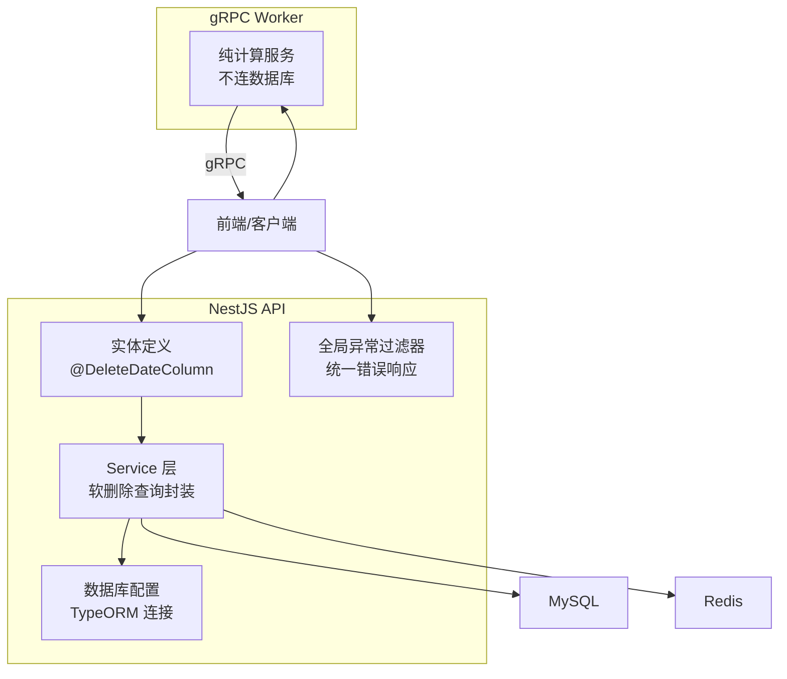
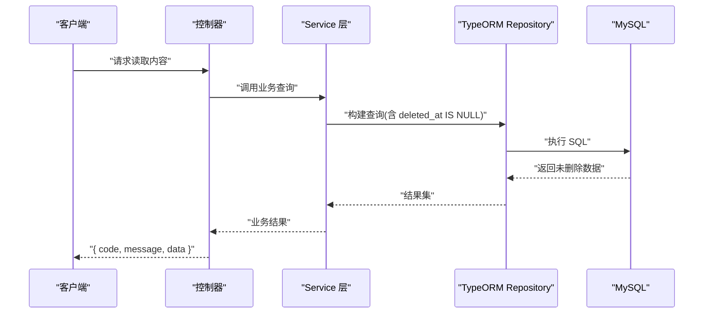
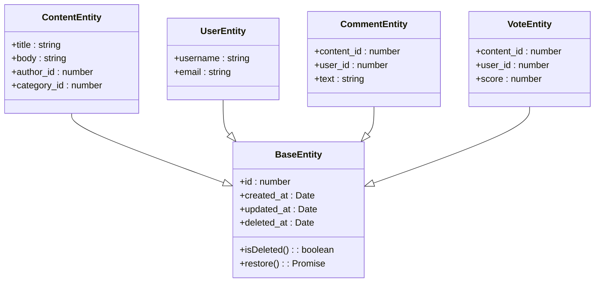
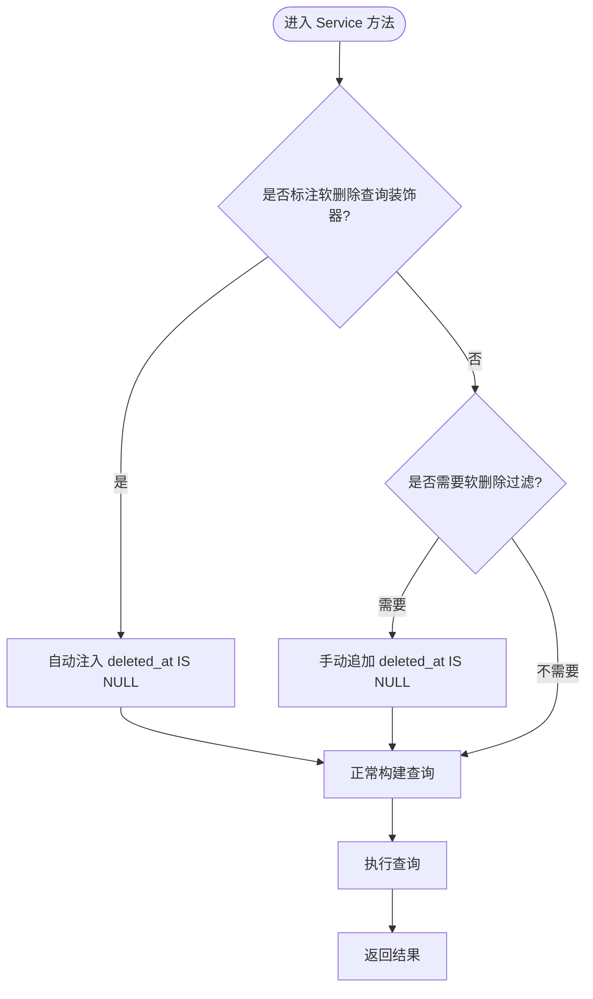
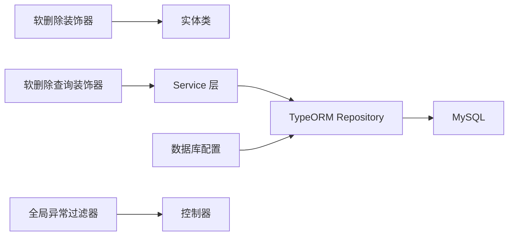

# 软删除机制

<cite>
**本文引用的文件**   
- [packages/api/src/common/decorators/soft-delete.decorator.ts](file://packages/api/src/common/decorators/soft-delete.decorator.ts)
- [packages/api/src/common/decorators/soft-delete-query.decorator.ts](file://packages/api/src/common/decorators/soft-delete-query.decorator.ts)
- [packages/api/src/common/filters/global-exception.filter.ts](file://packages/api/src/common/filters/global-exception.filter.ts)
- [packages/api/src/modules/content/content.service.ts](file://packages/api/src/modules/content/content.service.ts)
- [packages/api/src/modules/user/user.service.ts](file://packages/api/src/modules/user/user.service.ts)
- [packages/api/src/modules/comment/comment.service.ts](file://packages/api/src/modules/comment/comment.service.ts)
- [packages/api/src/modules/vote/vote.service.ts](file://packages/api/src/modules/vote/vote.service.ts)
- [packages/api/src/config/database.config.ts](file://packages/api/src/config/database.config.ts)
- [packages/api/.env](file://packages/api/.env)
- [proto/xqecz.proto](file://proto/xqecz.proto)
- [scripts/run-worker.mjs](file://scripts/run-worker.mjs)
</cite>

## 目录
1. [简介](#简介)
2. [项目结构](#项目结构)
3. [核心组件](#核心组件)
4. [架构总览](#架构总览)
5. [详细组件分析](#详细组件分析)
6. [依赖关系分析](#依赖关系分析)
7. [性能考虑](#性能考虑)
8. [故障排查指南](#故障排查指南)
9. [结论](#结论)
10. [附录](#附录)

## 简介
本文件面向 xqecz 平台，系统性阐述基于 TypeORM 的软删除机制。重点包括：
- @DeleteDateColumn 的使用与 deleted_at 字段的自动管理
- 查询过滤策略（默认 WHERE deleted_at IS NULL）
- Service 层软删除查询的正确实现方式
- 对关联查询、级联操作与数据迁移的影响
- 最佳实践与常见陷阱
- 结合 NestJS 与 gRPC Worker 的集成注意事项

## 项目结构
xqecz 采用 monorepo 组织，API 服务由 NestJS 提供，数据库访问通过 TypeORM；Worker 为无状态 gRPC 计算服务，不直接访问数据库。软删除相关能力集中在 API 层的装饰器与模块 Service 中，并通过统一的异常过滤器保障错误处理一致性。

图表来源
- [packages/api/src/config/database.config.ts](file://packages/api/src/config/database.config.ts)
- [packages/api/src/common/filters/global-exception.filter.ts](file://packages/api/src/common/filters/global-exception.filter.ts)
- [proto/xqecz.proto](file://proto/xqecz.proto)
- [scripts/run-worker.mjs](file://scripts/run-worker.mjs)

章节来源
- [packages/api/src/config/database.config.ts](file://packages/api/src/config/database.config.ts)
- [packages/api/src/common/filters/global-exception.filter.ts](file://packages/api/src/common/filters/global-exception.filter.ts)
- [proto/xqecz.proto](file://proto/xqecz.proto)
- [scripts/run-worker.mjs](file://scripts/run-worker.mjs)

## 核心组件
- 软删除装饰器：用于在实体上声明软删除字段与行为
- 软删除查询装饰器：用于在 Service 方法上快速启用“仅查未删除”的过滤
- 数据库配置：确保 TypeORM 正确加载实体并启用软删除支持
- 各模块 Service：封装业务查询，保证 SELECT 均包含 deleted_at 过滤
- 全局异常过滤器：统一错误返回格式，避免泄露内部细节

章节来源
- [packages/api/src/common/decorators/soft-delete.decorator.ts](file://packages/api/src/common/decorators/soft-delete.decorator.ts)
- [packages/api/src/common/decorators/soft-delete-query.decorator.ts](file://packages/api/src/common/decorators/soft-delete-query.decorator.ts)
- [packages/api/src/config/database.config.ts](file://packages/api/src/config/database.config.ts)
- [packages/api/src/common/filters/global-exception.filter.ts](file://packages/api/src/common/filters/global-exception.filter.ts)

## 架构总览
软删除贯穿“实体定义 → Service 查询 → 数据库执行”的全链路。所有读取路径默认排除已删除记录，写入路径需显式区分“逻辑删除”与“物理删除”。

图表来源
- [packages/api/src/modules/content/content.service.ts](file://packages/api/src/modules/content/content.service.ts)
- [packages/api/src/modules/user/user.service.ts](file://packages/api/src/modules/user/user.service.ts)
- [packages/api/src/modules/comment/comment.service.ts](file://packages/api/src/modules/comment/comment.service.ts)
- [packages/api/src/modules/vote/vote.service.ts](file://packages/api/src/modules/vote/vote.service.ts)

## 详细组件分析

### 实体层：@DeleteDateColumn 与 deleted_at 字段
- 在实体上添加软删除字段后，TypeORM 会在 SELECT/JOIN 等查询中自动注入 WHERE deleted_at IS NULL
- 更新与删除操作可通过 repository 的软删除方法将时间戳写入 deleted_at，而非真正删除行
- 建议为 deleted_at 建立索引以优化过滤查询

图表来源
- [packages/api/src/common/decorators/soft-delete.decorator.ts](file://packages/api/src/common/decorators/soft-delete.decorator.ts)

章节来源
- [packages/api/src/common/decorators/soft-delete.decorator.ts](file://packages/api/src/common/decorators/soft-delete.decorator.ts)

### Service 层：软删除查询封装与使用
- 使用“软删除查询装饰器”可快速为方法注入 deleted_at IS NULL 条件
- 对于复杂查询（多表 JOIN、子查询），务必显式追加 deleted_at 过滤，避免遗漏
- 写操作应区分“逻辑删除”（设置 deleted_at）和“物理删除”（彻底移除）

图表来源
- [packages/api/src/common/decorators/soft-delete-query.decorator.ts](file://packages/api/src/common/decorators/soft-delete-query.decorator.ts)
- [packages/api/src/modules/content/content.service.ts](file://packages/api/src/modules/content/content.service.ts)
- [packages/api/src/modules/user/user.service.ts](file://packages/api/src/modules/user/user.service.ts)
- [packages/api/src/modules/comment/comment.service.ts](file://packages/api/src/modules/comment/comment.service.ts)
- [packages/api/src/modules/vote/vote.service.ts](file://packages/api/src/modules/vote/vote.service.ts)

章节来源
- [packages/api/src/common/decorators/soft-delete-query.decorator.ts](file://packages/api/src/common/decorators/soft-delete-query.decorator.ts)
- [packages/api/src/modules/content/content.service.ts](file://packages/api/src/modules/content/content.service.ts)
- [packages/api/src/modules/user/user.service.ts](file://packages/api/src/modules/user/user.service.ts)
- [packages/api/src/modules/comment/comment.service.ts](file://packages/api/src/modules/comment/comment.service.ts)
- [packages/api/src/modules/vote/vote_service.ts](file://packages/api/src/modules/vote/vote.service.ts)

### 数据库配置与迁移
- 确保 TypeORM 正确扫描实体并启用软删除支持
- 为 deleted_at 字段创建索引，提升过滤性能
- 迁移脚本需包含 deleted_at 列的添加与索引创建

章节来源
- [packages/api/src/config/database.config.ts](file://packages/api/src/config/database.config.ts)

### 全局异常过滤器与统一响应
- 所有 API 响应统一包装为 { code, message, data }
- 异常过滤器捕获未处理错误，避免泄露堆栈信息
- 软删除相关错误（如权限不足、数据不存在）应返回明确且安全的消息

章节来源
- [packages/api/src/common/filters/global-exception.filter.ts](file://packages/api/src/common/filters/global-exception.filter.ts)

### gRPC Worker 与软删除的关系
- Worker 为无状态计算服务，不直接访问数据库
- 数据读写由 NestJS 完成，Worker 仅接收输入并返回计算结果
- 软删除逻辑完全在 API 层实现，Worker 无需感知 deleted_at

章节来源
- [proto/xqecz.proto](file://proto/xqecz.proto)
- [scripts/run-worker.mjs](file://scripts/run-worker.mjs)

## 依赖关系分析
- 实体依赖 TypeORM 的软删除能力
- Service 依赖装饰器与 Repository 进行查询封装
- 数据库配置驱动 TypeORM 初始化与实体扫描
- 异常过滤器与统一响应格式贯穿整个 API 层

图表来源
- [packages/api/src/common/decorators/soft-delete.decorator.ts](file://packages/api/src/common/decorators/soft-delete.decorator.ts)
- [packages/api/src/common/decorators/soft-delete-query.decorator.ts](file://packages/api/src/common/decorators/soft-delete-query.decorator.ts)
- [packages/api/src/config/database.config.ts](file://packages/api/src/config/database.config.ts)
- [packages/api/src/common/filters/global-exception.filter.ts](file://packages/api/src/common/filters/global-exception.filter.ts)

章节来源
- [packages/api/src/common/decorators/soft-delete.decorator.ts](file://packages/api/src/common/decorators/soft-delete.decorator.ts)
- [packages/api/src/common/decorators/soft-delete-query.decorator.ts](file://packages/api/src/common/decorators/soft-delete-query.decorator.ts)
- [packages/api/src/config/database.config.ts](file://packages/api/src/config/database.config.ts)
- [packages/api/src/common/filters/global-exception.filter.ts](file://packages/api/src/common/filters/global-exception.filter.ts)

## 性能考虑
- 为 deleted_at 建立索引，确保过滤查询高效
- 避免在软删除字段上进行函数计算或类型转换
- 合理使用分页与只读字段投影，减少不必要的数据传输
- 对高频查询增加 Redis 缓存，降低 MySQL 压力

## 故障排查指南
- 检查实体是否正确声明软删除字段
- 确认 Service 层查询是否包含 deleted_at 过滤
- 验证数据库索引是否存在
- 查看全局异常过滤器日志，定位具体错误原因
- 确认环境变量与数据库连接配置正确

章节来源
- [packages/api/src/common/filters/global-exception.filter.ts](file://packages/api/src/common/filters/global-exception.filter.ts)
- [packages/api/.env](file://packages/api/.env)

## 结论
通过 TypeORM 的 @DeleteDateColumn 与装饰器封装，xqecz 平台实现了安全、高效的软删除机制。所有读取路径默认排除已删除记录，写操作清晰区分逻辑删除与物理删除。配合合理的索引设计与缓存策略，可在保证数据安全的同时获得良好的性能表现。

## 附录
- 环境变量配置参考：[packages/api/.env](file://packages/api/.env)
- gRPC 契约定义：[proto/xqecz.proto](file://proto/xqecz.proto)
- Worker 启动脚本：[scripts/run-worker.mjs](file://scripts/run-worker.mjs)