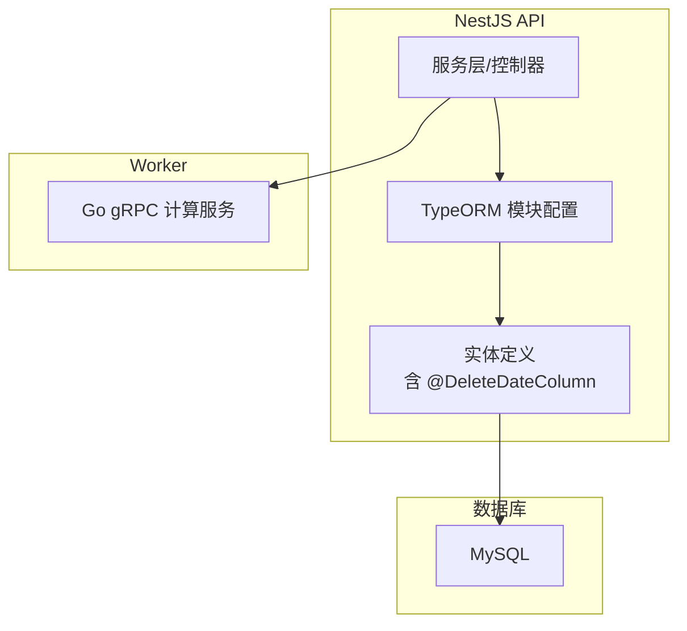
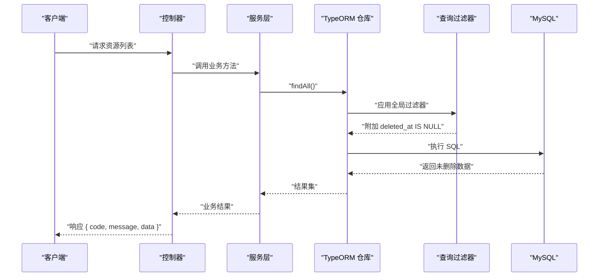
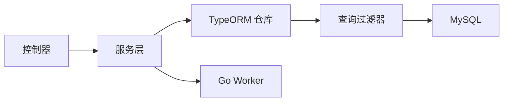

# 软删除机制

<cite>
**本文档引用的文件**   
- [plan.md](file://plan.md)
- [AGENTS.md](file://AGENTS.md)
</cite>

## 目录
1. [简介](#简介)
2. [项目结构](#项目结构)
3. [核心组件](#核心组件)
4. [架构总览](#架构总览)
5. [详细组件分析](#详细组件分析)
6. [依赖关系分析](#依赖关系分析)
7. [性能考量](#性能考量)
8. [故障排查指南](#故障排查指南)
9. [结论](#结论)
10. [附录](#附录)

## 简介
本技术文档聚焦 xqecz 平台的软删除机制，围绕 TypeORM 的 @DeleteDateColumn 装饰器与 deleted_at 字段的自动管理展开。结合项目约定“所有删除均为软删除（deleted_at + TypeORM @DeleteDateColumn 自动过滤）”，本文说明如何在 NestJS 中配置全局查询过滤器以自动排除已删除记录，阐述软删除与硬删除的区别与适用场景，并提供数据恢复方法与批量清理策略。同时给出对索引与查询性能的影响分析与优化建议，并附带最佳实践与代码示例路径指引。

## 项目结构
xqecz 为 monorepo，后端 API 由 NestJS 提供，数据库访问通过 TypeORM 完成；Go Worker 仅负责无状态计算，不直接操作数据库。软删除相关能力集中在 NestJS 的实体定义与 TypeORM 模块配置中。

图表来源
- [plan.md:1-200](file://plan.md#L1-L200)
- [AGENTS.md:1-200](file://AGENTS.md#L1-L200)

章节来源
- [plan.md:1-200](file://plan.md#L1-L200)
- [AGENTS.md:1-200](file://AGENTS.md#L1-L200)

## 核心组件
- 实体字段：使用 @DeleteDateColumn 声明 deleted_at 字段，TypeORM 会在软删除时写入时间戳，并在查询时自动追加 WHERE deleted_at IS NULL 条件。
- 查询过滤器：在 TypeORM 模块初始化时启用全局查询过滤器，确保 findAll、findOne、relations 等查询均遵循软删除语义。
- 事务与一致性：涉及多表关联的软删除应置于事务中，保证 deleted_at 更新的一致性。
- 外部依赖降级：当外部依赖缺失时，系统降级处理，不影响软删除主流程。

章节来源
- [plan.md:1-200](file://plan.md#L1-L200)
- [AGENTS.md:1-200](file://AGENTS.md#L1-L200)

## 架构总览
下图展示软删除在 NestJS + TypeORM 中的整体流程：控制器调用服务，服务通过 TypeORM 仓库执行增删改查；TypeORM 根据全局过滤器自动注入 deleted_at 条件；Worker 不参与数据库操作，仅进行纯计算。

图表来源
- [plan.md:1-200](file://plan.md#L1-L200)
- [AGENTS.md:1-200](file://AGENTS.md#L1-L200)

## 详细组件分析

### 实体与 @DeleteDateColumn
- 在需要软删除的实体上添加 @DeleteDateColumn 装饰器，TypeORM 会自动维护 deleted_at 字段。
- 常见用法：在实体类中引入装饰器并标注字段类型（如 Date | null），无需手动维护该字段值。
- 注意：避免在业务逻辑中直接修改 deleted_at，统一通过 TypeORM 提供的软删除接口（如 softRemove/remove）进行操作。

章节来源
- [plan.md:1-200](file://plan.md#L1-L200)
- [AGENTS.md:1-200](file://AGENTS.md#L1-L200)

### TypeORM 查询过滤器配置
- 在 TypeORM 模块初始化时启用全局查询过滤器，使所有查询默认排除 deleted_at 不为空的记录。
- 过滤器会作用于 findAll、findOne、relations 加载等场景，确保一致的数据可见性。
- 若需读取已删除数据（如审计或后台管理），可通过显式指定 where 条件绕过过滤器。

章节来源
- [plan.md:1-200](file://plan.md#L1-L200)
- [AGENTS.md:1-200](file://AGENTS.md#L1-L200)

### 软删除与硬删除对比
- 软删除：保留原始记录，设置 deleted_at 标记；便于恢复、审计与级联一致性；适合用户内容、评论、投票等可恢复场景。
- 硬删除：物理移除记录；不可恢复；适用于临时数据、日志归档后清理等一次性场景。
- 本项目约定：所有删除均为软删除，优先保障可恢复性与一致性。

章节来源
- [plan.md:1-200](file://plan.md#L1-L200)
- [AGENTS.md:1-200](file://AGENTS.md#L1-L200)

### 数据恢复与批量清理策略
- 单条恢复：通过 TypeORM 的 restore 接口将 deleted_at 置空，恢复数据可见性。
- 批量恢复：基于仓库查询已删除记录，批量调用 restore 或执行原生 SQL 更新 deleted_at。
- 批量清理：定期任务扫描超过保留期的 deleted_at 记录，执行硬删除或归档到冷存储；建议在事务中分批处理，避免长事务锁表。
- 注意事项：批量操作需考虑外键约束与关联表一致性，必要时先处理子表再处理父表。

章节来源
- [plan.md:1-200](file://plan.md#L1-L200)
- [AGENTS.md:1-200](file://AGENTS.md#L1-L200)

### 索引与查询优化
- 索引建议：为 deleted_at 建立索引，提升过滤效率；联合索引 (deleted_at, 常用排序/筛选字段) 可进一步优化复杂查询。
- 查询计划：确认 EXPLAIN 显示使用 deleted_at 索引；避免全表扫描。
- 分页与排序：在包含 deleted_at 过滤的分页查询中，确保排序字段有合适索引，减少回表开销。
- 统计与报表：如需统计包含已删除数据的指标，使用独立查询绕过过滤器，避免污染常规业务查询。

章节来源
- [plan.md:1-200](file://plan.md#L1-L200)
- [AGENTS.md:1-200](file://AGENTS.md#L1-L200)

### 代码示例与最佳实践
- 实体定义：在需要软删除的实体中添加 @DeleteDateColumn 装饰器，保持字段类型为 Date | null。
- 模块配置：在 TypeORM 模块初始化时启用全局查询过滤器，确保所有查询遵循软删除语义。
- 服务层：使用 TypeORM 提供的软删除接口进行删除与恢复，避免直接操作 deleted_at。
- 事务处理：多表关联的软删除/恢复应在事务中执行，保证一致性。
- 审计与导出：对已删除数据的审计查询应显式绕过过滤器，避免误用。
- 错误处理：外部依赖缺失时降级处理，不影响软删除主流程。

章节来源
- [plan.md:1-200](file://plan.md#L1-L200)
- [AGENTS.md:1-200](file://AGENTS.md#L1-L200)

## 依赖关系分析
- NestJS 控制器与服务层依赖 TypeORM 仓库进行数据访问。
- TypeORM 模块依赖全局查询过滤器实现软删除过滤。
- MySQL 作为持久化存储，受 deleted_at 索引影响查询性能。
- Go Worker 不参与数据库操作，仅进行纯计算，降低耦合度。

图表来源
- [plan.md:1-200](file://plan.md#L1-L200)
- [AGENTS.md:1-200](file://AGENTS.md#L1-L200)

章节来源
- [plan.md:1-200](file://plan.md#L1-L200)
- [AGENTS.md:1-200](file://AGENTS.md#L1-L200)

## 性能考量
- 索引设计：为 deleted_at 及其联合字段建立合适索引，避免全表扫描。
- 查询优化：确保分页与排序字段具备索引支持，减少回表与临时表生成。
- 批量操作：分批次处理大集合，控制事务大小，避免锁竞争。
- 监控与诊断：使用 EXPLAIN 分析慢查询，关注 deleted_at 过滤是否命中索引。

[本节为通用指导，不直接分析具体文件]

## 故障排查指南
- 现象：查询仍返回已删除记录
  - 检查 TypeORM 全局过滤器是否正确启用
  - 确认查询是否显式绕过了过滤器
- 现象：软删除后关联数据异常
  - 检查事务边界与外键约束
  - 确认级联逻辑是否符合预期
- 现象：性能退化
  - 检查 deleted_at 索引是否存在且被使用
  - 分析 EXPLAIN 输出，定位全表扫描

章节来源
- [plan.md:1-200](file://plan.md#L1-L200)
- [AGENTS.md:1-200](file://AGENTS.md#L1-L200)

## 结论
xqecz 平台采用 TypeORM 的 @DeleteDateColumn 与全局查询过滤器实现统一的软删除机制，确保所有查询默认排除已删除记录。通过合理的索引设计与事务管理，可在保障数据可恢复性的同时维持良好性能。建议在生产环境中持续监控查询计划与索引命中率，并结合业务需求制定数据保留与清理策略。

[本节为总结性内容，不直接分析具体文件]

## 附录
- 术语说明：
  - 软删除：通过标记字段（如 deleted_at）表示删除状态，数据仍保留在数据库中。
  - 硬删除：物理移除数据库记录，无法恢复。
- 参考约定：
  - 所有删除均为软删除（deleted_at + TypeORM @DeleteDateColumn 自动过滤）
  - API 响应统一为 { code, message, data } 包装格式

[本节为概念性内容，不直接分析具体文件]