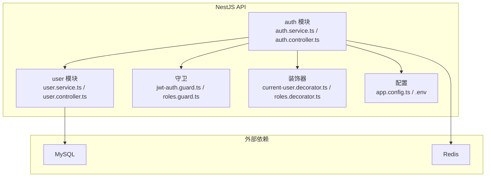
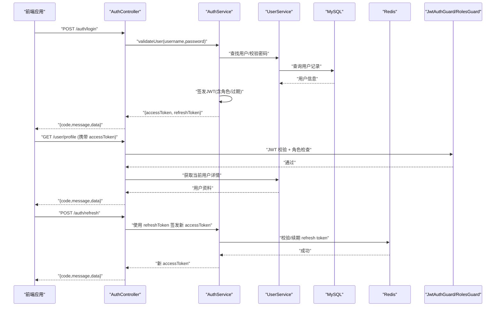
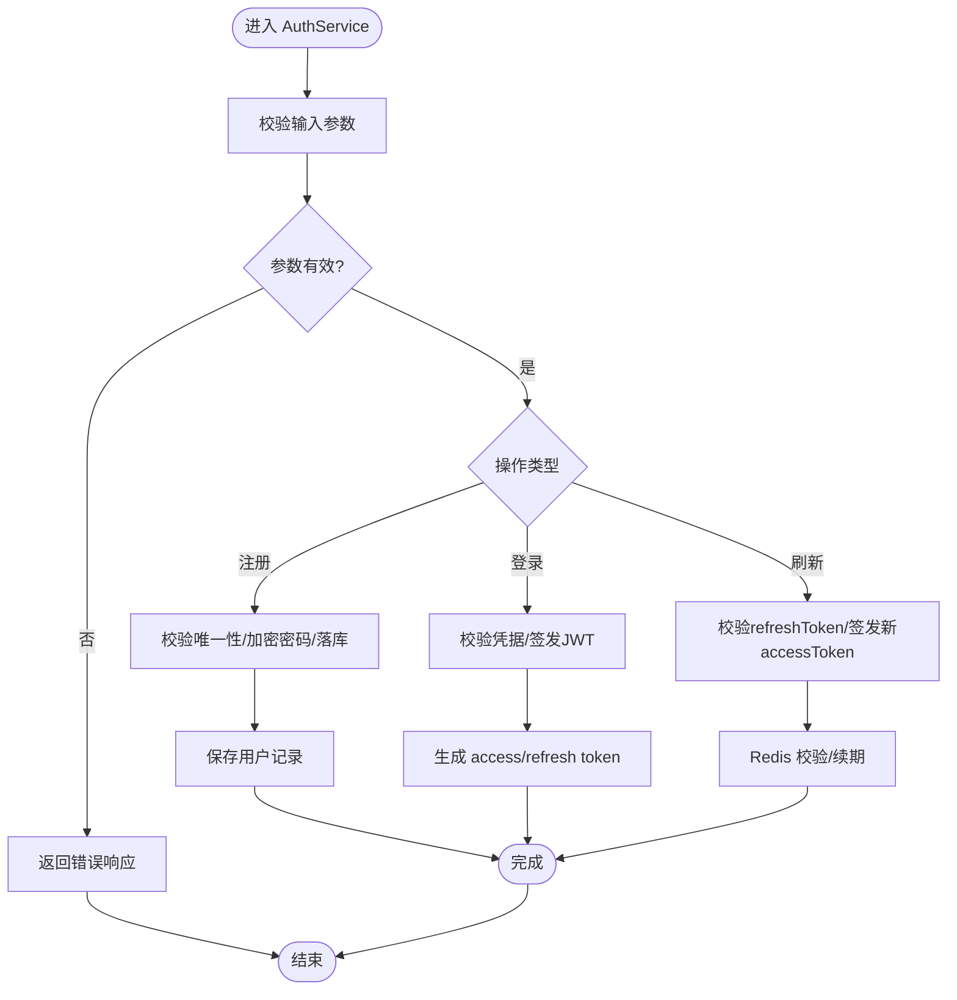
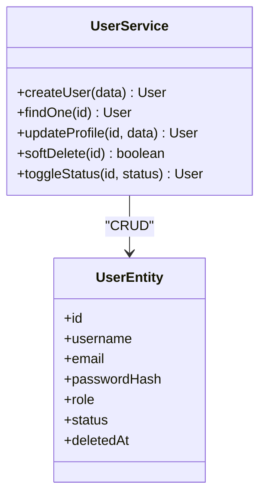
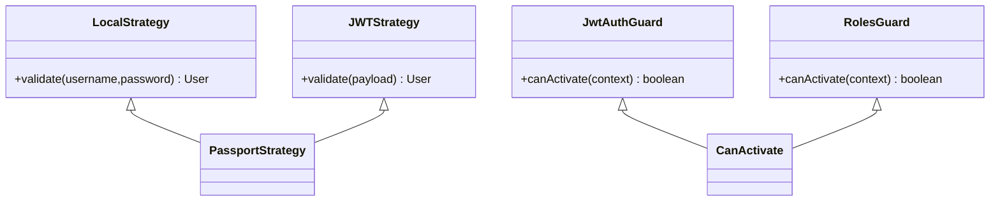
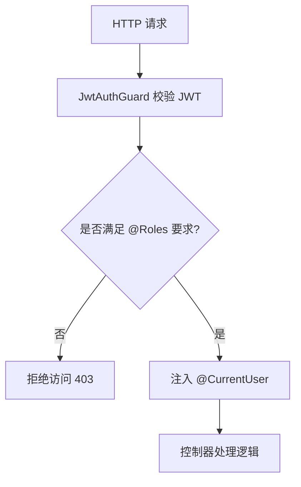
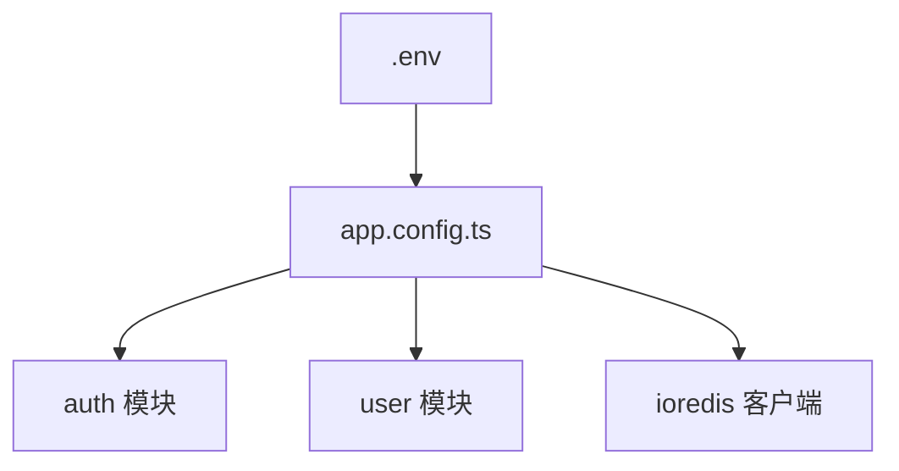
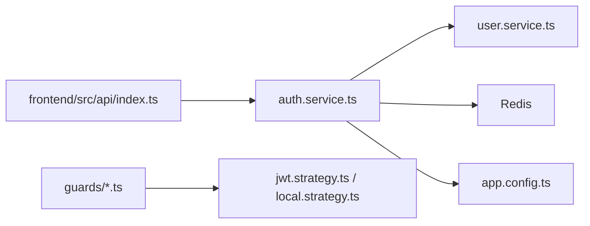

# 用户认证与授权

<cite>
**本文引用的文件**   
- [packages/api/src/auth/auth.service.ts](file://packages/api/src/auth/auth.service.ts)
- [packages/api/src/auth/auth.controller.ts](file://packages/api/src/auth/auth.controller.ts)
- [packages/api/src/auth/jwt.strategy.ts](file://packages/api/src/auth/jwt.strategy.ts)
- [packages/api/src/auth/local.strategy.ts](file://packages/api/src/auth/local.strategy.ts)
- [packages/api/src/auth/guards/roles.guard.ts](file://packages/api/src/auth/guards/roles.guard.ts)
- [packages/api/src/auth/guards/jwt-auth.guard.ts](file://packages/api/src/auth/guards/jwt-auth.guard.ts)
- [packages/api/src/user/user.service.ts](file://packages/api/src/user/user.service.ts)
- [packages/api/src/user/user.controller.ts](file://packages/api/src/user/user.controller.ts)
- [packages/api/src/user/entities/user.entity.ts](file://packages/api/src/user/entities/user.entity.ts)
- [packages/api/src/common/decorators/current-user.decorator.ts](file://packages/api/src/common/decorators/current-user.decorator.ts)
- [packages/api/src/common/decorators/roles.decorator.ts](file://packages/api/src/common/decorators/roles.decorator.ts)
- [packages/api/src/config/app.config.ts](file://packages/api/src/config/app.config.ts)
- [packages/api/.env](file://packages/api/.env)
- [packages/frontend/src/api/index.ts](file://packages/frontend/src/api/index.ts)
- [proto/xqecz.proto](file://proto/xqecz.proto)
</cite>

## 目录
1. [简介](#简介)
2. [项目结构](#项目结构)
3. [核心组件](#核心组件)
4. [架构总览](#架构总览)
5. [详细组件分析](#详细组件分析)
6. [依赖关系分析](#依赖关系分析)
7. [性能考量](#性能考量)
8. [故障排查指南](#故障排查指南)
9. [结论](#结论)
10. [附录：API 接口与安全配置](#附录api-接口与安全配置)

## 简介
本文件面向 xqecz 平台的用户认证与授权系统，覆盖用户注册、登录、密码管理、JWT 令牌生成/验证/刷新、角色权限与访问控制、用户资料管理与状态、会话管理以及安全最佳实践。文档同时提供 API 接口说明与安全配置建议，帮助开发者快速理解并正确集成认证能力。

## 项目结构
认证与授权相关代码集中在 NestJS API 包中，采用分层与模块化组织：
- auth 模块：负责认证策略（本地登录、JWT）、守卫（JWT、角色）与业务编排
- user 模块：负责用户实体、用户服务与用户控制器
- common 装饰器：当前用户注入、角色声明等横切关注点
- config：统一读取环境变量（如 JWT 密钥、过期时间）
- frontend 契约：前端唯一接口定义文件，约定统一响应格式 { code, message, data }

图表来源
- [packages/api/src/auth/auth.service.ts](file://packages/api/src/auth/auth.service.ts)
- [packages/api/src/auth/auth.controller.ts](file://packages/api/src/auth/auth.controller.ts)
- [packages/api/src/user/user.service.ts](file://packages/api/src/user/user.service.ts)
- [packages/api/src/user/user.controller.ts](file://packages/api/src/user/user.controller.ts)
- [packages/api/src/auth/guards/jwt-auth.guard.ts](file://packages/api/src/auth/guards/jwt-auth.guard.ts)
- [packages/api/src/auth/guards/roles.guard.ts](file://packages/api/src/auth/guards/roles.guard.ts)
- [packages/api/src/common/decorators/current-user.decorator.ts](file://packages/api/src/common/decorators/current-user.decorator.ts)
- [packages/api/src/common/decorators/roles.decorator.ts](file://packages/api/src/common/decorators/roles.decorator.ts)
- [packages/api/src/config/app.config.ts](file://packages/api/src/config/app.config.ts)
- [packages/api/.env](file://packages/api/.env)

章节来源
- [packages/api/src/auth/auth.service.ts](file://packages/api/src/auth/auth.service.ts)
- [packages/api/src/auth/auth.controller.ts](file://packages/api/src/auth/auth.controller.ts)
- [packages/api/src/user/user.service.ts](file://packages/api/src/user/user.service.ts)
- [packages/api/src/user/user.controller.ts](file://packages/api/src/user/user.controller.ts)
- [packages/api/src/auth/guards/jwt-auth.guard.ts](file://packages/api/src/auth/guards/jwt-auth.guard.ts)
- [packages/api/src/auth/guards/roles.guard.ts](file://packages/api/src/auth/guards/roles.guard.ts)
- [packages/api/src/common/decorators/current-user.decorator.ts](file://packages/api/src/common/decorators/current-user.decorator.ts)
- [packages/api/src/common/decorators/roles.decorator.ts](file://packages/api/src/common/decorators/roles.decorator.ts)
- [packages/api/src/config/app.config.ts](file://packages/api/src/config/app.config.ts)
- [packages/api/.env](file://packages/api/.env)

## 核心组件
- 认证服务（AuthService）：封装注册、登录、密码重置、JWT 签发与校验、刷新令牌等核心流程
- 用户服务（UserService）：用户数据持久化、查询、更新、软删除处理
- 策略（LocalStrategy/JWTStrategy）：分别处理用户名/密码校验与 JWT 解析
- 守卫（JwtAuthGuard/RolesGuard）：请求级鉴权，基于 JWT 载荷中的角色进行访问控制
- 装饰器（@CurrentUser/@Roles）：便捷注入当前用户上下文与声明所需角色
- 配置（AppConfig/.env）：集中管理 JWT 密钥、过期时间、Redis 前缀等敏感配置

章节来源
- [packages/api/src/auth/auth.service.ts](file://packages/api/src/auth/auth.service.ts)
- [packages/api/src/user/user.service.ts](file://packages/api/src/user/user.service.ts)
- [packages/api/src/auth/jwt.strategy.ts](file://packages/api/src/auth/jwt.strategy.ts)
- [packages/api/src/auth/local.strategy.ts](file://packages/api/src/auth/local.strategy.ts)
- [packages/api/src/auth/guards/jwt-auth.guard.ts](file://packages/api/src/auth/guards/jwt-auth.guard.ts)
- [packages/api/src/auth/guards/roles.guard.ts](file://packages/api/src/auth/guards/roles.guard.ts)
- [packages/api/src/common/decorators/current-user.decorator.ts](file://packages/api/src/common/decorators/current-user.decorator.ts)
- [packages/api/src/common/decorators/roles.decorator.ts](file://packages/api/src/common/decorators/roles.decorator.ts)
- [packages/api/src/config/app.config.ts](file://packages/api/src/config/app.config.ts)
- [packages/api/.env](file://packages/api/.env)

## 架构总览
下图展示从客户端到后端的认证与授权调用链，涵盖登录、鉴权、资源访问与令牌刷新。

图表来源
- [packages/api/src/auth/auth.controller.ts](file://packages/api/src/auth/auth.controller.ts)
- [packages/api/src/auth/auth.service.ts](file://packages/api/src/auth/auth.service.ts)
- [packages/api/src/user/user.service.ts](file://packages/api/src/user/user.service.ts)
- [packages/api/src/auth/guards/jwt-auth.guard.ts](file://packages/api/src/auth/guards/jwt-auth.guard.ts)
- [packages/api/src/auth/guards/roles.guard.ts](file://packages/api/src/auth/guards/roles.guard.ts)

## 详细组件分析

### 认证服务（AuthService）
- 职责
  - 用户注册：校验唯一性、密码加密存储
  - 登录：校验凭据、签发 JWT（access/refresh）
  - 密码管理：支持修改/重置，遵循最小暴露原则
  - 令牌管理：签发、校验、刷新；必要时在 Redis 中维护黑名单或续期
- 关键流程
  - 登录成功后返回统一的 { code, message, data } 包装体
  - 刷新令牌时优先校验 Redis 中的 refresh token 有效性
  - 失败路径返回标准错误码与消息

图表来源
- [packages/api/src/auth/auth.service.ts](file://packages/api/src/auth/auth.service.ts)

章节来源
- [packages/api/src/auth/auth.service.ts](file://packages/api/src/auth/auth.service.ts)

### 用户服务（UserService）
- 职责
  - 用户实体的增删改查，支持软删除（deleted_at）
  - 用户资料更新：头像、昵称、签名等字段
  - 状态管理：启用/禁用、锁定等
- 关键点
  - 所有删除为软删除，查询自动过滤已删除记录
  - 对外仅暴露必要字段，避免泄露敏感信息

图表来源
- [packages/api/src/user/user.service.ts](file://packages/api/src/user/user.service.ts)
- [packages/api/src/user/entities/user.entity.ts](file://packages/api/src/user/entities/user.entity.ts)

章节来源
- [packages/api/src/user/user.service.ts](file://packages/api/src/user/user.service.ts)
- [packages/api/src/user/entities/user.entity.ts](file://packages/api/src/user/entities/user.entity.ts)

### 策略与守卫（LocalStrategy/JWTStrategy/JwtAuthGuard/RolesGuard）
- LocalStrategy：用于登录端点，校验用户名与密码
- JWTStrategy：解析请求头中的 Authorization Bearer，提取用户上下文
- JwtAuthGuard：全局或路由级保护，确保请求具备有效 JWT
- RolesGuard：基于 JWT 载荷中的角色进行细粒度访问控制

图表来源
- [packages/api/src/auth/local.strategy.ts](file://packages/api/src/auth/local.strategy.ts)
- [packages/api/src/auth/jwt.strategy.ts](file://packages/api/src/auth/jwt.strategy.ts)
- [packages/api/src/auth/guards/jwt-auth.guard.ts](file://packages/api/src/auth/guards/jwt-auth.guard.ts)
- [packages/api/src/auth/guards/roles.guard.ts](file://packages/api/src/auth/guards/roles.guard.ts)

章节来源
- [packages/api/src/auth/local.strategy.ts](file://packages/api/src/auth/local.strategy.ts)
- [packages/api/src/auth/jwt.strategy.ts](file://packages/api/src/auth/jwt.strategy.ts)
- [packages/api/src/auth/guards/jwt-auth.guard.ts](file://packages/api/src/auth/guards/jwt-auth.guard.ts)
- [packages/api/src/auth/guards/roles.guard.ts](file://packages/api/src/auth/guards/roles.guard.ts)

### 装饰器（@CurrentUser/@Roles）
- @CurrentUser：从请求上下文注入当前登录用户对象
- @Roles：声明路由所需的角色，配合 RolesGuard 实现 RBAC

图表来源
- [packages/api/src/common/decorators/current-user.decorator.ts](file://packages/api/src/common/decorators/current-user.decorator.ts)
- [packages/api/src/common/decorators/roles.decorator.ts](file://packages/api/src/common/decorators/roles.decorator.ts)
- [packages/api/src/auth/guards/jwt-auth.guard.ts](file://packages/api/src/auth/guards/jwt-auth.guard.ts)
- [packages/api/src/auth/guards/roles.guard.ts](file://packages/api/src/auth/guards/roles.guard.ts)

章节来源
- [packages/api/src/common/decorators/current-user.decorator.ts](file://packages/api/src/common/decorators/current-user.decorator.ts)
- [packages/api/src/common/decorators/roles.decorator.ts](file://packages/api/src/common/decorators/roles.decorator.ts)
- [packages/api/src/auth/guards/jwt-auth.guard.ts](file://packages/api/src/auth/guards/jwt-auth.guard.ts)
- [packages/api/src/auth/guards/roles.guard.ts](file://packages/api/src/auth/guards/roles.guard.ts)

### 配置与环境变量
- JWT 密钥与过期时间：通过 app.config.ts 读取 .env 中的配置项
- Redis 前缀：统一以 xqecz: 作为 keyPrefix，避免命名冲突
- 上传目录：由 UPLOAD_DIR 环境变量指定，前后端共享

图表来源
- [packages/api/src/config/app.config.ts](file://packages/api/src/config/app.config.ts)
- [packages/api/.env](file://packages/api/.env)

章节来源
- [packages/api/src/config/app.config.ts](file://packages/api/src/config/app.config.ts)
- [packages/api/.env](file://packages/api/.env)

## 依赖关系分析
- 模块耦合
  - auth 模块依赖 user 模块进行用户数据操作
  - auth 模块依赖 Redis 进行 refresh token 管理
  - guards 依赖 jwt.strategy 与 roles 装饰器
- 外部依赖
  - MySQL：用户数据持久化
  - Redis：缓存与令牌续期/黑名单
  - gRPC：worker 无状态计算服务，不直接参与认证流程

图表来源
- [packages/api/src/auth/auth.service.ts](file://packages/api/src/auth/auth.service.ts)
- [packages/api/src/user/user.service.ts](file://packages/api/src/user/user.service.ts)
- [packages/api/src/auth/jwt.strategy.ts](file://packages/api/src/auth/jwt.strategy.ts)
- [packages/api/src/auth/local.strategy.ts](file://packages/api/src/auth/local.strategy.ts)
- [packages/api/src/config/app.config.ts](file://packages/api/src/config/app.config.ts)
- [packages/frontend/src/api/index.ts](file://packages/frontend/src/api/index.ts)

章节来源
- [packages/api/src/auth/auth.service.ts](file://packages/api/src/auth/auth.service.ts)
- [packages/api/src/user/user.service.ts](file://packages/api/src/user/user.service.ts)
- [packages/api/src/auth/jwt.strategy.ts](file://packages/api/src/auth/jwt.strategy.ts)
- [packages/api/src/auth/local.strategy.ts](file://packages/api/src/auth/local.strategy.ts)
- [packages/api/src/config/app.config.ts](file://packages/api/src/config/app.config.ts)
- [packages/frontend/src/api/index.ts](file://packages/frontend/src/api/index.ts)

## 性能考量
- 登录路径优化
  - 密码哈希算法选择合理强度（如 bcrypt/scrypt），避免过度开销
  - 热点用户可引入短期缓存（注意一致性）
- JWT 校验
  - 尽量无状态校验，减少数据库/Redis 访问
  - 对刷新令牌做批量续期与过期清理
- Redis 键空间
  - 使用统一前缀 xqecz:，避免冲突
  - 设置合理的 TTL，防止内存泄漏
- 软删除
  - TypeORM 的 @DeleteDateColumn 自动过滤，无需额外条件

[本节为通用指导，不直接分析具体文件]

## 故障排查指南
- 常见问题
  - 登录失败：检查用户名/密码、用户状态、软删除标记
  - 401 未授权：检查 Authorization 头格式、JWT 是否过期
  - 403 禁止访问：检查角色是否满足 @Roles 要求
  - 刷新失败：检查 Redis 中 refresh token 是否存在且未过期
- 定位步骤
  - 查看日志输出（NestJS 默认日志）
  - 检查 Redis 键值与 TTL
  - 核对 .env 配置（JWT_SECRET、过期时间、REDIS_URL）
  - 确认前端请求是否符合统一响应格式 { code, message, data }

章节来源
- [packages/api/src/auth/auth.controller.ts](file://packages/api/src/auth/auth.controller.ts)
- [packages/api/src/auth/auth.service.ts](file://packages/api/src/auth/auth.service.ts)
- [packages/api/src/auth/guards/jwt-auth.guard.ts](file://packages/api/src/auth/guards/jwt-auth.guard.ts)
- [packages/api/src/auth/guards/roles.guard.ts](file://packages/api/src/auth/guards/roles.guard.ts)
- [packages/api/.env](file://packages/api/.env)
- [packages/frontend/src/api/index.ts](file://packages/frontend/src/api/index.ts)

## 结论
xqecz 平台的认证与授权体系基于 NestJS 的 Passport 与守卫机制，结合 JWT 与 Redis 实现无状态鉴权与令牌管理。通过角色装饰器与守卫实现灵活的 RBAC 访问控制。用户数据采用软删除，保证数据完整性与审计能力。整体设计清晰、可扩展，便于后续接入更多安全特性（如多因素认证、设备指纹等）。

[本节为总结，不直接分析具体文件]

## 附录：API 接口与安全配置

### 认证与用户 API
- 统一响应格式：{ code, message, data }
- 主要端点
  - POST /auth/register：用户注册
  - POST /auth/login：用户登录，返回 access/refresh token
  - POST /auth/refresh：刷新 access token
  - GET /user/profile：获取当前用户资料
  - PUT /user/profile：更新用户资料
  - POST /auth/password/change：修改密码
  - POST /auth/password/reset：重置密码（按业务规则）
- 鉴权方式
  - 受保护接口需携带 Authorization: Bearer <accessToken>
  - 角色受限接口需在控制器上声明 @Roles(...)

章节来源
- [packages/api/src/auth/auth.controller.ts](file://packages/api/src/auth/auth.controller.ts)
- [packages/api/src/user/user.controller.ts](file://packages/api/src/user/user.controller.ts)
- [packages/frontend/src/api/index.ts](file://packages/frontend/src/api/index.ts)

### 安全配置指南
- JWT
  - 使用强随机密钥（JWT_SECRET）
  - 合理设置 access/refresh 过期时间
  - 服务端侧可维护黑名单或续期表（Redis）
- Redis
  - 统一 keyPrefix 为 xqecz:
  - 设置合理的 TTL，定期清理过期键
- 传输安全
  - 生产环境强制 HTTPS
  - 敏感头与 Cookie 设置 Secure/SameSite
- 输入校验
  - 严格校验用户名、邮箱、密码复杂度
  - 防重放与限流（可在网关层实现）
- 日志与审计
  - 记录登录成功/失败事件
  - 脱敏敏感信息

章节来源
- [packages/api/src/config/app.config.ts](file://packages/api/src/config/app.config.ts)
- [packages/api/.env](file://packages/api/.env)

### gRPC 契约说明
- 认证流程不依赖 gRPC，但平台内其他功能（如内容推荐）通过 proto/xqecz.proto 定义
- NestJS 客户端开启 keepCase:true，字段使用 snake_case

章节来源
- [proto/xqecz.proto](file://proto/xqecz.proto)