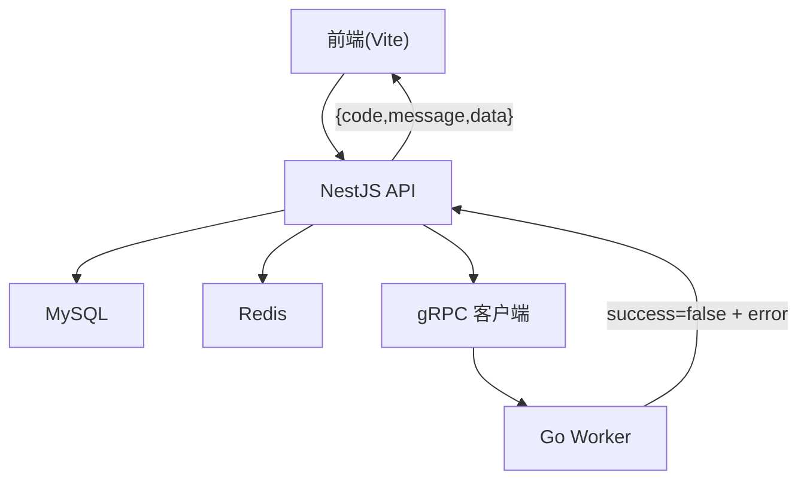
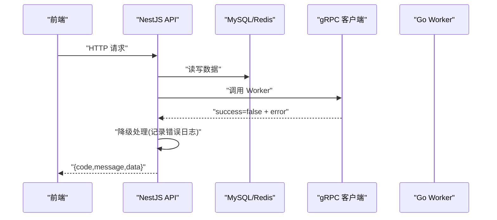
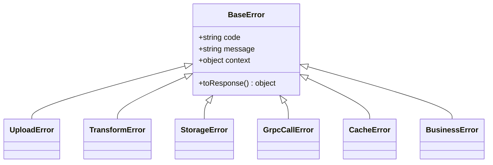
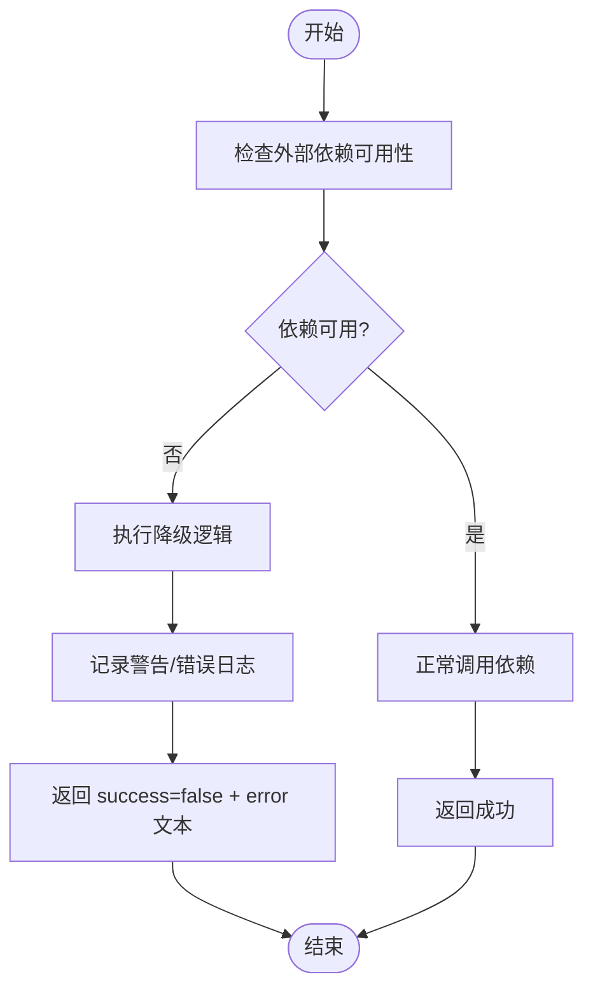
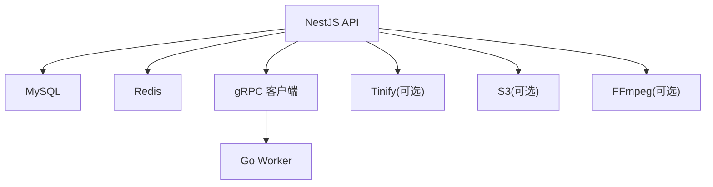

# 错误处理与日志

<cite>
**本文引用的文件**   
- [packages/api/.env](file://packages/api/.env)
- [packages/frontend/src/api/index.ts](file://packages/frontend/src/api/index.ts)
- [proto/xqecz.proto](file://proto/xqecz.proto)
- [scripts/run-worker.mjs](file://scripts/run-worker.mjs)
</cite>

## 目录
1. [简介](#简介)
2. [项目结构](#项目结构)
3. [核心组件](#核心组件)
4. [架构总览](#架构总览)
5. [详细组件分析](#详细组件分析)
6. [依赖关系分析](#依赖关系分析)
7. [性能考虑](#性能考虑)
8. [故障排查指南](#故障排查指南)
9. [结论](#结论)
10. [附录](#附录)

## 简介
本文件面向 xqecz 平台的错误处理与日志系统，目标是：
- 说明全局异常过滤器与自定义错误类型的实现思路与规范
- 统一错误响应格式与错误码规范
- 明确日志记录策略（请求日志、业务日志、错误日志）
- 描述外部依赖缺失时的降级机制（Tinify/S3/FFmpeg/Worker）
- 提供错误监控、告警与故障排查指南
- 总结常见错误解决方案与最佳实践

本项目为「小泉动漫二创站」，采用 NestJS API + Go Worker + Vite 前端的 monorepo 架构。NestJS 独占 MySQL/Redis；Go Worker 是无状态 gRPC 计算服务，不连数据库、无 cron。所有删除均为软删除。对外部依赖缺失一律降级，gRPC 不返回 rpc error，只返回 success=false + error 文本。API 响应统一为 { code, message, data } 包装格式。

## 项目结构
- packages/api：NestJS API 服务，负责 HTTP 接口、MySQL/Redis 访问、gRPC 客户端调用、统一错误响应与日志
- packages/worker：Go 实现的 gRPC 计算服务，接收任务并返回结果
- packages/frontend：Vite 前端，通过 packages/frontend/src/api/index.ts 与后端交互
- proto：gRPC 契约定义
- scripts：运行脚本，如 run-worker.mjs 启动 worker 并注入环境变量

图表来源
- [packages/frontend/src/api/index.ts](file://packages/frontend/src/api/index.ts)
- [proto/xqecz.proto](file://proto/xqecz.proto)
- [scripts/run-worker.mjs](file://scripts/run-worker.mjs)

章节来源
- [packages/api/.env](file://packages/api/.env)
- [packages/frontend/src/api/index.ts](file://packages/frontend/src/api/index.ts)
- [proto/xqecz.proto](file://proto/xqecz.proto)
- [scripts/run-worker.mjs](file://scripts/run-worker.mjs)

## 核心组件
- 全局异常过滤器：在 NestJS 层捕获未处理异常，统一转换为 { code, message, data } 响应，并输出结构化错误日志
- 自定义错误类型：按领域划分错误类别（如上传、压缩、转码、缓存、gRPC 调用），携带可追踪的 code 与上下文
- 统一错误响应格式：{ code, message, data }，code 为数字或短码，message 为用户可读信息，data 可选
- 日志分类：
  - 请求日志：HTTP 请求/响应、耗时、IP、UA、traceId
  - 业务日志：关键流程节点、状态变更、外部调用摘要
  - 错误日志：异常堆栈、上下文、失败原因、是否可恢复
- 降级策略：外部依赖不可用时，返回成功标志但附带错误文本，保证主流程可用

章节来源
- [packages/frontend/src/api/index.ts](file://packages/frontend/src/api/index.ts)
- [proto/xqecz.proto](file://proto/xqecz.proto)
- [scripts/run-worker.mjs](file://scripts/run-worker.mjs)

## 架构总览
下图展示从前端到 API、再到 Worker 的错误与日志流转路径，以及降级点。

图表来源
- [packages/frontend/src/api/index.ts](file://packages/frontend/src/api/index.ts)
- [proto/xqecz.proto](file://proto/xqecz.proto)
- [scripts/run-worker.mjs](file://scripts/run-worker.mjs)

## 详细组件分析

### 全局异常过滤器与自定义错误类型
- 目标：将任意异常转换为统一的 { code, message, data } 响应，避免泄露内部细节
- 设计要点：
  - 捕获 NestJS 内置异常与业务异常
  - 根据异常类型映射到错误码（如参数校验失败、权限不足、资源不存在、外部依赖失败等）
  - 附加 traceId、请求 ID、用户 ID、操作对象等上下文
  - 输出结构化错误日志（包含堆栈、时间戳、环境标识）
- 自定义错误类型建议：
  - UploadError：上传失败（大小限制、类型不支持、存储不可用）
  - TransformError：压缩/转码失败（Tinify/FFmpeg 不可用或超时）
  - StorageError：S3/本地存储不可用
  - GrpcCallError：gRPC 调用失败（连接超时、服务端错误）
  - CacheError：Redis 读写失败
  - BusinessError：业务规则违反（重复提交、状态非法）

图表来源
- [packages/frontend/src/api/index.ts](file://packages/frontend/src/api/index.ts)

章节来源
- [packages/frontend/src/api/index.ts](file://packages/frontend/src/api/index.ts)

### 统一错误响应格式与错误码规范
- 响应格式：{ code, message, data }
  - code：数字或短码，区分成功与失败，失败时表达具体错误域
  - message：用户可读的错误描述
  - data：可选，包含必要上下文（如重试提示、相关 ID）
- 错误码建议：
  - 2xx：成功
  - 4xx：客户端错误（参数、权限、资源不存在）
  - 5xx：服务端错误（内部异常、外部依赖失败）
  - 子域编码：如 4001=参数错误，4010=权限不足，4040=资源不存在，5001=存储失败，5002=压缩失败，5003=转码失败，5004=gRPC 调用失败，5005=缓存失败
- 前端消费：统一解析 { code, message, data }，对特定 code 做友好提示或重试

章节来源
- [packages/frontend/src/api/index.ts](file://packages/frontend/src/api/index.ts)

### 日志记录策略
- 请求日志：
  - 内容：方法、路径、查询参数、请求体摘要、IP、UA、耗时、traceId
  - 级别：INFO
  - 过滤敏感字段（密码、token）
- 业务日志：
  - 内容：关键流程节点、状态变更、外部调用摘要（成功/失败）、耗时
  - 级别：INFO/WARN
- 错误日志：
  - 内容：异常类型、消息、堆栈、上下文、traceId、请求快照
  - 级别：ERROR
- 输出格式：JSON 结构化，便于集中采集与分析

章节来源
- [packages/api/.env](file://packages/api/.env)

### 外部依赖缺失的降级处理机制
- Tinify（图片压缩）：
  - 检测配置或服务不可用，跳过压缩，直接返回原图
  - 记录 WARN 日志，附带错误文本
- S3（对象存储）：
  - 连接失败或权限不足时，回退到本地存储或仅记录元数据
  - 记录 ERROR 日志，附带失败原因
- FFmpeg（视频转码）：
  - 命令不可用或执行失败时，跳过转码，保留原始文件或标记待处理
  - 记录 ERROR 日志，附带进程退出码
- Worker（gRPC 计算）：
  - 连接失败或超时，返回 success=false + error 文本
  - 读取端降级为基于 view_count 排序
- 统一原则：不中断主流程，返回成功标志但附带错误文本，确保用户体验

图表来源
- [proto/xqecz.proto](file://proto/xqecz.proto)
- [scripts/run-worker.mjs](file://scripts/run-worker.mjs)

章节来源
- [proto/xqecz.proto](file://proto/xqecz.proto)
- [scripts/run-worker.mjs](file://scripts/run-worker.mjs)

### 错误监控、告警与故障排查
- 监控指标：
  - 错误率（按模块/接口）
  - 外部依赖失败次数与耗时
  - gRPC 调用成功率与延迟
  - Redis/MySQL 错误与慢查询
- 告警规则：
  - 错误率超过阈值（如 5%）持续 N 分钟
  - 外部依赖连续失败（如 3 次）
  - gRPC 调用超时比例上升
- 故障排查步骤：
  - 通过 traceId 定位请求链路
  - 查看错误日志中的上下文与堆栈
  - 检查环境变量与配置文件（UPLOAD_DIR、gRPC 地址、存储凭证）
  - 验证外部依赖服务状态（Tinify/S3/FFmpeg/Worker）
  - 复现问题并观察降级行为

章节来源
- [packages/api/.env](file://packages/api/.env)
- [scripts/run-worker.mjs](file://scripts/run-worker.mjs)

### 常见错误与解决方案
- 上传失败：
  - 检查文件大小与类型限制
  - 确认存储路径权限与环境变量 UPLOAD_DIR
  - 若使用 S3，检查凭证与网络连通性
- 压缩失败：
  - 确认 Tinify API Key 有效且配额充足
  - 降级为原图，记录错误日志
- 转码失败：
  - 检查 FFmpeg 安装与 PATH
  - 降级为原始视频，记录错误日志
- gRPC 调用失败：
  - 检查 Worker 服务状态与端口
  - 降级为基于 view_count 排序
- 缓存失败：
  - 检查 Redis 连接与 keyPrefix
  - 降级为直接读 MySQL

章节来源
- [packages/api/.env](file://packages/api/.env)
- [packages/frontend/src/api/index.ts](file://packages/frontend/src/api/index.ts)

## 依赖关系分析
- NestJS API 依赖：
  - MySQL/Redis：数据持久化与缓存
  - gRPC 客户端：与 Worker 通信
  - 外部服务：Tinify/S3/FFmpeg（可选，具备降级）
- Worker 依赖：
  - 无数据库、无 cron，纯计算
  - 接收任务参数，返回结果或失败文本
- 前端依赖：
  - 统一接口契约 packages/frontend/src/api/index.ts
  - 解析 { code, message, data } 响应

图表来源
- [packages/api/.env](file://packages/api/.env)
- [proto/xqecz.proto](file://proto/xqecz.proto)
- [scripts/run-worker.mjs](file://scripts/run-worker.mjs)

章节来源
- [packages/api/.env](file://packages/api/.env)
- [proto/xqecz.proto](file://proto/xqecz.proto)
- [scripts/run-worker.mjs](file://scripts/run-worker.mjs)

## 性能考虑
- 日志采样：在高并发场景下对请求日志进行采样，避免 I/O 瓶颈
- 异步写入：日志写入采用异步队列，降低主线程阻塞
- 降级优先：外部依赖失败快速返回，减少等待时间
- 缓存命中：优先读 Redis，失败再回源 MySQL
- gRPC 超时：设置合理超时与重试策略，避免雪崩

[本节为通用指导，无需引用具体文件]

## 故障排查指南
- 定位请求：通过 traceId 聚合日志
- 检查依赖：逐一验证 Tinify/S3/FFmpeg/Worker 状态
- 查看配置：核对 .env 中的 UPLOAD_DIR、gRPC 地址、存储凭证
- 分析错误：关注错误日志中的 code、message、context
- 复现问题：构造最小用例，观察降级行为
- 修复验证：修复后回归测试，确认错误率下降

章节来源
- [packages/api/.env](file://packages/api/.env)
- [scripts/run-worker.mjs](file://scripts/run-worker.mjs)

## 结论
xqecz 平台的错误处理与日志系统以“统一响应、分类日志、稳健降级”为核心原则，确保在主流程中即使外部依赖不可用也能保持基本功能可用。通过结构化日志与监控告警，能够快速定位与解决问题，提升平台稳定性与可维护性。

[本节为总结，无需引用具体文件]

## 附录
- 环境变量参考：
  - UPLOAD_DIR：共享上传目录
  - gRPC 地址：Worker 服务地址
  - 存储凭证：S3 访问密钥
- 接口契约：
  - 统一响应格式：{ code, message, data }
  - gRPC 返回：success 布尔值 + error 文本

章节来源
- [packages/api/.env](file://packages/api/.env)
- [packages/frontend/src/api/index.ts](file://packages/frontend/src/api/index.ts)
- [proto/xqecz.proto](file://proto/xqecz.proto)
- [scripts/run-worker.mjs](file://scripts/run-worker.mjs)