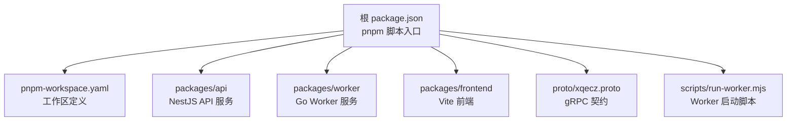
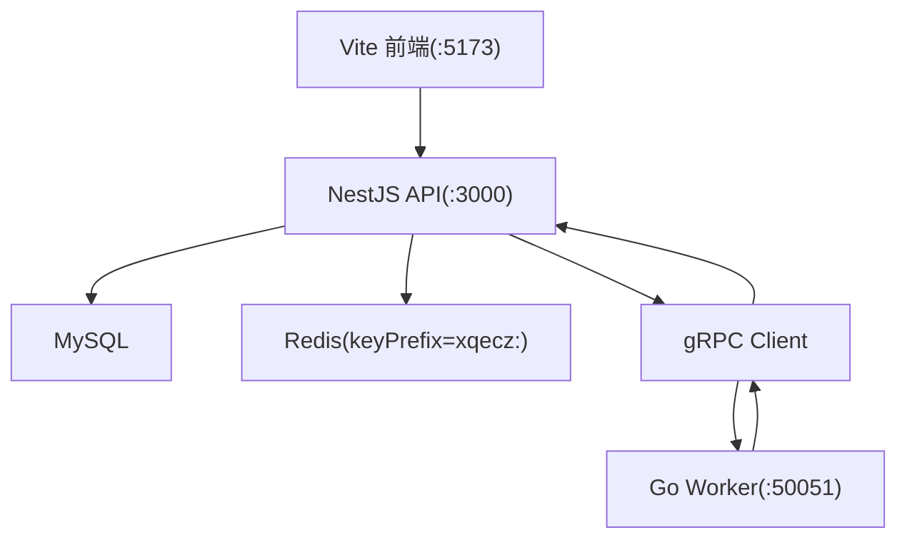
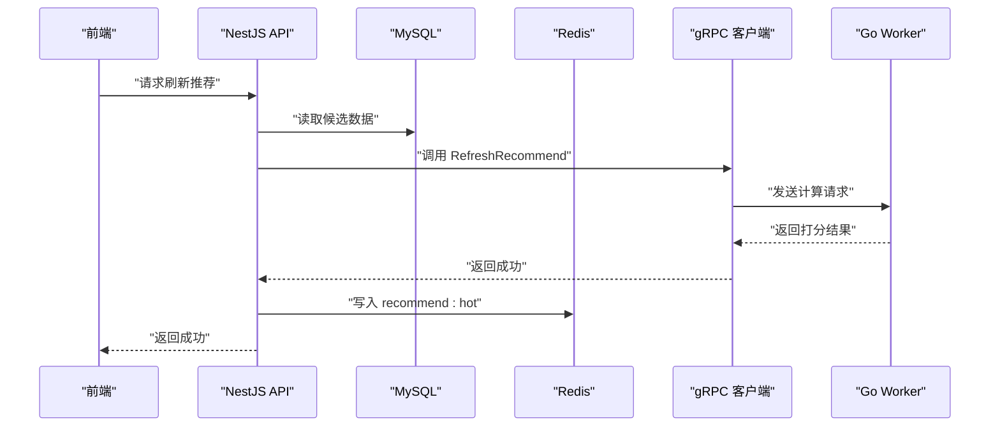
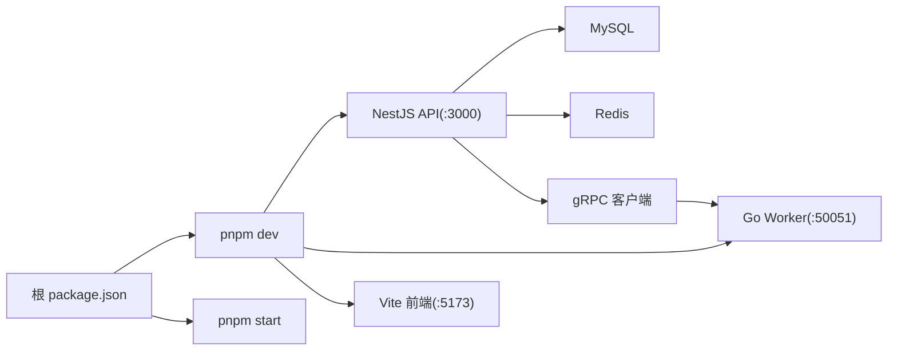

# 开发环境搭建

<cite>
**本文引用的文件**   
- [package.json](file://package.json)
- [pnpm-workspace.yaml](file://pnpm-workspace.yaml)
- [packages/api/.env](file://packages/api/.env)
- [scripts/run-worker.mjs](file://scripts/run-worker.mjs)
- [proto/xqecz.proto](file://proto/xqecz.proto)
- [packages/frontend/src/api/index.ts](file://packages/frontend/src/api/index.ts)
</cite>

## 目录
1. [简介](#简介)
2. [项目结构](#项目结构)
3. [核心组件](#核心组件)
4. [架构总览](#架构总览)
5. [详细组件分析](#详细组件分析)
6. [依赖关系分析](#依赖关系分析)
7. [性能注意事项](#性能注意事项)
8. [故障排查指南](#故障排查指南)
9. [结论](#结论)
10. [附录](#附录)

## 简介
本指南面向 xqecz（小泉动漫二创站）的本地开发与调试，目标是帮助开发者快速搭建可运行的完整环境。项目采用 pnpm monorepo 组织，包含三个服务：NestJS API、Go Worker 与 Vite 前端。生产模式通过统一脚本一键构建并启动所有服务。文档将详细说明环境要求、安装步骤、环境变量配置、各服务端口与启动方式，以及常见问题排查方法。

## 项目结构
xqecz 使用 pnpm workspace 管理多包工程，根目录包含工作区配置与脚本，业务代码分布在 packages 下，协议定义在 proto 目录，脚本位于 scripts 目录。

图表来源
- [package.json:1-200](file://package.json#L1-L200)
- [pnpm-workspace.yaml:1-50](file://pnpm-workspace.yaml#L1-L50)

章节来源
- [package.json:1-200](file://package.json#L1-L200)
- [pnpm-workspace.yaml:1-50](file://pnpm-workspace.yaml#L1-L50)

## 核心组件
- NestJS API（端口 :3000）
  - 负责 HTTP API、数据库与缓存交互、业务编排与 gRPC 客户端调用。
  - 数据源：MySQL、Redis（ioredis keyPrefix=xqecz:）。
  - 上传目录由 UPLOAD_DIR 环境变量指定，单一配置源为 packages/api/.env。
- Go Worker（端口 :50051）
  - 无状态 gRPC 计算服务，不连接数据库或定时任务。
  - 接收来自 API 的数据，执行纯计算后返回结果给 API 落库/写缓存。
- Vite 前端（端口 :5173）
  - 开发时通过代理访问 API 接口；前后端唯一接口契约见 packages/frontend/src/api/index.ts。

章节来源
- [packages/api/.env:1-200](file://packages/api/.env#L1-L200)
- [scripts/run-worker.mjs:1-200](file://scripts/run-worker.mjs#L1-L200)
- [proto/xqecz.proto:1-200](file://proto/xqecz.proto#L1-L200)
- [packages/frontend/src/api/index.ts:1-200](file://packages/frontend/src/api/index.ts#L1-L200)

## 架构总览
下图展示三服务协作关系与数据流向：前端通过 Vite 开发服务器访问 API，API 读写 MySQL/Redis，并在需要时通过 gRPC 调用 Worker 进行计算。

图表来源
- [package.json:1-200](file://package.json#L1-L200)
- [scripts/run-worker.mjs:1-200](file://scripts/run-worker.mjs#L1-L200)
- [proto/xqecz.proto:1-200](file://proto/xqecz.proto#L1-L200)

## 详细组件分析

### 环境与依赖要求
- Node.js：用于运行 pnpm、前端与 API 服务。
- Go：用于编译与运行 Worker。
- MySQL：API 持久化存储。
- Redis：API 缓存与排行榜等场景。
- pnpm：工作区与脚本管理。

安装建议
- 安装 Node.js LTS 版本并配置全局 pnpm。
- 安装 Go 工具链并确保 go.mod 可用。
- 本地启动 MySQL 与 Redis 实例，确保默认端口可达。

章节来源
- [package.json:1-200](file://package.json#L1-L200)

### pnpm workspace 配置与使用
- 工作区定义于根目录 pnpm-workspace.yaml，声明 packages/* 下的子包。
- 根 package.json 提供统一脚本：
  - pnpm dev：启动开发环境（API、Worker、前端）。
  - pnpm start：生产模式一键构建并运行。
- 子包可通过 pnpm 命令在工作区内相互引用与运行。

章节来源
- [pnpm-workspace.yaml:1-50](file://pnpm-workspace.yaml#L1-L50)
- [package.json:1-200](file://package.json#L1-L200)

### 环境变量与上传目录
- 统一配置源：packages/api/.env
- 关键变量：
  - UPLOAD_DIR：上传文件的绝对路径，Worker 通过 gRPC 以绝对路径传递文件位置。
  - 其他数据库与缓存相关变量（如 MySQL/Redis 连接信息）亦在此文件中配置。
- 启动 Worker 时，scripts/run-worker.mjs 会自动读取同一 .env 并注入到 Worker 进程。

章节来源
- [packages/api/.env:1-200](file://packages/api/.env#L1-L200)
- [scripts/run-worker.mjs:1-200](file://scripts/run-worker.mjs#L1-L200)

### 服务启动与端口
- 开发模式：pnpm dev
  - NestJS API 监听 :3000
  - Go Worker 监听 :50051
  - Vite 前端监听 :5173
- 生产模式：pnpm start
  - 构建产物并启动 API、Worker 与前端（按构建配置输出）。

章节来源
- [package.json:1-200](file://package.json#L1-L200)

### gRPC 契约与字段约定
- 契约定义：proto/xqecz.proto
- NestJS 客户端设置 keepCase:true，字段保持 snake_case。
- Worker 为无状态计算服务，仅处理 gRPC 请求并返回结果。

章节来源
- [proto/xqecz.proto:1-200](file://proto/xqecz.proto#L1-L200)

### 前后端接口契约
- 唯一契约文件：packages/frontend/src/api/index.ts
- 响应格式统一为 { code, message, data }。

章节来源
- [packages/frontend/src/api/index.ts:1-200](file://packages/frontend/src/api/index.ts#L1-L200)

### 推荐链路：内容热度刷新
- API 从 MySQL 读取候选内容。
- 通过 gRPC 调用 Worker 执行打分逻辑。
- 结果写入 Redis ZSet recommend:hot（keyPrefix=xqecz:）。
- 读取时若缓存不可用，降级为 view_count 排序。

图表来源
- [package.json:1-200](file://package.json#L1-L200)
- [scripts/run-worker.mjs:1-200](file://scripts/run-worker.mjs#L1-L200)
- [proto/xqecz.proto:1-200](file://proto/xqecz.proto#L1-L200)

## 依赖关系分析
- 根脚本协调三个服务的生命周期与端口。
- API 依赖 MySQL、Redis 与 gRPC 客户端。
- Worker 依赖 gRPC 服务端实现，无外部状态。
- 前端依赖 API 接口契约与开发代理。

图表来源
- [package.json:1-200](file://package.json#L1-L200)

章节来源
- [package.json:1-200](file://package.json#L1-L200)

## 性能注意事项
- 优先使用 Redis 缓存热点数据，减少 MySQL 压力。
- Worker 无状态设计便于水平扩展，可按负载增加实例。
- 删除操作均为软删除，避免频繁物理删除带来的 IO 开销。
- 外部依赖缺失（如 Tinify/S3/FFmpeg/Worker）应做降级处理，保证主流程可用性。

[本节为通用指导，无需特定文件来源]

## 故障排查指南
- 端口冲突
  - 现象：启动失败或端口被占用。
  - 解决：检查 :3000、:50051、:5173 是否被占用，修改端口或释放占用。
- 环境变量未生效
  - 现象：上传路径错误、数据库/缓存连接失败。
  - 解决：确认 packages/api/.env 存在且包含 UPLOAD_DIR 及必要连接信息；确保 Worker 启动脚本能读取该文件。
- gRPC 调用失败
  - 现象：Worker 无法连接或返回异常。
  - 解决：确认 Worker 已启动且监听 :50051；检查 proto 字段命名与 keepCase 设置一致。
- 前端无法访问 API
  - 现象：开发时请求 404 或跨域错误。
  - 解决：检查 Vite 代理配置指向 :3000；确认 API 正常启动。
- 缓存不可用
  - 现象：推荐列表回退到 view_count 排序。
  - 解决：检查 Redis 连接与 keyPrefix 配置；确认 recommend:hot 写入成功。

章节来源
- [packages/api/.env:1-200](file://packages/api/.env#L1-L200)
- [scripts/run-worker.mjs:1-200](file://scripts/run-worker.mjs#L1-L200)
- [proto/xqecz.proto:1-200](file://proto/xqecz.proto#L1-L200)
- [packages/frontend/src/api/index.ts:1-200](file://packages/frontend/src/api/index.ts#L1-L200)

## 结论
通过遵循本指南，开发者可在本地快速搭建 xqecz 的完整开发环境。pnpm 工作区统一管理三个服务，环境变量集中配置，gRPC 契约清晰明确。遇到问题时，依据排查指南定位并解决，即可高效推进功能开发与调试。

[本节为总结性内容，无需特定文件来源]

## 附录
- 常用命令
  - pnpm dev：启动开发环境（API、Worker、前端）。
  - pnpm start：生产模式构建并运行。
- 端口清单
  - NestJS API：:3000
  - Go Worker：:50051
  - Vite 前端：:5173
- 关键文件
  - 工作区配置：pnpm-workspace.yaml
  - 统一脚本：package.json
  - 环境变量：packages/api/.env
  - gRPC 契约：proto/xqecz.proto
  - 接口契约：packages/frontend/src/api/index.ts
  - Worker 启动脚本：scripts/run-worker.mjs

章节来源
- [package.json:1-200](file://package.json#L1-L200)
- [pnpm-workspace.yaml:1-50](file://pnpm-workspace.yaml#L1-L50)
- [packages/api/.env:1-200](file://packages/api/.env#L1-L200)
- [proto/xqecz.proto:1-200](file://proto/xqecz.proto#L1-L200)
- [packages/frontend/src/api/index.ts:1-200](file://packages/frontend/src/api/index.ts#L1-L200)
- [scripts/run-worker.mjs:1-200](file://scripts/run-worker.mjs#L1-L200)