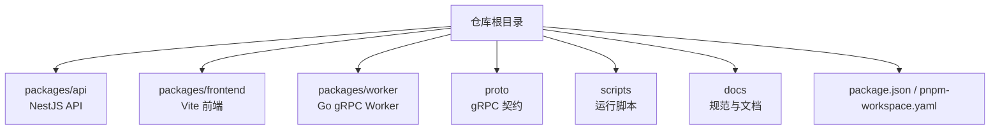
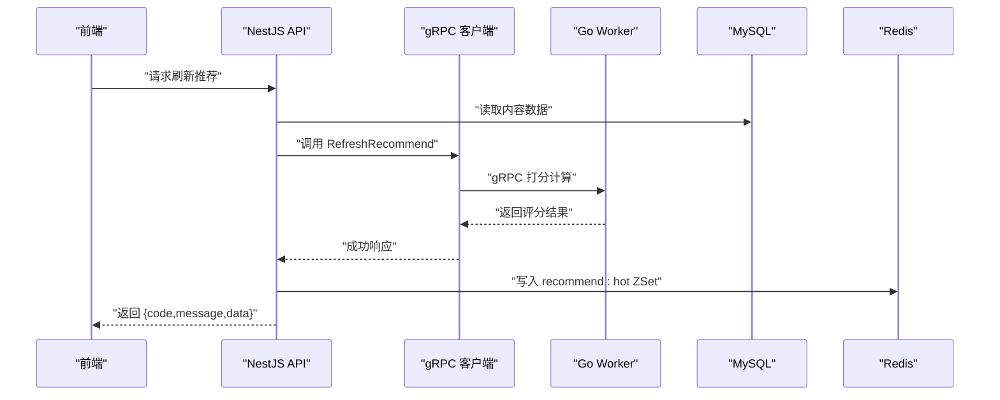
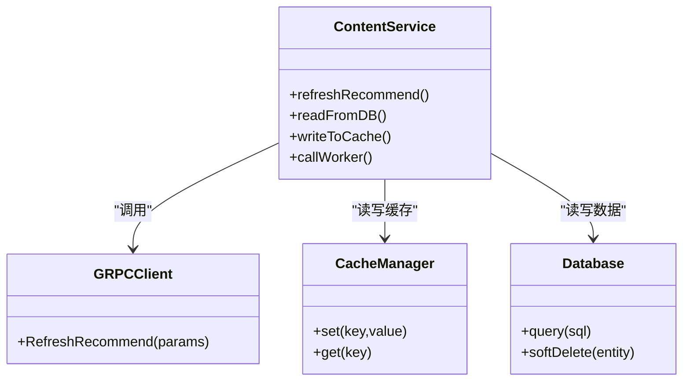
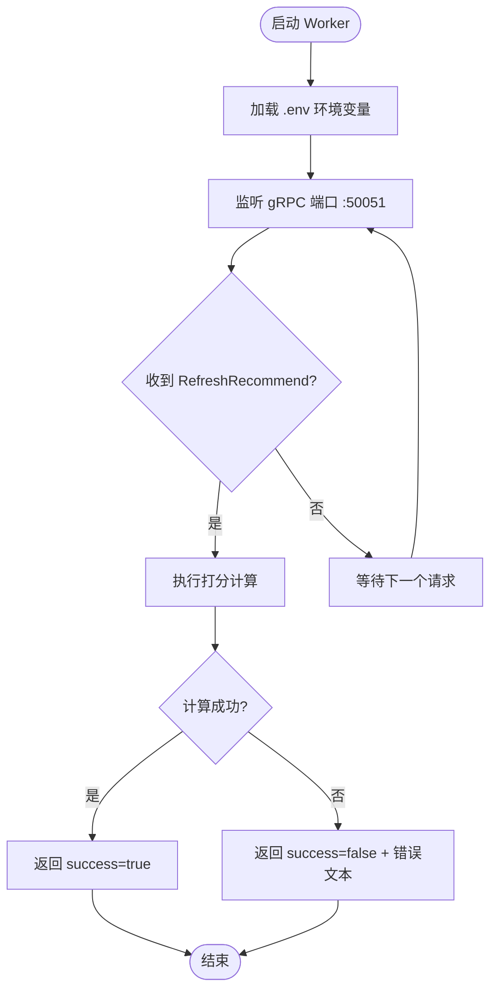
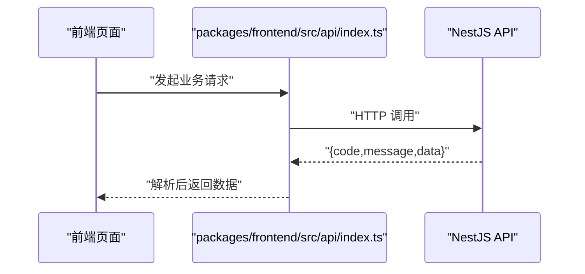

# 开发规范与贡献指南

<cite>
**本文引用的文件**   
- [package.json](file://package.json)
- [pnpm-workspace.yaml](file://pnpm-workspace.yaml)
- [AGENTS.md](file://AGENTS.md)
- [plan.md](file://plan.md)
- [.github/pull_request_template.md](file://.github/pull_request_template.md)
- [docs/code-review.md](file://docs/code-review.md)
- [packages/api/.env](file://packages/api/.env)
- [scripts/run-worker.mjs](file://scripts/run-worker.mjs)
- [proto/xqecz.proto](file://proto/xqecz.proto)
- [packages/frontend/src/api/index.ts](file://packages/frontend/src/api/index.ts)
</cite>

## 目录
1. [简介](#简介)
2. [项目结构](#项目结构)
3. [核心组件](#核心组件)
4. [架构总览](#架构总览)
5. [详细组件分析](#详细组件分析)
6. [依赖与包管理](#依赖与包管理)
7. [代码风格与提交规范](#代码风格与提交规范)
8. [Git 工作流与分支策略](#git-工作流与分支策略)
9. [代码审查与 Pull Request](#代码审查与-pull-request)
10. [问题报告与分类标准](#问题报告与分类标准)
11. [新功能开发与维护规范](#新功能开发与维护规范)
12. [文档更新要求](#文档更新要求)
13. [发布流程](#发布流程)
14. [性能与可靠性要点](#性能与可靠性要点)
15. [故障排查指南](#故障排查指南)
16. [结论](#结论)

## 简介
本指南面向 xqecz（小泉动漫二创站）Monorepo 项目的贡献者，统一开发规范、协作流程与质量保障实践。项目采用 pnpm workspace 组织多包：NestJS API、Go Worker、Vite 前端；通过 gRPC 契约解耦计算服务。所有删除为软删除，外部依赖缺失需降级处理，确保系统高可用。

## 项目结构
- Monorepo 根目录包含全局脚本、配置与文档；packages 下按职责划分 api、frontend、worker；proto 定义 gRPC 契约；scripts 提供本地运行辅助。
- 启动方式：pnpm dev 同时启动 NestJS API(:3000)、Go Worker(:50051)、Vite 前端(:5173)；pnpm start 用于生产构建与运行。

**图示来源** 
- [package.json](file://package.json)
- [pnpm-workspace.yaml](file://pnpm-workspace.yaml)
- [scripts/run-worker.mjs](file://scripts/run-worker.mjs)
- [proto/xqecz.proto](file://proto/xqecz.proto)

**章节来源**
- [package.json](file://package.json)
- [pnpm-workspace.yaml](file://pnpm-workspace.yaml)
- [scripts/run-worker.mjs](file://scripts/run-worker.mjs)

## 核心组件
- NestJS API：负责业务编排、MySQL/Redis 访问、对外 HTTP API、gRPC 客户端调用。
- Go Worker：无状态 gRPC 计算服务，纯打分/计算逻辑，不直连数据库或定时任务。
- Vite 前端：用户界面与交互，通过 packages/frontend/src/api/index.ts 与后端交互。
- gRPC 契约：proto/xqecz.proto 定义接口，NestJS 客户端启用 keepCase:true，字段使用 snake_case。

**章节来源**
- [packages/frontend/src/api/index.ts](file://packages/frontend/src/api/index.ts)
- [proto/xqecz.proto](file://proto/xqecz.proto)

## 架构总览
推荐链路示例：ContentService.refreshRecommend() 读取 MySQL → 经 gRPC RefreshRecommend 由 worker 打分 → API 写入 Redis ZSet recommend:hot（ioredis keyPrefix=xqecz:）→ 读取失败时降级为 view_count 排序。

**图示来源** 
- [packages/frontend/src/api/index.ts](file://packages/frontend/src/api/index.ts)
- [proto/xqecz.proto](file://proto/xqecz.proto)

## 详细组件分析

### NestJS API 组件
- 职责：HTTP 路由、事务编排、缓存与数据库操作、gRPC 客户端封装、错误与降级处理。
- 关键约定：
  - 统一响应格式 { code, message, data }。
  - 所有删除为软删除（deleted_at + TypeORM @DeleteDateColumn）。
  - 外部依赖缺失一律降级，保证可用性。

**图示来源** 
- [packages/frontend/src/api/index.ts](file://packages/frontend/src/api/index.ts)

**章节来源**
- [packages/frontend/src/api/index.ts](file://packages/frontend/src/api/index.ts)

### Go Worker 组件
- 职责：接收 gRPC 参数进行纯计算/打分，不连接数据库、无 cron。
- 启动方式：通过 scripts/run-worker.mjs 启动，自动注入 .env 环境变量。
- 错误处理：不返回 rpc error，仅返回 success=false 与错误文本。

**图示来源** 
- [scripts/run-worker.mjs](file://scripts/run-worker.mjs)
- [proto/xqecz.proto](file://proto/xqecz.proto)

**章节来源**
- [scripts/run-worker.mjs](file://scripts/run-worker.mjs)
- [proto/xqecz.proto](file://proto/xqecz.proto)

### 前端与接口契约
- 唯一接口契约文件：packages/frontend/src/api/index.ts，统一封装请求与响应解析。
- 响应包装格式：{ code, message, data }，前端据此做统一错误提示与数据渲染。

**图示来源** 
- [packages/frontend/src/api/index.ts](file://packages/frontend/src/api/index.ts)

**章节来源**
- [packages/frontend/src/api/index.ts](file://packages/frontend/src/api/index.ts)

## 依赖与包管理
- 包管理器：pnpm workspace，集中管理多包依赖与脚本。
- 共享上传目录：UPLOAD_DIR 环境变量，单一配置源为 packages/api/.env；worker 启动时自动注入同一 .env，路径以绝对路径经 gRPC 传递。
- 依赖更新策略：优先在根 package.json 中声明跨包脚本，各包内按需升级并验证兼容性；变更需附带测试与说明。

**章节来源**
- [pnpm-workspace.yaml](file://pnpm-workspace.yaml)
- [package.json](file://package.json)
- [packages/api/.env](file://packages/api/.env)
- [scripts/run-worker.mjs](file://scripts/run-worker.mjs)

## 代码风格与提交规范
- 代码风格：
  - TypeScript/JavaScript：遵循 ESLint/Prettier（如已配置），保持缩进、分号、引号一致。
  - Go：遵循 gofmt，命名与包结构清晰。
  - 注释：公共函数与复杂逻辑需中文注释说明意图与边界条件。
- 提交信息规范：
  - 类型：feat/fix/docs/style/refactor/perf/test/build/ci/chore/revert
  - 格式：<type>(scope): <subject>
  - 正文：描述动机、影响范围、注意事项
  - 关联：Closes #issue-number
- 示例（不展示具体代码，仅提供路径参考）：
  - 提交模板与规范参见 [AGENTS.md](file://AGENTS.md)

**章节来源**
- [AGENTS.md](file://AGENTS.md)

## Git 工作流与分支策略
- 分支模型：
  - main：稳定版本，仅接受合并后的发布分支
  - develop：集成开发分支
  - feature/*：功能分支
  - fix/*：修复分支
  - release/*：预发布分支
  - hotfix/*：紧急修复分支
- 工作流：
  - 从 develop 拉取 feature/*，完成后提交 PR 到 develop
  - 经过代码审查与 CI 通过后合并
  - 发布前创建 release/*，打 tag 并合并至 main

**章节来源**
- [plan.md](file://plan.md)

## 代码审查与 Pull Request
- 审查清单：
  - 功能正确性与边界条件
  - 性能与资源占用
  - 安全与权限控制
  - 日志与可观测性
  - 文档与注释完整性
- PR 模板：使用 .github/pull_request_template.md 填写变更背景、影响范围、测试情况与回滚方案。
- 审查流程：至少一名 Maintainer 批准后方可合并；CI 必须全部通过。

**章节来源**
- [.github/pull_request_template.md](file://.github/pull_request_template.md)
- [docs/code-review.md](file://docs/code-review.md)

## 问题报告与分类标准
- Issue 分类：
  - bug：功能异常或崩溃
  - feature：新功能需求
  - improvement：现有功能优化
  - docs：文档修正与补充
  - question：使用咨询
- 报告模板：
  - 环境信息：操作系统、Node/Go 版本、浏览器
  - 复现步骤：最小化步骤与期望行为
  - 日志与截图：关键日志片段与界面截图
  - 影响范围：受影响模块与用户群体

**章节来源**
- [AGENTS.md](file://AGENTS.md)

## 新功能开发与维护规范
- 新功能：
  - 明确需求与验收标准
  - 设计接口与数据模型，更新 proto 契约（如需）
  - 编写单元测试与集成测试
  - 更新相关文档与示例
- 现有功能维护：
  - 优先兼容与降级策略
  - 避免破坏性变更，必要时通过版本演进
  - 清理技术债与冗余代码

**章节来源**
- [proto/xqecz.proto](file://proto/xqecz.proto)
- [AGENTS.md](file://AGENTS.md)

## 文档更新要求
- 文档位置：docs/ 与仓库根 README（如有）
- 更新时机：接口变更、部署方式变化、重要配置调整
- 审核要求：PR 中需包含文档变更说明与影响评估

**章节来源**
- [docs/code-review.md](file://docs/code-review.md)

## 发布流程
- 版本规划：里程碑与特性冻结
- 构建与测试：pnpm build 与全量测试通过
- 打包与制品：生成 Docker 镜像（如适用）或二进制产物
- 发布与回滚：打 tag、发布说明、灰度发布与快速回滚预案

**章节来源**
- [plan.md](file://plan.md)

## 性能与可靠性要点
- 缓存策略：推荐热点数据写入 Redis ZSet，读取失败降级为视图数排序
- 软删除：统一 deleted_at 过滤，避免物理删除导致的数据不一致
- 外部依赖：S3/Tinify/FFmpeg/Worker 缺失时降级，保证主流程可用
- 监控与告警：关键指标埋点与错误率阈值告警

**章节来源**
- [packages/frontend/src/api/index.ts](file://packages/frontend/src/api/index.ts)

## 故障排查指南
- 常见问题：
  - gRPC 连接失败：检查 Worker 是否启动、端口与网络可达
  - 上传失败：确认 UPLOAD_DIR 权限与磁盘空间
  - 缓存异常：检查 Redis 连通性与 keyPrefix 配置
- 定位方法：
  - 查看 API 与 Worker 日志
  - 使用调试工具抓包 gRPC 请求
  - 逐步禁用外部依赖验证降级路径

**章节来源**
- [scripts/run-worker.mjs](file://scripts/run-worker.mjs)
- [packages/api/.env](file://packages/api/.env)

## 结论
本指南为 xqecz Monorepo 的统一开发规范与协作流程，涵盖代码风格、Git 工作流、代码审查、包管理与发布流程。新贡献者可据此快速上手，老成员可借此对齐最佳实践，共同提升项目质量与交付效率。