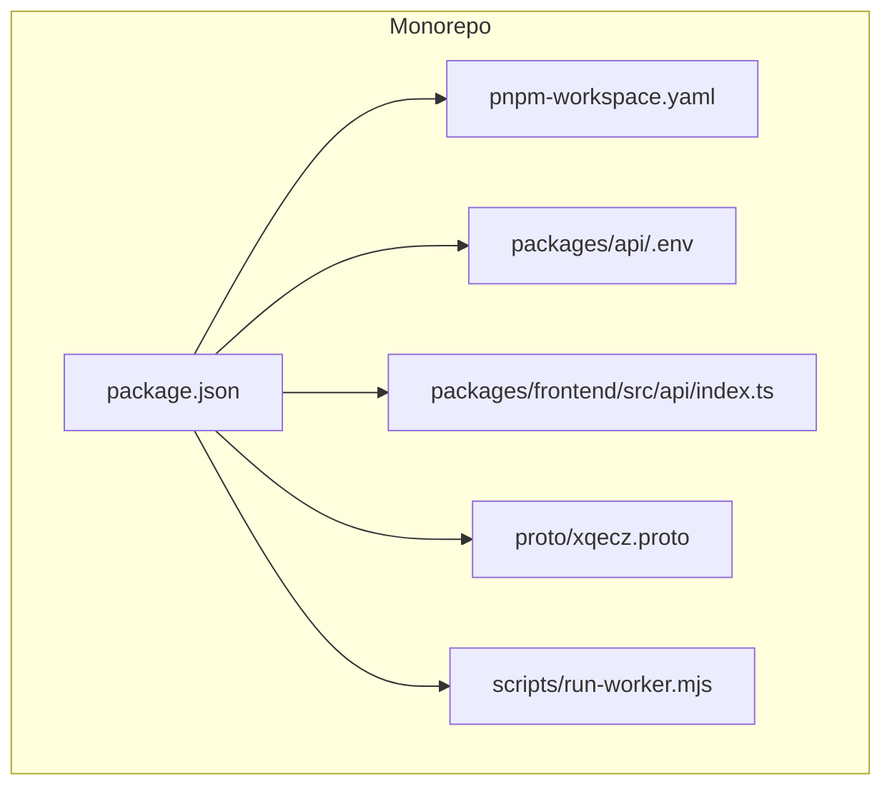
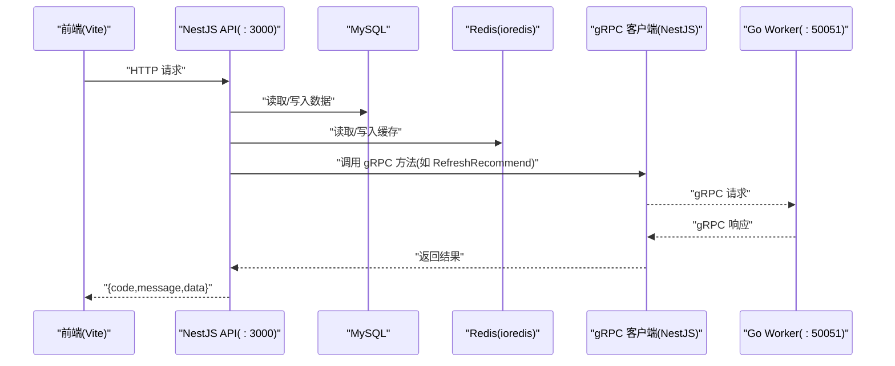
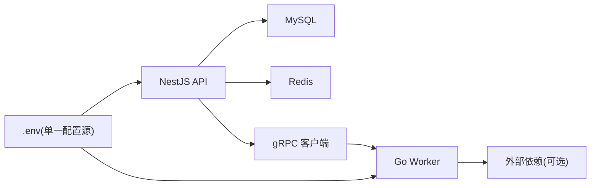

# 故障排查与调试

<cite>
**本文引用的文件**   
- [packages/api/.env](file://packages/api/.env)
- [packages/frontend/src/api/index.ts](file://packages/frontend/src/api/index.ts)
- [proto/xqecz.proto](file://proto/xqecz.proto)
- [scripts/run-worker.mjs](file://scripts/run-worker.mjs)
- [package.json](file://package.json)
- [pnpm-workspace.yaml](file://pnpm-workspace.yaml)
</cite>

## 目录
1. [简介](#简介)
2. [项目结构](#项目结构)
3. [核心组件](#核心组件)
4. [架构总览](#架构总览)
5. [详细组件分析](#详细组件分析)
6. [依赖关系分析](#依赖关系分析)
7. [性能考量](#性能考量)
8. [故障排查指南](#故障排查指南)
9. [结论](#结论)
10. [附录](#附录)

## 简介
本指南面向 xqecz 平台（小泉动漫二创站）的运维、开发与测试人员，聚焦于本地直启模式下的常见问题定位与解决。内容覆盖服务启动失败、gRPC 连接问题、数据库连接异常、日志收集与查看、调试工具使用、性能分析与内存泄漏检测、降级机制触发与恢复策略，以及环境变量配置错误的排查方法与常见陷阱。

## 项目结构
xqecz 为 monorepo，采用 pnpm workspace 组织代码。当前运行方式仅支持本地直启：通过 pnpm dev 同时启动 NestJS API（默认 :3000）、Go Worker gRPC 服务（默认 :50051）、Vite 前端（默认 :5173）。生产模式使用 pnpm start 进行一键构建与运行。

- 入口脚本与命令定义位于根目录 package.json；工作区配置在 pnpm-workspace.yaml。
- 共享上传目录由 UPLOAD_DIR 环境变量约定，单一配置源为 packages/api/.env；worker 经 scripts/run-worker.mjs 启动时自动读取同一 .env 注入，文件路径以绝对路径经 gRPC 传递。
- 前后端接口契约统一封装在 packages/frontend/src/api/index.ts，响应格式为 { code, message, data }。
- gRPC 契约定义在 proto/xqecz.proto；NestJS 客户端启用 keepCase:true，字段名保持 snake_case。

图表来源
- [package.json:1-200](file://package.json#L1-L200)
- [pnpm-workspace.yaml:1-200](file://pnpm-workspace.yaml#L1-L200)
- [packages/api/.env:1-200](file://packages/api/.env#L1-L200)
- [packages/frontend/src/api/index.ts:1-200](file://packages/frontend/src/api/index.ts#L1-L200)
- [proto/xqecz.proto:1-200](file://proto/xqecz.proto#L1-L200)
- [scripts/run-worker.mjs:1-200](file://scripts/run-worker.mjs#L1-L200)

章节来源
- [package.json:1-200](file://package.json#L1-L200)
- [pnpm-workspace.yaml:1-200](file://pnpm-workspace.yaml#L1-L200)

## 核心组件
- NestJS API 服务
  - 负责 HTTP 接口、MySQL/Redis 访问、gRPC 客户端调用、缓存读写、业务编排。
  - 关键链路示例：ContentService.refreshRecommend() 读 MySQL → gRPC RefreshRecommend 由 worker 纯打分 → api 写 Redis ZSet recommend:hot（ioredis keyPrefix=xqecz:）；读取降级为 view_count 排序。
- Go Worker 服务
  - 无状态 gRPC 计算服务，不连数据库、无 cron；数据经 gRPC 从 NestJS 传入，结果回传 NestJS 落库/写缓存。
- Vite 前端
  - 通过 packages/frontend/src/api/index.ts 发起 API 请求，统一处理 { code, message, data } 响应。

章节来源
- [packages/api/.env:1-200](file://packages/api/.env#L1-L200)
- [packages/frontend/src/api/index.ts:1-200](file://packages/frontend/src/api/index.ts#L1-L200)
- [proto/xqecz.proto:1-200](file://proto/xqecz.proto#L1-L200)
- [scripts/run-worker.mjs:1-200](file://scripts/run-worker.mjs#L1-L200)

## 架构总览
下图展示本地直启模式下各组件交互关系与数据流向。

图表来源
- [packages/api/.env:1-200](file://packages/api/.env#L1-L200)
- [packages/frontend/src/api/index.ts:1-200](file://packages/frontend/src/api/index.ts#L1-L200)
- [proto/xqecz.proto:1-200](file://proto/xqecz.proto#L1-L200)
- [scripts/run-worker.mjs:1-200](file://scripts/run-worker.mjs#L1-L200)

## 详细组件分析

### NestJS API 服务
- 职责
  - HTTP 路由与控制器、服务层编排、数据库与缓存操作、gRPC 客户端调用、错误与降级处理。
- 关键行为
  - 推荐刷新链路：读取 MySQL → 调用 gRPC RefreshRecommend → 写 Redis ZSet recommend:hot（keyPrefix=xqecz:）→ 读取时若缓存不可用则降级为按 view_count 排序。
  - 所有删除均为软删除（TypeORM @DeleteDateColumn），外部依赖缺失一律降级。
- 调试要点
  - 检查 .env 中数据库与 Redis 连接参数是否正确。
  - 观察 gRPC 客户端配置（keepCase:true、字段 snake_case）是否匹配 proto 定义。
  - 关注 ioredis 的 keyPrefix 与命名空间隔离。

章节来源
- [packages/api/.env:1-200](file://packages/api/.env#L1-L200)
- [proto/xqecz.proto:1-200](file://proto/xqecz.proto#L1-L200)

### Go Worker 服务
- 职责
  - 无状态 gRPC 计算服务，执行纯打分逻辑，不直接访问数据库或定时任务。
- 关键行为
  - 接收 NestJS 传入的数据，计算后返回结果；若外部依赖（如 FFmpeg/Tinify/S3）缺失，返回 success=false + error 文本，不抛 rpc error。
- 调试要点
  - 确认端口 :50051 可被 NestJS 访问。
  - 检查上传目录绝对路径是否正确（经 gRPC 传递）。
  - 观察日志输出，定位计算耗时与异常分支。

章节来源
- [proto/xqecz.proto:1-200](file://proto/xqecz.proto#L1-L200)
- [scripts/run-worker.mjs:1-200](file://scripts/run-worker.mjs#L1-L200)

### 前端接口契约
- 职责
  - 统一封装 API 请求与响应解析，确保 { code, message, data } 格式一致。
- 关键行为
  - 根据 code 判断成功与否，message 用于提示，data 承载业务数据。
- 调试要点
  - 浏览器开发者工具 Network 面板查看请求与响应。
  - 校验后端返回是否符合契约，便于快速定位问题来源。

章节来源
- [packages/frontend/src/api/index.ts:1-200](file://packages/frontend/src/api/index.ts#L1-L200)

## 依赖关系分析
- 运行时依赖
  - NestJS 依赖 MySQL、Redis、gRPC 客户端。
  - Worker 依赖 gRPC 服务端与外部媒体处理工具（可选，缺失即降级）。
- 配置依赖
  - 单一配置源 packages/api/.env 控制数据库、缓存、上传目录等。
  - scripts/run-worker.mjs 启动时读取同一 .env 注入环境变量。
- 契约依赖
  - proto/xqecz.proto 定义 gRPC 消息与服务；NestJS 客户端需保持字段命名一致。

图表来源
- [packages/api/.env:1-200](file://packages/api/.env#L1-L200)
- [scripts/run-worker.mjs:1-200](file://scripts/run-worker.mjs#L1-L200)
- [proto/xqecz.proto:1-200](file://proto/xqecz.proto#L1-L200)

章节来源
- [packages/api/.env:1-200](file://packages/api/.env#L1-L200)
- [scripts/run-worker.mjs:1-200](file://scripts/run-worker.mjs#L1-L200)
- [proto/xqecz.proto:1-200](file://proto/xqecz.proto#L1-L200)

## 性能考量
- 缓存优先
  - 推荐列表优先从 Redis ZSet recommend:hot 读取，miss 时再回源 MySQL 并重建缓存。
- 计算卸载
  - 高耗时打分逻辑下沉至 Go Worker，避免阻塞 API 主线程。
- 资源隔离
  - ioredis keyPrefix=xqecz: 避免键冲突与误删。
- 监控建议
  - 记录 gRPC 调用耗时、MySQL 慢查询、Redis 命中率与延迟。
  - 对 Worker 计算过程打点，识别热点路径与瓶颈。

[本节为通用指导，无需引用具体文件]

## 故障排查指南

### 服务启动失败
- 症状
  - pnpm dev 无法同时拉起 API、Worker、Frontend；或某一进程立即退出。
- 诊断步骤
  - 检查端口占用：:3000（API）、:50051（Worker）、:5173（Frontend）。
  - 验证 Node/Go 环境版本与 pnpm 安装。
  - 查看控制台输出与日志，定位报错堆栈。
  - 确认 .env 存在且语法正确（无多余空格、引号匹配）。
- 解决方案
  - 释放端口或修改端口映射。
  - 修复 .env 语法错误。
  - 重新安装依赖并清理缓存后重试。

章节来源
- [package.json:1-200](file://package.json#L1-L200)
- [packages/api/.env:1-200](file://packages/api/.env#L1-L200)

### gRPC 连接问题
- 症状
  - API 调用 gRPC 超时、连接拒绝、协议不匹配。
- 诊断步骤
  - 确认 Worker 已监听 :50051 并可被本机访问。
  - 检查 proto 定义与客户端 keepCase:true、字段 snake_case 一致性。
  - 使用 gRPC 调试工具（如 grpcurl）直接调用服务方法，验证连通性。
- 解决方案
  - 重启 Worker 并确保防火墙放行端口。
  - 修正 proto 字段命名或客户端配置。
  - 增加超时与重试策略，提升鲁棒性。

章节来源
- [proto/xqecz.proto:1-200](file://proto/xqecz.proto#L1-L200)
- [scripts/run-worker.mjs:1-200](file://scripts/run-worker.mjs#L1-L200)

### 数据库连接异常
- 症状
  - NestJS 启动时报 MySQL 连接失败、权限不足、字符集不匹配。
- 诊断步骤
  - 检查 .env 中的数据库主机、端口、用户名、密码、库名。
  - 使用命令行客户端直连数据库验证凭据与网络可达性。
  - 查看 TypeORM 初始化日志与错误码。
- 解决方案
  - 修正连接参数，确保账号具备必要权限。
  - 调整字符集与排序规则，必要时重建库表。
  - 增加连接池参数与重连策略。

章节来源
- [packages/api/.env:1-200](file://packages/api/.env#L1-L200)

### 缓存连接异常
- 症状
  - Redis 连接失败、认证失败、键前缀不一致导致数据错乱。
- 诊断步骤
  - 检查 .env 中 Redis 地址、端口、密码、db 索引。
  - 确认 ioredis keyPrefix=xqecz: 设置生效。
  - 使用 redis-cli 直连验证连通性与键空间。
- 解决方案
  - 修正连接参数与权限。
  - 清理或迁移旧键，确保命名空间隔离。

章节来源
- [packages/api/.env:1-200](file://packages/api/.env#L1-L200)

### 前端网络请求异常
- 症状
  - 页面加载失败、接口返回非预期格式、跨域错误。
- 诊断步骤
  - 打开浏览器开发者工具 Network 面板，查看请求 URL、状态码、响应体。
  - 确认后端返回符合 { code, message, data } 契约。
  - 检查代理与 CORS 配置（如使用开发代理）。
- 解决方案
  - 修正后端响应格式与错误码语义。
  - 调整代理与跨域策略。
  - 在前端增加错误边界与用户提示。

章节来源
- [packages/frontend/src/api/index.ts:1-200](file://packages/frontend/src/api/index.ts#L1-L200)

### 日志收集与查看
- NestJS 日志
  - 使用控制台输出与日志级别过滤；结合 Winston/Pino（若使用）集中采集。
- Go Worker 日志
  - 标准输出到控制台；可通过脚本捕获并滚动归档。
- 前端网络日志
  - 浏览器开发者工具 Network 面板；可导出 HAR 文件供离线分析。
- 建议
  - 统一日志格式（时间戳、级别、模块、traceId）。
  - 将关键链路埋点（API 入口、gRPC 调用、缓存命中/未命中）。

[本节为通用指导，无需引用具体文件]

### 调试工具使用
- 浏览器开发者工具
  - Network、Console、Performance、Memory 面板组合使用，定位渲染与请求问题。
- Postman / curl
  - 构造 HTTP 请求验证 API 行为；配合环境变量批量测试。
- gRPC 调试工具
  - 使用 grpcurl 或 IDE 插件直接调用 proto 定义的方法，验证 Worker 行为。
- 性能分析
  - Node.js：使用 --inspect 与 Chrome DevTools 分析 CPU/内存。
  - Go：pprof 采集 CPU/内存/阻塞分析，生成火焰图。

[本节为通用指导，无需引用具体文件]

### 性能分析与内存泄漏检测
- 指标采集
  - API 响应时间、P95/P99、错误率；Worker 计算耗时分布；Redis 命中率与延迟。
- 内存泄漏定位
  - Node.js：heap snapshot 对比增长趋势，定位未释放引用。
  - Go：pprof heap 采样，结合 goroutine 分析泄露路径。
- 优化建议
  - 减少大对象分配与频繁 GC；合理使用连接池与缓冲。
  - 对热点路径加缓存与异步化，降低同步阻塞。

[本节为通用指导，无需引用具体文件]

### 降级机制触发条件与恢复策略
- 触发条件
  - gRPC 调用失败或超时：返回 success=false + error 文本，API 侧降级为按 view_count 排序。
  - 外部依赖缺失（Tinify/S3/FFmpeg）：跳过增强处理，保留基础功能。
  - 缓存不可用：回源数据库并重建缓存。
- 恢复策略
  - 自动重试与退避；熔断后快速失败，等待健康检查恢复。
  - 人工介入：修复依赖后主动刷新缓存与推荐列表。

章节来源
- [packages/api/.env:1-200](file://packages/api/.env#L1-L200)
- [proto/xqecz.proto:1-200](file://proto/xqecz.proto#L1-L200)

### 环境变量配置错误排查与常见陷阱
- 常见错误
  - .env 语法错误（缺少引号、换行符、注释位置不当）。
  - 路径变量未转义或相对路径导致 Worker 找不到上传目录。
  - 数据库/Redis 凭据错误或端口不通。
- 排查步骤
  - 逐条核对 .env 键值，确保与代码读取一致。
  - 使用最小可用配置逐步添加，定位问题项。
  - 打印关键环境变量（脱敏）辅助定位。
- 常见陷阱
  - 多环境混用导致配置污染。
  - 大小写敏感差异（Windows vs Linux）。
  - 特殊字符未正确转义。

章节来源
- [packages/api/.env:1-200](file://packages/api/.env#L1-L200)
- [scripts/run-worker.mjs:1-200](file://scripts/run-worker.mjs#L1-L200)

## 结论
通过统一的配置源、清晰的 gRPC 契约与完善的降级策略，xqecz 平台在本地直启模式下具备良好的可观测性与可维护性。遵循本指南的诊断流程与最佳实践，可快速定位并解决常见问题，保障系统稳定运行。

[本节为总结性内容，无需引用具体文件]

## 附录
- 常用命令
  - 本地开发：pnpm dev
  - 生产构建与运行：pnpm start
- 参考文件
  - 工作区与脚本：package.json、pnpm-workspace.yaml
  - 配置与契约：packages/api/.env、proto/xqecz.proto、packages/frontend/src/api/index.ts、scripts/run-worker.mjs

[本节为补充信息，无需引用具体文件]