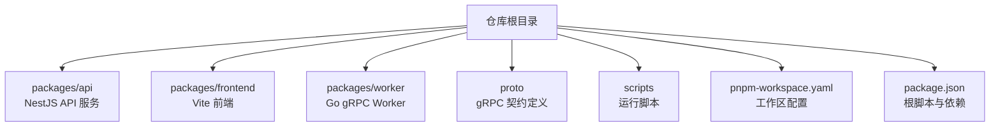
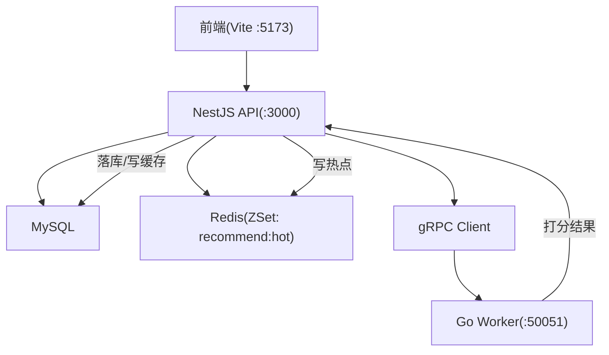
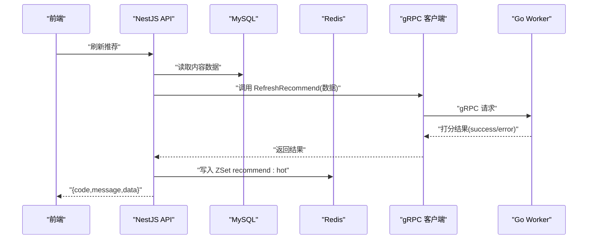
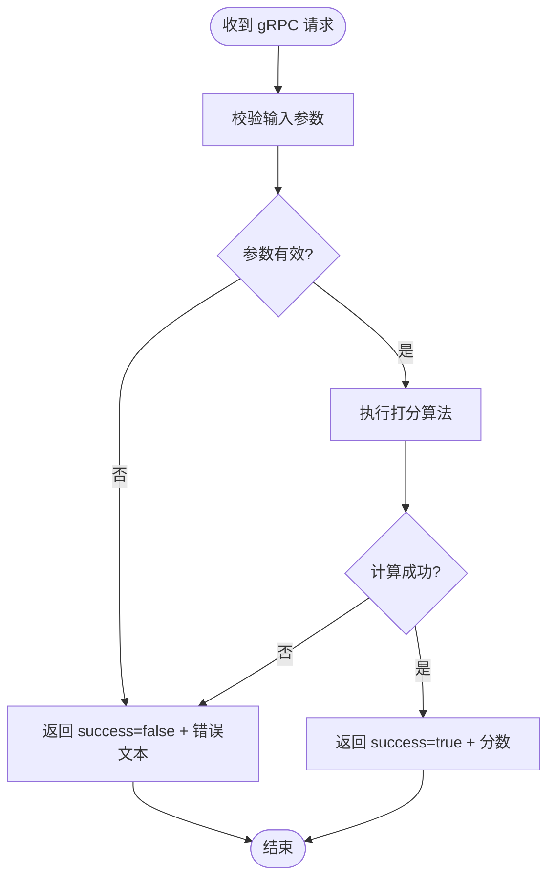
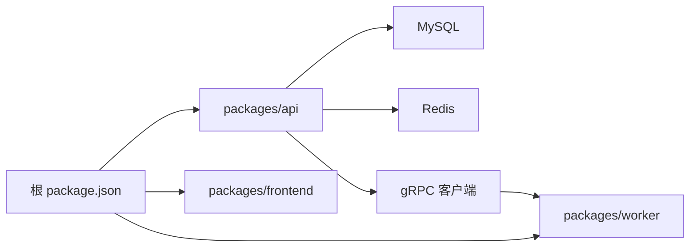

# 微服务架构

<cite>
**本文引用的文件**   
- [package.json](file://package.json)
- [pnpm-workspace.yaml](file://pnpm-workspace.yaml)
- [plan.md](file://plan.md)
- [AGENTS.md](file://AGENTS.md)
- [xqecz.proto](file://proto/xqecz.proto)
- [run-worker.mjs](file://scripts/run-worker.mjs)
</cite>

## 目录
1. [简介](#简介)
2. [项目结构](#项目结构)
3. [核心组件](#核心组件)
4. [架构总览](#架构总览)
5. [详细组件分析](#详细组件分析)
6. [依赖关系分析](#依赖关系分析)
7. [性能考量](#性能考量)
8. [故障排查指南](#故障排查指南)
9. [结论](#结论)
10. [附录](#附录)

## 简介
本文件面向 xqecz（小泉动漫二创站）的微服务架构，聚焦以下目标：
- 明确 NestJS API 服务作为主入口的职责边界与编排能力，包括请求处理、业务编排、数据库访问与缓存策略。
- 阐述 Go gRPC Worker 的无状态计算定位，专注推荐算法打分等计算密集型任务。
- 说明 monorepo 下 pnpm workspace 的包管理策略、各服务间依赖与版本治理。
- 解释服务发现、负载均衡与服务间通信协议的选择依据。
- 提供微服务架构图，展示职责边界、数据流向与故障隔离机制。

## 项目结构
仓库采用 monorepo 组织，根目录通过 pnpm workspace 统一管理前端、API 与 Worker 三个子包，并通过脚本统一启动开发/生产流程。Proto 定义集中存放于 proto 目录，供 NestJS 客户端与 Go Worker 共同消费。

**图表来源**
- [pnpm-workspace.yaml](file://pnpm-workspace.yaml)
- [package.json](file://package.json)

**章节来源**
- [pnpm-workspace.yaml](file://pnpm-workspace.yaml)
- [package.json](file://package.json)

## 核心组件
- NestJS API 服务
  - 职责：HTTP 接口网关、业务编排、MySQL/Redis 读写、对外错误码包装、调用 gRPC Worker。
  - 关键特性：统一响应格式 { code, message, data }；软删除由 ORM 自动过滤；外部依赖缺失降级；推荐热点写入 Redis ZSet 并支持回退排序。
- Go gRPC Worker
  - 职责：无状态计算服务，接收 NestJS 传入的数据进行纯打分计算，返回结果给 NestJS 落库或写缓存。
  - 关键特性：不直连数据库、无定时任务；gRPC 失败不抛 rpc error，返回 success=false 与错误文本。
- Proto 契约
  - 职责：定义 gRPC 方法与消息结构，NestJS 客户端开启 keepCase:true，字段使用 snake_case。
- 运行脚本
  - 职责：统一读取 .env 注入环境变量，按约定路径启动 Worker，确保上传目录等配置一致。

**章节来源**
- [xqecz.proto](file://proto/xqecz.proto)
- [run-worker.mjs](file://scripts/run-worker.mjs)
- [AGENTS.md](file://AGENTS.md)
- [plan.md](file://plan.md)

## 架构总览
下图展示了 xqecz 微服务整体架构：NestJS 作为 HTTP 网关与业务编排中心，负责 MySQL/Redis 操作与 gRPC 调用；Go Worker 作为无状态计算节点执行推荐打分；前端通过 Vite 开发服务器与 API 交互。

**图表来源**
- [xqecz.proto](file://proto/xqecz.proto)
- [run-worker.mjs](file://scripts/run-worker.mjs)
- [package.json](file://package.json)

## 详细组件分析

### NestJS API 服务
- 请求处理与编排
  - 统一响应包装为 { code, message, data }，保证前后端契约一致性。
  - 业务编排层协调数据库、缓存与 gRPC Worker，实现高内聚低耦合。
- 数据库与缓存
  - 独占 MySQL 与 Redis 访问权限；所有删除均为软删除（deleted_at + TypeORM @DeleteDateColumn）。
  - 推荐热点写入 Redis ZSet（keyPrefix=xqecz:），读取时若热点不可用则降级为 view_count 排序。
- gRPC 调用
  - 通过 NestJS gRPC 客户端调用 Worker，保持字段命名风格（snake_case），开启 keepCase:true。
  - 对 Worker 的调用遵循“成功/失败”语义，失败不抛 rpc error，仅返回 success=false 与错误文本。
- 推荐链路
  - ContentService.refreshRecommend() 从 MySQL 读取内容，经 gRPC RefreshRecommend 由 Worker 打分，最终将热点写入 Redis ZSet。

**图表来源**
- [xqecz.proto](file://proto/xqecz.proto)
- [run-worker.mjs](file://scripts/run-worker.mjs)

**章节来源**
- [AGENTS.md](file://AGENTS.md)
- [plan.md](file://plan.md)

### Go gRPC Worker
- 无状态计算服务
  - 不连接数据库、无 cron；输入数据由 NestJS 通过 gRPC 传递，输出打分结果。
- 错误处理
  - 不抛出 rpc error，而是返回 success=false 与错误文本，便于 NestJS 统一降级与记录。
- 启动与环境
  - 通过 scripts/run-worker.mjs 启动，自动读取同一 .env 注入环境变量（如 UPLOAD_DIR），确保文件路径一致。

**图表来源**
- [xqecz.proto](file://proto/xqecz.proto)
- [run-worker.mjs](file://scripts/run-worker.mjs)

**章节来源**
- [AGENTS.md](file://AGENTS.md)
- [plan.md](file://plan.md)

### Proto 契约与字段命名
- 契约位置：proto/xqecz.proto
- 字段命名：NestJS 客户端开启 keepCase:true，字段使用 snake_case，确保跨语言一致性。
- 生成产物：proto/gen 与 packages/worker/proto 为自动生成代码，不应视为手写源码。

**章节来源**
- [xqecz.proto](file://proto/xqecz.proto)

### 运行脚本与环境变量
- 统一启动：pnpm dev 同时启动 NestJS API(:3000)、Go Worker(:50051)、Vite 前端(:5173)。
- 环境变量：单一配置源为 packages/api/.env；Worker 启动脚本自动读取并注入，确保 UPLOAD_DIR 等路径一致。
- 绝对路径：文件路径经 gRPC 以绝对路径传递，避免路径不一致导致的 I/O 异常。

**章节来源**
- [run-worker.mjs](file://scripts/run-worker.mjs)
- [AGENTS.md](file://AGENTS.md)

## 依赖关系分析
- Monorepo 与包管理
  - 使用 pnpm workspace 统一管理 packages/api、packages/frontend、packages/worker。
  - 根 package.json 提供统一脚本（dev/start），简化多服务联调与构建。
- 服务间依赖
  - NestJS 依赖 MySQL、Redis、gRPC 客户端；Worker 无外部存储依赖，仅依赖 gRPC 运行时。
  - 前端依赖 API 接口契约（packages/frontend/src/api/index.ts），作为唯一接口契约。
- 版本治理
  - 通过 pnpm workspace 锁定依赖版本，避免漂移；共享依赖在根级声明，子包复用。

**图表来源**
- [package.json](file://package.json)
- [pnpm-workspace.yaml](file://pnpm-workspace.yaml)

**章节来源**
- [package.json](file://package.json)
- [pnpm-workspace.yaml](file://pnpm-workspace.yaml)

## 性能考量
- 热点缓存
  - 推荐热点写入 Redis ZSet（recommend:hot），读路径优先命中缓存，未命中时降级为 view_count 排序，保障可用性。
- 无状态 Worker
  - Worker 无状态设计利于水平扩展与弹性伸缩，适合承载计算密集型任务。
- 软删除与查询优化
  - 全表软删除由 ORM 自动过滤，减少业务侧条件复杂度；建议对高频查询字段建立索引。
- 外部依赖降级
  - Tinify/S3/FFmpeg/Worker 缺失时一律降级，避免级联故障影响主流程。

[本节为通用性能指导，不直接分析具体文件]

## 故障排查指南
- gRPC 调用失败
  - 检查 Worker 是否正常运行（端口 :50051）、环境变量是否正确注入（UPLOAD_DIR 等）。
  - 确认 gRPC 字段命名与 keepCase:true 设置一致。
- 推荐热点异常
  - 检查 Redis 连接与 keyPrefix（xqecz:）是否正确；确认 ZSet 写入逻辑与降级排序生效。
- 软删除问题
  - 确认 TypeORM @DeleteDateColumn 配置正确，查询是否被自动过滤 deleted_at。
- 外部依赖缺失
  - 确认 Tinify/S3/FFmpeg/Worker 可用；缺失时应触发降级逻辑而非中断流程。

**章节来源**
- [AGENTS.md](file://AGENTS.md)
- [plan.md](file://plan.md)

## 结论
xqecz 平台采用清晰的微服务分层：NestJS API 作为统一入口与业务编排中心，Go Worker 作为无状态计算服务专注推荐打分。monorepo 与 pnpm workspace 提供了统一的依赖管理与脚本编排，proto 契约保障了跨语言一致性。通过热点缓存、软删除与外部依赖降级，系统在可用性与可维护性上取得平衡。未来可在服务发现与负载均衡层面进一步增强弹性与可观测性。

[本节为总结性内容，不直接分析具体文件]

## 附录
- 部署与运行
  - 开发模式：pnpm dev 启动 API(:3000)、Worker(:50051)、前端(:5173)。
  - 生产模式：pnpm start 一键构建与运行。
- 接口契约
  - 前后端唯一接口契约位于 packages/frontend/src/api/index.ts，响应统一为 { code, message, data }。
- 环境配置
  - 单一配置源：packages/api/.env；Worker 启动脚本自动读取并注入环境变量。

**章节来源**
- [package.json](file://package.json)
- [AGENTS.md](file://AGENTS.md)
- [plan.md](file://plan.md)