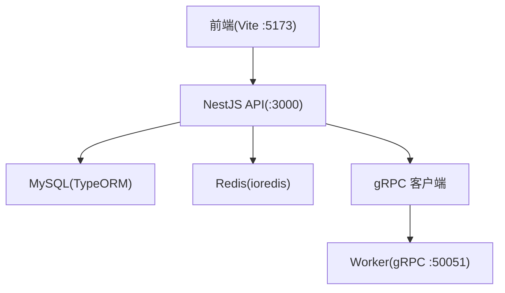
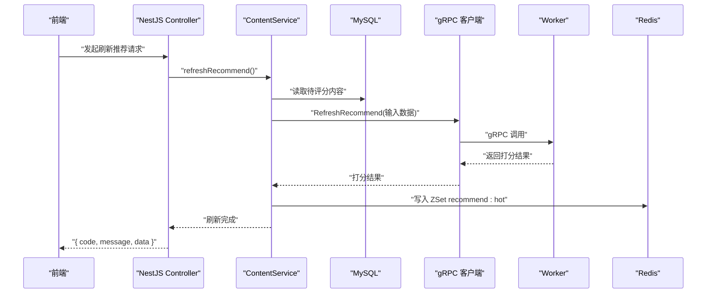
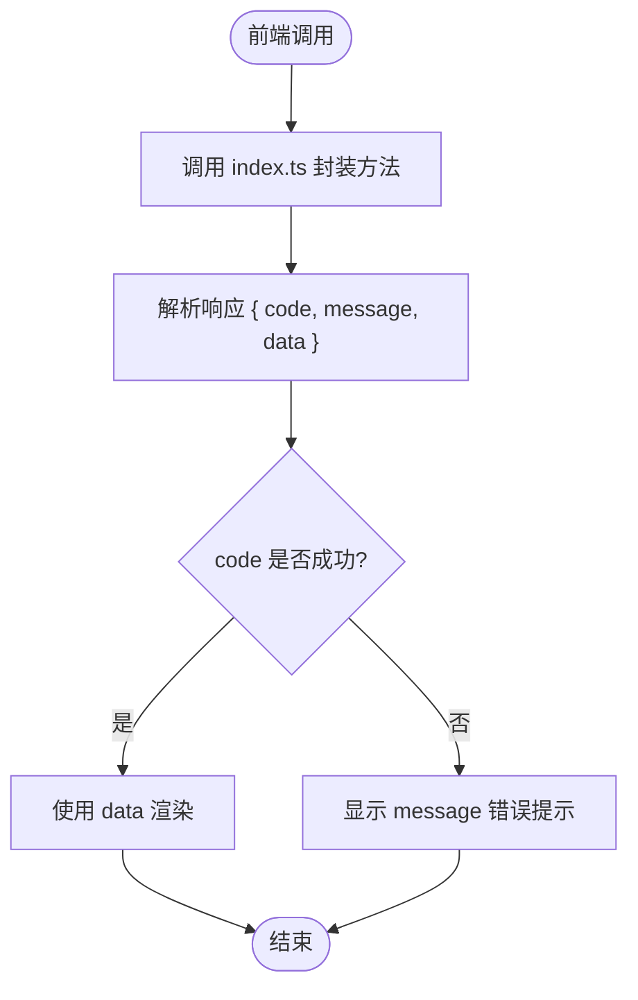
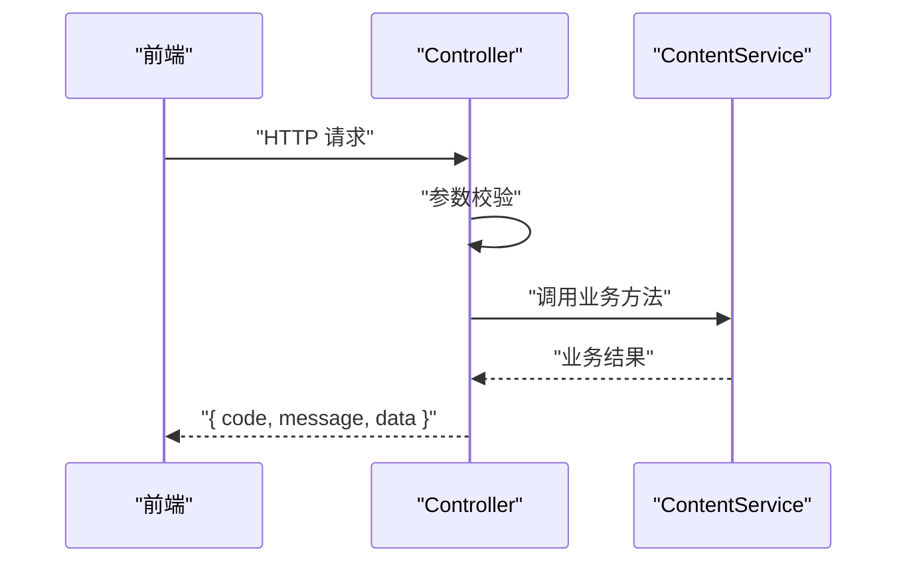
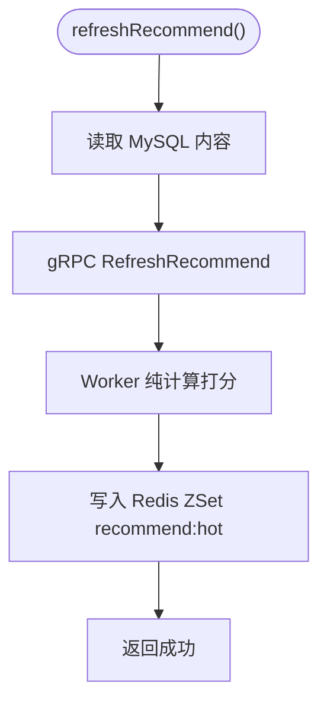
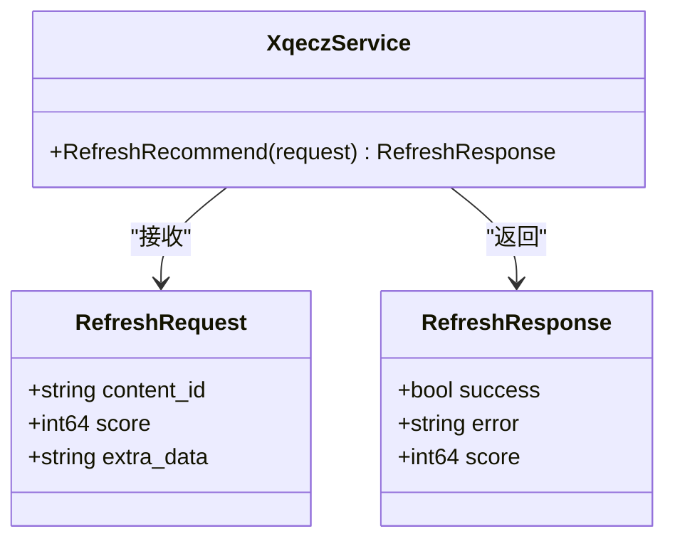
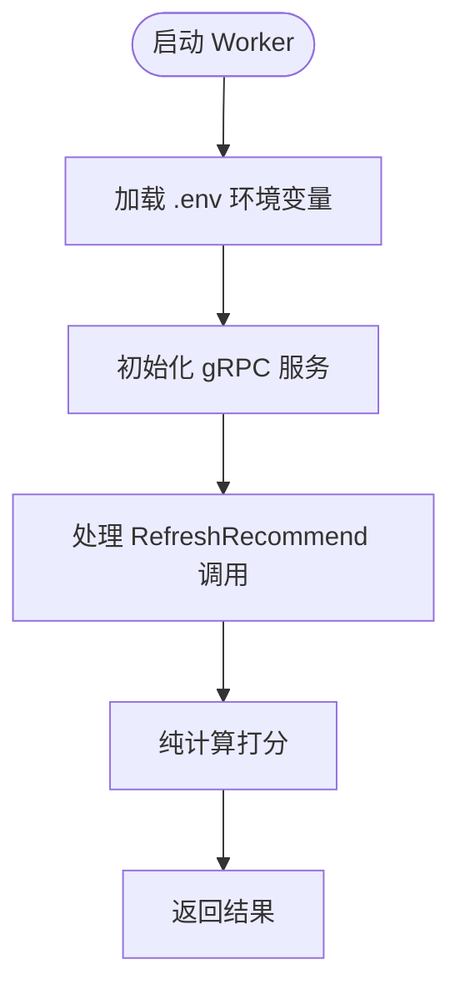
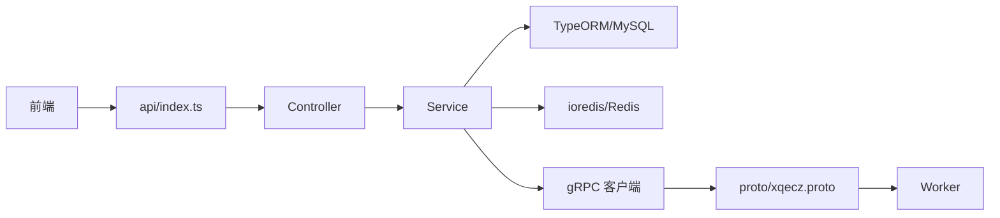

# 数据流设计

<cite>
**本文引用的文件**   
- [packages/api/src/content/content.service.ts](file://packages/api/src/content/content.service.ts)
- [packages/api/src/content/content.controller.ts](file://packages/api/src/content/content.controller.ts)
- [packages/frontend/src/api/index.ts](file://packages/frontend/src/api/index.ts)
- [proto/xqecz.proto](file://proto/xqecz.proto)
- [scripts/run-worker.mjs](file://scripts/run-worker.mjs)
</cite>

## 目录
1. [引言](#引言)
2. [项目结构](#项目结构)
3. [核心组件](#核心组件)
4. [架构总览](#架构总览)
5. [详细组件分析](#详细组件分析)
6. [依赖关系分析](#依赖关系分析)
7. [性能考量](#性能考量)
8. [故障排查指南](#故障排查指南)
9. [结论](#结论)
10. [附录](#附录)

## 引言
本文件面向 xqecz（小泉动漫二创站）的数据流设计，聚焦从前端发起请求到 NestJS Controller → Service → Database 的标准链路，并重点阐述推荐刷新流程的跨进程数据流：ContentService.refreshRecommend() 读取 MySQL → gRPC RefreshRecommend 调用 Worker → Worker 纯计算打分 → 结果回传 NestJS → 写入 Redis ZSet recommend:hot。同时说明前后端统一响应契约 { code, message, data } 的设计模式，以及软删除机制中 deleted_at 字段的自动过滤逻辑。文档包含数据流图与时序图，帮助读者快速理解关键业务场景的数据走向。

## 项目结构
xqecz 采用 monorepo 组织，核心运行方式由 pnpm 脚本驱动：
- NestJS API 服务（默认端口 :3000）
- Go Worker 无状态 gRPC 计算服务（默认端口 :50051）
- Vite 前端（默认端口 :5173）

关键目录与职责：
- packages/api：NestJS 后端，负责 HTTP API、数据库访问、缓存操作、gRPC 客户端调用
- packages/worker：Go 实现的 gRPC 计算服务，仅做纯计算，不连接数据库
- packages/frontend：Vite 前端，通过 packages/frontend/src/api/index.ts 统一管理接口契约与响应格式
- proto：gRPC 协议定义，NestJS 与 Worker 共享
- scripts：启动脚本，如 run-worker.mjs 用于注入环境变量并启动 Worker

**图表来源** 
- [packages/api/src/content/content.controller.ts](file://packages/api/src/content/content.controller.ts)
- [packages/api/src/content/content.service.ts](file://packages/api/src/content/content.service.ts)
- [proto/xqecz.proto](file://proto/xqecz.proto)
- [scripts/run-worker.mjs](file://scripts/run-worker.mjs)

**章节来源**
- [packages/api/src/content/content.controller.ts](file://packages/api/src/content/content.controller.ts)
- [packages/api/src/content/content.service.ts](file://packages/api/src/content/content.service.ts)
- [packages/frontend/src/api/index.ts](file://packages/frontend/src/api/index.ts)
- [proto/xqecz.proto](file://proto/xqecz.proto)
- [scripts/run-worker.mjs](file://scripts/run-worker.mjs)

## 核心组件
- 前端 API 契约层：packages/frontend/src/api/index.ts 统一封装所有接口调用，保证响应体为 { code, message, data } 标准格式，便于前端一致处理成功与失败分支。
- NestJS Controller：接收 HTTP 请求，参数校验后委派给 Service 处理。
- NestJS Service：编排业务逻辑，访问数据库与缓存，必要时调用 gRPC 客户端触发 Worker 计算。
- gRPC 协议：proto/xqecz.proto 定义 RefreshRecommend 等 RPC 方法，字段命名遵循 snake_case，客户端配置 keepCase:true。
- Worker：Go 实现，接收输入数据，执行纯计算打分，返回结果；不读写数据库，保持无状态。
- 存储层：TypeORM 访问 MySQL，ioredis 访问 Redis，keyPrefix 统一为 xqecz:。

**章节来源**
- [packages/frontend/src/api/index.ts](file://packages/frontend/src/api/index.ts)
- [packages/api/src/content/content.controller.ts](file://packages/api/src/content/content.controller.ts)
- [packages/api/src/content/content.service.ts](file://packages/api/src/content/content.service.ts)
- [proto/xqecz.proto](file://proto/xqecz.proto)
- [scripts/run-worker.mjs](file://scripts/run-worker.mjs)

## 架构总览
整体数据流分为两类：
- 标准 CRUD 流程：前端 → NestJS Controller → Service → MySQL/Redis → 返回统一响应
- 推荐刷新流程：前端 → NestJS Controller → ContentService.refreshRecommend() → MySQL 读取 → gRPC RefreshRecommend → Worker 打分 → NestJS 写 Redis ZSet recommend:hot → 前端降级读 view_count

**图表来源** 
- [packages/api/src/content/content.controller.ts](file://packages/api/src/content/content.controller.ts)
- [packages/api/src/content/content.service.ts](file://packages/api/src/content/content.service.ts)
- [proto/xqecz.proto](file://proto/xqecz.proto)

## 详细组件分析

### 前端 API 契约层（packages/frontend/src/api/index.ts）
- 统一封装所有接口调用，确保响应体为 { code, message, data } 标准格式
- 前端根据 code 判断成功或失败，message 用于提示，data 承载业务数据
- 该文件是前后端唯一接口契约，避免分散定义导致的契约不一致

**图表来源** 
- [packages/frontend/src/api/index.ts](file://packages/frontend/src/api/index.ts)

**章节来源**
- [packages/frontend/src/api/index.ts](file://packages/frontend/src/api/index.ts)

### NestJS Controller（packages/api/src/content/content.controller.ts）
- 接收 HTTP 请求，进行基础参数校验
- 将请求委派给 ContentService 处理
- 统一返回 { code, message, data } 格式响应

**图表来源** 
- [packages/api/src/content/content.controller.ts](file://packages/api/src/content/content.controller.ts)
- [packages/api/src/content/content.service.ts](file://packages/api/src/content/content.service.ts)

**章节来源**
- [packages/api/src/content/content.controller.ts](file://packages/api/src/content/content.controller.ts)

### NestJS Service（packages/api/src/content/content.service.ts）
- 编排业务逻辑，包括数据库查询、缓存操作、gRPC 调用
- refreshRecommend() 方法实现推荐刷新的核心流程：
  - 读取 MySQL 中的内容数据
  - 调用 gRPC RefreshRecommend 触发 Worker 打分
  - 将打分结果写入 Redis ZSet recommend:hot
  - 读取时若 ZSet 为空则降级为按 view_count 排序

**图表来源** 
- [packages/api/src/content/content.service.ts](file://packages/api/src/content/content.service.ts)
- [proto/xqecz.proto](file://proto/xqecz.proto)

**章节来源**
- [packages/api/src/content/content.service.ts](file://packages/api/src/content/content.service.ts)

### gRPC 协议（proto/xqecz.proto）
- 定义 RefreshRecommend 等 RPC 方法
- 字段命名遵循 snake_case，NestJS 客户端配置 keepCase:true
- Worker 仅处理输入数据并返回计算结果，不访问数据库

**图表来源** 
- [proto/xqecz.proto](file://proto/xqecz.proto)

**章节来源**
- [proto/xqecz.proto](file://proto/xqecz.proto)

### Worker 启动与环境注入（scripts/run-worker.mjs）
- 读取 .env 文件注入环境变量，确保 Worker 与 API 共享 UPLOAD_DIR 等配置
- 以绝对路径传递文件路径，避免路径不一致问题
- Worker 无状态，仅执行计算任务

**图表来源** 
- [scripts/run-worker.mjs](file://scripts/run-worker.mjs)
- [proto/xqecz.proto](file://proto/xqecz.proto)

**章节来源**
- [scripts/run-worker.mjs](file://scripts/run-worker.mjs)

## 依赖关系分析
- 前端依赖 packages/frontend/src/api/index.ts 作为唯一接口契约
- NestJS Controller 依赖 Service 处理业务逻辑
- Service 依赖 TypeORM 访问 MySQL，ioredis 访问 Redis，gRPC 客户端调用 Worker
- Worker 依赖 proto 定义的方法签名，不依赖数据库

**图表来源** 
- [packages/frontend/src/api/index.ts](file://packages/frontend/src/api/index.ts)
- [packages/api/src/content/content.controller.ts](file://packages/api/src/content/content.controller.ts)
- [packages/api/src/content/content.service.ts](file://packages/api/src/content/content.service.ts)
- [proto/xqecz.proto](file://proto/xqecz.proto)

**章节来源**
- [packages/frontend/src/api/index.ts](file://packages/frontend/src/api/index.ts)
- [packages/api/src/content/content.controller.ts](file://packages/api/src/content/content.controller.ts)
- [packages/api/src/content/content.service.ts](file://packages/api/src/content/content.service.ts)
- [proto/xqecz.proto](file://proto/xqecz.proto)

## 性能考量
- 推荐刷新采用异步 gRPC 调用，避免阻塞主线程
- Redis ZSet 提供高效的热门内容排序，读取复杂度 O(log N)
- 降级策略：当 ZSet 为空时按 view_count 排序，保证基本可用性
- Worker 无状态设计，便于水平扩展
- 统一 keyPrefix=xqecz: 避免 Redis 键冲突

[本节为通用指导，无需特定文件引用]

## 故障排查指南
- 软删除机制：所有删除均为软删除，TypeORM @DeleteDateColumn 自动过滤 deleted_at 不为空的记录
- 外部依赖缺失：Tinify/S3/FFmpeg/Worker 缺失时一律降级，gRPC 不返回 rpc error，只返回 success=false + error 文本
- 常见问题检查：
  - 确认 Worker 已启动且端口 :50051 可访问
  - 检查 .env 中 UPLOAD_DIR 配置是否正确
  - 验证 Redis 中 recommend:hot 是否存在数据
  - 查看 gRPC 调用日志确认 Worker 是否正常处理

**章节来源**
- [packages/api/src/content/content.service.ts](file://packages/api/src/content/content.service.ts)
- [scripts/run-worker.mjs](file://scripts/run-worker.mjs)

## 结论
xqecz 平台的数据流设计清晰分离了 Web 服务与计算服务，通过 gRPC 实现松耦合通信。统一的响应契约简化了前端处理逻辑，软删除机制保证了数据安全性。推荐刷新流程充分利用 Redis ZSet 的高性能特性，结合降级策略确保了系统的稳定性与可用性。

[本节为总结性内容，无需特定文件引用]

## 附录
- 环境配置：pnpm dev 启动开发环境，pnpm start 构建并启动生产环境
- 端口分配：NestJS API (:3000)、Worker (:50051)、前端 (:5173)
- 部署方式：本地直启，不再使用 Docker/Nginx

[本节为补充信息，无需特定文件引用]