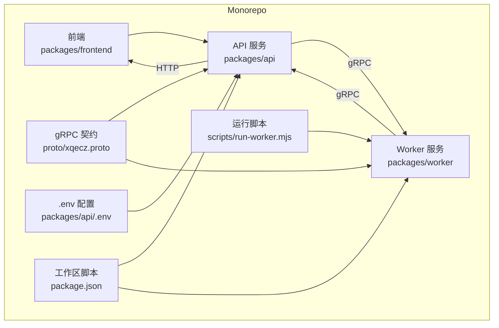
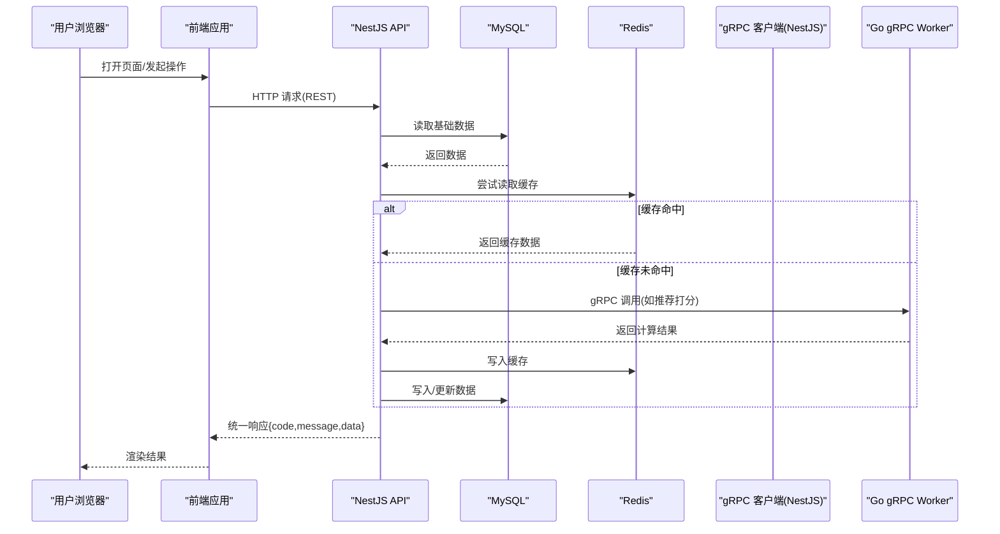
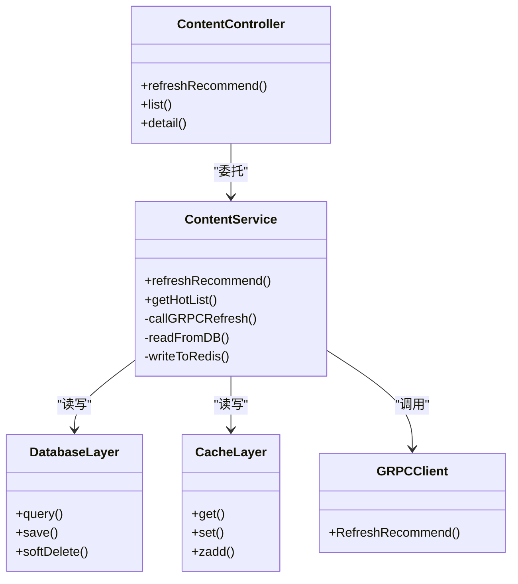
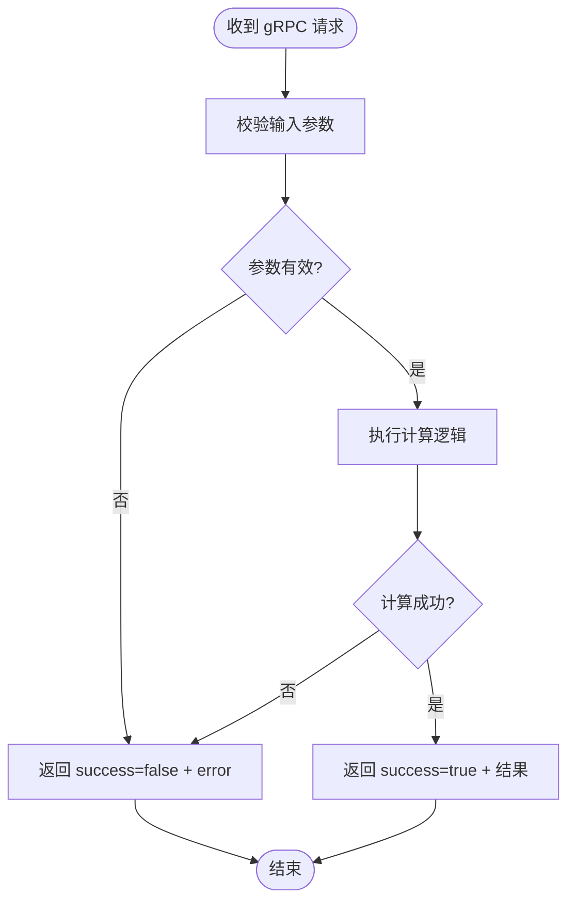
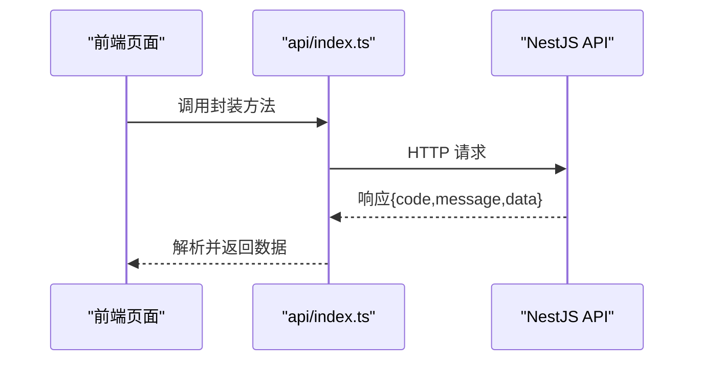
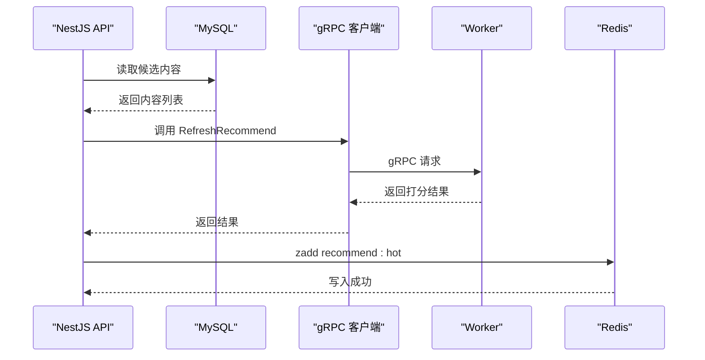
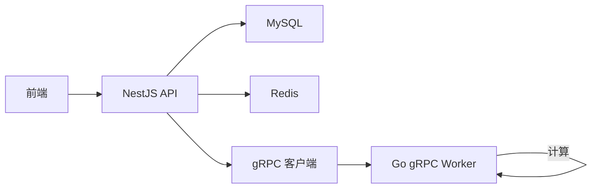

# 架构设计

<cite>
**本文引用的文件**   
- [packages/api/src/content/content.controller.ts](file://packages/api/src/content/content.controller.ts)
- [packages/api/src/content/content.service.ts](file://packages/api/src/content/content.service.ts)
- [packages/api/src/app.module.ts](file://packages/api/src/app.module.ts)
- [packages/api/.env](file://packages/api/.env)
- [packages/frontend/src/api/index.ts](file://packages/frontend/src/api/index.ts)
- [proto/xqecz.proto](file://proto/xqecz.proto)
- [scripts/run-worker.mjs](file://scripts/run-worker.mjs)
- [package.json](file://package.json)
</cite>

## 目录
1. [简介](#简介)
2. [项目结构](#项目结构)
3. [核心组件](#核心组件)
4. [架构总览](#架构总览)
5. [详细组件分析](#详细组件分析)
6. [依赖关系分析](#依赖关系分析)
7. [性能考量](#性能考量)
8. [故障排查指南](#故障排查指南)
9. [结论](#结论)
10. [附录](#附录)

## 简介
本文件为 xqecz（小泉动漫二创站）的架构设计文档，面向开发者与运维人员，系统阐述微服务架构、数据流、前后端契约、软删除机制、降级策略与环境变量配置。整体采用 NestJS API 作为主入口，Go gRPC Worker 作为无状态计算服务，二者通过 gRPC 通信；数据库与缓存由 NestJS 独占访问，Worker 不直连任何持久化存储。

## 项目结构
仓库采用 monorepo 组织，核心目录如下：
- packages/api：NestJS API 服务，负责 HTTP 接口、业务编排、数据库与缓存访问
- packages/worker：Go gRPC 计算服务，提供纯计算能力（如推荐打分）
- packages/frontend：Vite 前端应用，统一通过 packages/frontend/src/api/index.ts 调用后端接口
- proto：gRPC 协议定义
- scripts：本地运行脚本（含 worker 启动脚本）
- package.json：工作区与脚本入口

图表来源
- [package.json:1-200](file://package.json#L1-L200)
- [packages/api/.env:1-200](file://packages/api/.env#L1-L200)
- [proto/xqecz.proto:1-200](file://proto/xqecz.proto#L1-L200)
- [scripts/run-worker.mjs:1-200](file://scripts/run-worker.mjs#L1-L200)

章节来源
- [package.json:1-200](file://package.json#L1-L200)

## 核心组件
- NestJS API 服务
  - 职责：HTTP 路由、鉴权、业务编排、MySQL/Redis 读写、对外暴露 REST 接口
  - 关键模块：Controller → Service → ORM/Cache
- Go gRPC Worker
  - 职责：无状态计算（如推荐打分、媒体处理），接收参数后返回结果，不访问数据库或缓存
- 前端 API 契约
  - 职责：统一封装请求、响应格式 { code, message, data }，集中管理接口路径与类型
- gRPC 契约
  - 职责：定义跨语言服务方法与消息结构，保持 API 与 Worker 稳定契约

章节来源
- [packages/api/src/content/content.controller.ts:1-200](file://packages/api/src/content/content.controller.ts#L1-L200)
- [packages/api/src/content/content.service.ts:1-200](file://packages/api/src/content/content.service.ts#L1-L200)
- [packages/frontend/src/api/index.ts:1-200](file://packages/frontend/src/api/index.ts#L1-L200)
- [proto/xqecz.proto:1-200](file://proto/xqecz.proto#L1-L200)

## 架构总览
系统采用“API 编排 + Worker 计算”的微服务模式：
- 用户请求进入 NestJS Controller，经 Service 编排，必要时调用 gRPC Worker 进行计算，最终落库或写缓存
- 读取热点数据时优先从 Redis 获取，缺失则回源 MySQL，并回填缓存
- 所有删除操作均为软删除，ORM 自动过滤已删除记录
- 外部依赖缺失一律降级，保证可用性

图表来源
- [packages/api/src/content/content.controller.ts:1-200](file://packages/api/src/content/content.controller.ts#L1-L200)
- [packages/api/src/content/content.service.ts:1-200](file://packages/api/src/content/content.service.ts#L1-L200)
- [proto/xqecz.proto:1-200](file://proto/xqecz.proto#L1-L200)

## 详细组件分析

### 组件一：NestJS API 服务（Controller → Service → 数据层）
- Controller 层
  - 接收 HTTP 请求，参数校验，委托 Service 处理
- Service 层
  - 业务编排：读 MySQL、读/写 Redis、调用 gRPC Worker
  - 推荐刷新流程：ContentService.refreshRecommend() 从 MySQL 读取内容，调用 gRPC RefreshRecommend 计算得分，将结果写入 Redis ZSet recommend:hot（ioredis keyPrefix=xqecz:）
  - 读取降级：当推荐不可用时，按 view_count 排序作为降级策略
- 数据层
  - 使用 TypeORM 访问 MySQL，所有实体支持软删除（deleted_at + @DeleteDateColumn）
  - 使用 ioredis 访问 Redis，统一 keyPrefix=xqecz:

图表来源
- [packages/api/src/content/content.controller.ts:1-200](file://packages/api/src/content/content.controller.ts#L1-L200)
- [packages/api/src/content/content.service.ts:1-200](file://packages/api/src/content/content.service.ts#L1-L200)

章节来源
- [packages/api/src/content/content.controller.ts:1-200](file://packages/api/src/content/content.controller.ts#L1-L200)
- [packages/api/src/content/content.service.ts:1-200](file://packages/api/src/content/content.service.ts#L1-L200)

### 组件二：Go gRPC Worker（无状态计算服务）
- 职责
  - 接收来自 NestJS 的计算任务（如推荐打分、媒体转码参数），执行纯计算逻辑
  - 返回结构化结果，不访问数据库或缓存
- 错误处理
  - 不返回 rpc error，而是 success=false + error 文本，便于上层降级
- 启动方式
  - 通过 scripts/run-worker.mjs 启动，自动注入 .env 环境变量（如 UPLOAD_DIR）

图表来源
- [proto/xqecz.proto:1-200](file://proto/xqecz.proto#L1-L200)
- [scripts/run-worker.mjs:1-200](file://scripts/run-worker.mjs#L1-L200)

章节来源
- [proto/xqecz.proto:1-200](file://proto/xqecz.proto#L1-L200)
- [scripts/run-worker.mjs:1-200](file://scripts/run-worker.mjs#L1-L200)

### 组件三：前后端契约统一管理
- 统一入口
  - packages/frontend/src/api/index.ts 集中定义接口路径、请求封装与响应类型
- 响应格式
  - 统一包装为 { code, message, data }，前端据此做成功/失败分支处理
- 优势
  - 降低耦合、统一错误处理、便于类型推导与测试

图表来源
- [packages/frontend/src/api/index.ts:1-200](file://packages/frontend/src/api/index.ts#L1-L200)

章节来源
- [packages/frontend/src/api/index.ts:1-200](file://packages/frontend/src/api/index.ts#L1-L200)

### 组件四：推荐刷新流程（NestJS → gRPC → Worker → Redis）
- 触发点：ContentService.refreshRecommend()
- 步骤
  1) 从 MySQL 读取候选内容
  2) 调用 gRPC RefreshRecommend，Worker 执行打分算法
  3) 将结果写入 Redis ZSet recommend:hot（keyPrefix=xqecz:）
  4) 读取时优先取 Redis，缺失则按 view_count 降级排序

图表来源
- [packages/api/src/content/content.service.ts:1-200](file://packages/api/src/content/content.service.ts#L1-L200)
- [proto/xqecz.proto:1-200](file://proto/xqecz.proto#L1-L200)

章节来源
- [packages/api/src/content/content.service.ts:1-200](file://packages/api/src/content/content.service.ts#L1-L200)

### 组件五：软删除机制
- 实现方式
  - 使用 TypeORM @DeleteDateColumn 标记 deleted_at 字段
  - 查询自动过滤已删除记录，无需手动加条件
- 影响范围
  - 所有实体均遵循该约定，确保数据一致性

章节来源
- [packages/api/src/content/content.service.ts:1-200](file://packages/api/src/content/content.service.ts#L1-L200)

### 组件六：降级处理策略
- 外部依赖缺失
  - Tinify/S3/FFmpeg/Worker 等缺失时，一律降级返回可用结果或默认值
- gRPC 异常
  - 不抛 rpc error，返回 success=false + error 文本，上层捕获后走降级逻辑
- 读取降级
  - 推荐不可用时，按 view_count 排序作为兜底

章节来源
- [packages/api/src/content/content.service.ts:1-200](file://packages/api/src/content/content.service.ts#L1-L200)
- [proto/xqecz.proto:1-200](file://proto/xqecz.proto#L1-L200)

### 组件七：环境变量配置管理
- 单一配置源
  - packages/api/.env 为唯一配置源，包含数据库、缓存、上传目录等
- Worker 启动注入
  - scripts/run-worker.mjs 启动时自动读取同一 .env，注入环境变量（如 UPLOAD_DIR）
- 路径传递
  - gRPC 以绝对路径传递文件路径，避免相对路径歧义

章节来源
- [packages/api/.env:1-200](file://packages/api/.env#L1-L200)
- [scripts/run-worker.mjs:1-200](file://scripts/run-worker.mjs#L1-L200)

## 依赖关系分析
- 组件内聚与耦合
  - API 高内聚：Controller/Service/DataLayer 分层清晰
  - Worker 低耦合：仅依赖 gRPC 契约与计算库
- 直接/间接依赖
  - API 依赖 MySQL、Redis、gRPC 客户端
  - Worker 依赖 gRPC 服务端与计算库
- 外部集成点
  - 对象存储、图片压缩、视频转码等可选依赖，缺失即降级

图表来源
- [package.json:1-200](file://package.json#L1-L200)
- [packages/api/src/app.module.ts:1-200](file://packages/api/src/app.module.ts#L1-L200)

章节来源
- [package.json:1-200](file://package.json#L1-L200)
- [packages/api/src/app.module.ts:1-200](file://packages/api/src/app.module.ts#L1-L200)

## 性能考量
- 缓存优先
  - 热点数据优先从 Redis 读取，减少 MySQL 压力
- 异步计算
  - 推荐打分等耗时计算交由 Worker 异步处理，避免阻塞 HTTP 请求
- 连接池与超时
  - 合理设置数据库与 Redis 连接池大小与超时时间
- 资源隔离
  - Worker 无状态，可水平扩展，按需扩容

[本节为通用指导，不直接分析具体文件]

## 故障排查指南
- 常见问题定位
  - 检查 .env 配置是否正确加载
  - 确认 gRPC 端口与契约版本一致
  - 查看 Worker 日志中的 success=false + error 文本
- 降级验证
  - 模拟外部依赖缺失，验证降级逻辑是否生效
- 缓存一致性
  - 核对 Redis keyPrefix 与 ZSet 命名是否符合约定

章节来源
- [packages/api/.env:1-200](file://packages/api/.env#L1-L200)
- [proto/xqecz.proto:1-200](file://proto/xqecz.proto#L1-L200)
- [scripts/run-worker.mjs:1-200](file://scripts/run-worker.mjs#L1-L200)

## 结论
xqecz 平台通过 NestJS API 与 Go gRPC Worker 的职责分离，实现了清晰的微服务边界与稳定的数据流。统一的 API 契约、软删除机制与完善的降级策略，保障了系统的可维护性与高可用性。建议在生产环境中持续监控缓存命中率、gRPC 延迟与 Worker 负载，进一步优化性能与稳定性。

## 附录
- 开发模式
  - pnpm dev：同时启动 NestJS API(:3000)、Go Worker(:50051)、Vite 前端(:5173)
  - pnpm start：生产模式一键构建+运行
- 部署说明
  - 已弃用 Docker/Nginx，推荐使用 pnpm 脚本本地直启

章节来源
- [package.json:1-200](file://package.json#L1-L200)