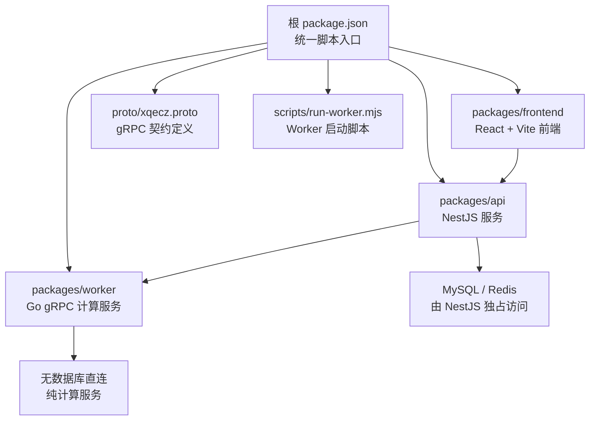
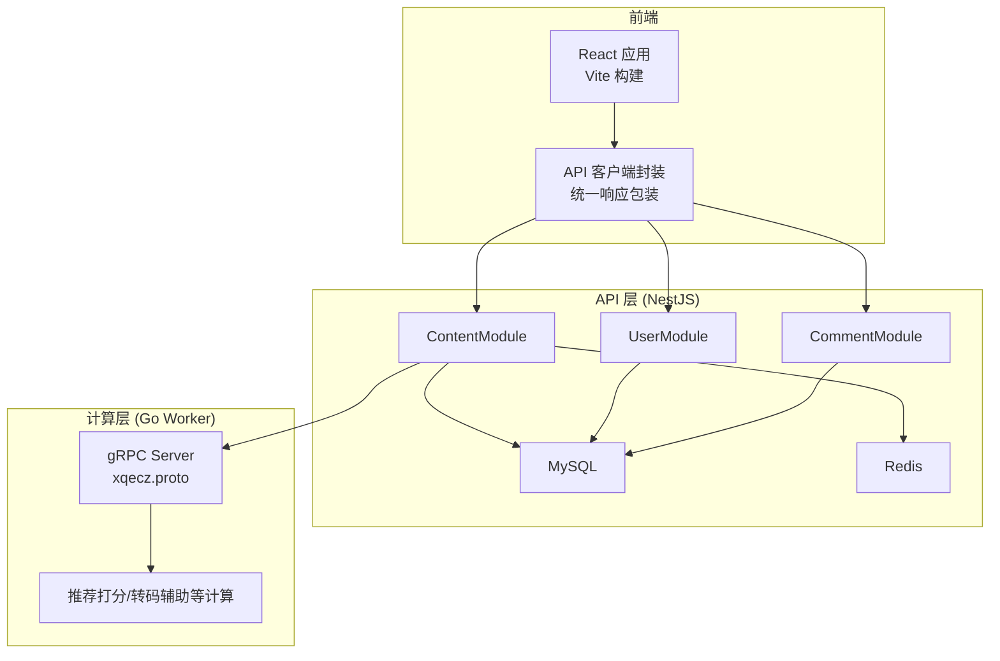
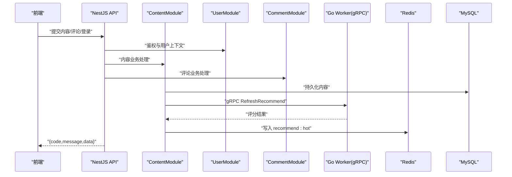
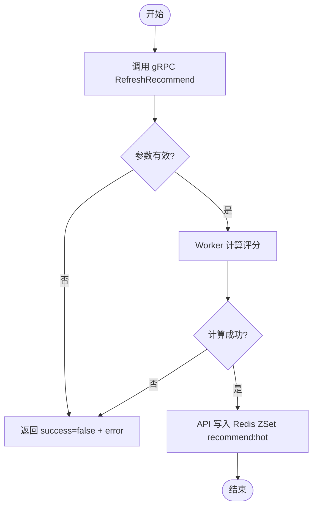
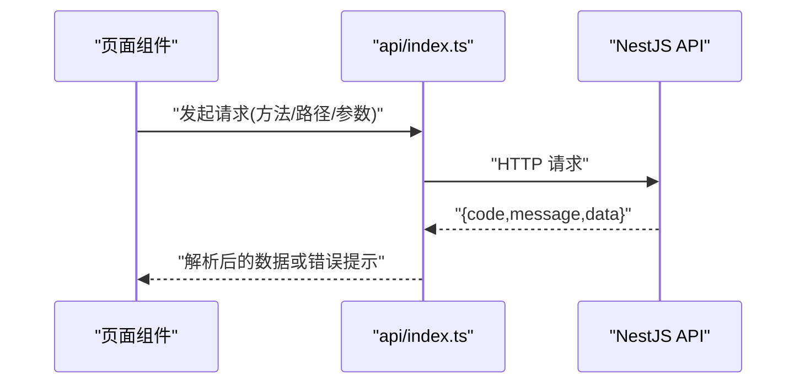
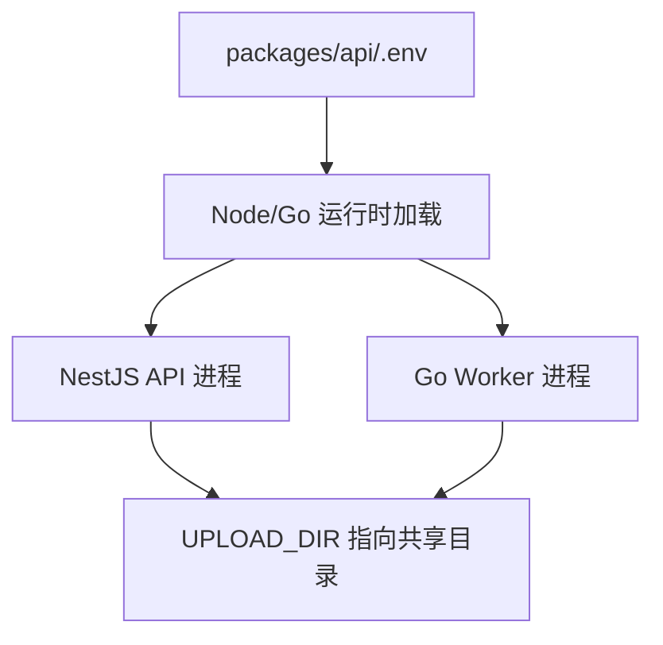
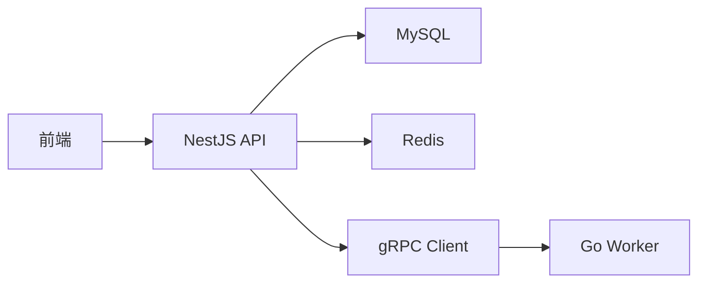

# 组件关系

<cite>
**本文引用的文件**   
- [packages/api/.env](file://packages/api/.env)
- [scripts/run-worker.mjs](file://scripts/run-worker.mjs)
- [proto/xqecz.proto](file://proto/xqecz.proto)
- [packages/frontend/src/api/index.ts](file://packages/frontend/src/api/index.ts)
- [package.json](file://package.json)
- [pnpm-workspace.yaml](file://pnpm-workspace.yaml)
</cite>

## 目录
1. [简介](#简介)
2. [项目结构](#项目结构)
3. [核心模块与职责划分](#核心模块与职责划分)
4. [架构总览](#架构总览)
5. [详细组件分析](#详细组件分析)
6. [依赖关系分析](#依赖关系分析)
7. [性能考量](#性能考量)
8. [故障排查指南](#故障排查指南)
9. [结论](#结论)
10. [附录](#附录)

## 简介
本文件面向 xqecz（小泉动漫二创站）平台，系统性梳理 NestJS API、Go Worker 与 React 前端之间的组件关系与数据流。重点说明：
- NestJS 模块化架构中 ContentModule、UserModule、CommentModule 的职责边界与交互模式
- Go Worker 作为无状态 gRPC 计算服务与 NestJS API 的依赖关系与调用契约
- 前端 React 应用通过统一 API 客户端与后端交互的方式
- 第三方服务（对象存储、图片压缩、视频处理等）集成点与降级策略
- 环境变量配置的统一管理与 .env 共享策略

## 项目结构
仓库采用 pnpm monorepo 组织，包含 api、frontend、worker 三个核心包以及 proto 定义与脚本工具。根级 package.json 提供统一脚本入口，pnpm-workspace.yaml 声明工作区。

图表来源
- [package.json](file://package.json)
- [pnpm-workspace.yaml](file://pnpm-workspace.yaml)
- [proto/xqecz.proto](file://proto/xqecz.proto)
- [scripts/run-worker.mjs](file://scripts/run-worker.mjs)

章节来源
- [package.json](file://package.json)
- [pnpm-workspace.yaml](file://pnpm-workspace.yaml)

## 核心模块与职责划分
- ContentModule
  - 负责内容生命周期管理（上传、转码、索引、推荐刷新）
  - 与 UserModule、CommentModule 协作完成内容关联操作
  - 通过 gRPC 调用 Worker 执行推荐打分等计算任务
- UserModule
  - 用户注册、登录、权限校验、个人资料管理
  - 为 ContentModule、CommentModule 提供鉴权上下文
- CommentModule
  - 评论的增删改查、点赞、排序
  - 与 ContentModule 建立外键关联，受软删除策略保护

交互要点
- 所有删除均为软删除（deleted_at），ORM 自动过滤已删除记录
- 对外部依赖缺失一律降级，保证可用性

章节来源
- [packages/api/.env](file://packages/api/.env)

## 架构总览
系统由三层构成：
- 前端层：React + Vite，统一通过 packages/frontend/src/api/index.ts 发起请求，响应格式 { code, message, data }
- API 层：NestJS 单体服务，独占 MySQL/Redis，编排业务逻辑，协调外部服务
- 计算层：Go Worker，无状态 gRPC 服务，仅做计算与数据处理，不直接读写数据库

图表来源
- [packages/frontend/src/api/index.ts](file://packages/frontend/src/api/index.ts)
- [proto/xqecz.proto](file://proto/xqecz.proto)

## 详细组件分析

### NestJS 模块间交互
- ContentModule 与 UserModule
  - 内容创建/更新需校验当前用户身份与权限
  - 用户资料变更影响内容展示元信息（如作者头像、昵称）
- ContentModule 与 CommentModule
  - 评论归属内容与用户，支持按内容维度分页与排序
  - 删除内容时级联标记评论为软删除
- 推荐链路
  - ContentService.refreshRecommend() 触发 gRPC RefreshRecommend
  - Worker 返回评分结果，API 写入 Redis ZSet recommend:hot（keyPrefix=xqecz:）
  - 读取失败或不可用时降级为 view_count 排序

图表来源
- [packages/frontend/src/api/index.ts](file://packages/frontend/src/api/index.ts)
- [proto/xqecz.proto](file://proto/xqecz.proto)

章节来源
- [packages/frontend/src/api/index.ts](file://packages/frontend/src/api/index.ts)
- [proto/xqecz.proto](file://proto/xqecz.proto)

### gRPC 接口与数据交换
- 契约位置：proto/xqecz.proto
- 字段命名：NestJS 客户端启用 keepCase:true，使用 snake_case 字段
- 错误约定：不返回 rpc error，统一 success=false + error 文本
- 典型流程：RefreshRecommend
  - API 将待打分内容 ID 列表以绝对路径形式传入
  - Worker 计算后返回分数数组
  - API 落库/写缓存

图表来源
- [proto/xqecz.proto](file://proto/xqecz.proto)

章节来源
- [proto/xqecz.proto](file://proto/xqecz.proto)

### 前端与 API 集成
- 唯一契约：packages/frontend/src/api/index.ts
- 响应包装：{ code, message, data }
- 路由与状态管理：由前端自行组织，统一通过该客户端发起请求并处理错误

图表来源
- [packages/frontend/src/api/index.ts](file://packages/frontend/src/api/index.ts)

章节来源
- [packages/frontend/src/api/index.ts](file://packages/frontend/src/api/index.ts)

### 环境变量与 .env 共享策略
- 单一配置源：packages/api/.env
- Worker 启动注入：scripts/run-worker.mjs 启动时读取同一 .env，注入环境变量
- 关键变量：UPLOAD_DIR 指定共享上传目录；其他服务连接串、密钥等集中管理
- 优先级：进程环境变量 > .env 覆盖值（遵循 Node/Go 常见加载顺序）

图表来源
- [packages/api/.env](file://packages/api/.env)
- [scripts/run-worker.mjs](file://scripts/run-worker.mjs)

章节来源
- [packages/api/.env](file://packages/api/.env)
- [scripts/run-worker.mjs](file://scripts/run-worker.mjs)

### 第三方服务集成点
- 对象存储（S3 兼容）
  - 用于静态资源托管与下载加速
  - 缺失时降级为本地磁盘存储
- 图片压缩（Tinify）
  - 上传后压缩优化体积
  - 缺失时跳过压缩，保留原图
- 视频处理（FFmpeg）
  - 转码、截图、时长提取
  - 缺失时跳过处理，仅保存原始文件
- gRPC Worker
  - 推荐打分、统计聚合等计算
  - 不可用时降级为基于 view_count 的排序

章节来源
- [packages/api/.env](file://packages/api/.env)

## 依赖关系分析
- NestJS API 依赖
  - MySQL：持久化用户、内容、评论等实体
  - Redis：热点推荐、会话缓存、限流
  - gRPC Client：调用 Worker 进行计算
- Go Worker 依赖
  - 无数据库直连，仅接收输入、计算、返回结果
- 前端依赖
  - 统一 API 客户端，遵循 { code, message, data } 协议

图表来源
- [packages/frontend/src/api/index.ts](file://packages/frontend/src/api/index.ts)
- [proto/xqecz.proto](file://proto/xqecz.proto)

章节来源
- [packages/frontend/src/api/index.ts](file://packages/frontend/src/api/index.ts)
- [proto/xqecz.proto](file://proto/xqecz.proto)

## 性能考量
- 推荐链路优先走 Redis ZSet，读多写少场景下显著降低数据库压力
- 软删除避免物理删除带来的级联开销与数据丢失风险
- 外部依赖缺失降级保障高可用，避免单点故障导致整体不可用
- gRPC 计算服务无状态，便于水平扩展与弹性伸缩

## 故障排查指南
- 常见问题定位
  - 环境变量未生效：检查 scripts/run-worker.mjs 是否正确注入 .env 变量
  - gRPC 调用失败：确认 proto 字段命名与 keepCase 设置一致，核对 success 与 error 文本
  - 推荐列表异常：查看 Redis keyPrefix 是否为 xqecz:，确认 recommend:hot 是否写入成功
  - 上传失败：验证 UPLOAD_DIR 是否存在且可写，对象存储/压缩/转码服务是否可用
- 日志与监控
  - 在 NestJS 中记录关键步骤与降级分支
  - 在 Worker 中记录计算耗时与失败原因

章节来源
- [scripts/run-worker.mjs](file://scripts/run-worker.mjs)
- [packages/api/.env](file://packages/api/.env)
- [packages/frontend/src/api/index.ts](file://packages/frontend/src/api/index.ts)
- [proto/xqecz.proto](file://proto/xqecz.proto)

## 结论
xqecz 平台采用“前端—NestJS API—Go Worker”的分层架构，API 独占数据层，Worker 专注计算，前后端通过统一 API 契约解耦。通过环境变量统一管理、外部依赖降级与软删除策略，系统在可用性与可扩展性之间取得平衡。建议在生产环境持续完善监控与告警，确保各依赖健康度可见可控。

## 附录
- 运行方式
  - 开发：pnpm dev 同时启动 NestJS(:3000)、Go Worker(:50051)、Vite 前端(:5173)
  - 生产：pnpm start 一键构建与运行
- 工作区与脚本
  - pnpm-workspace.yaml 声明 monorepo 工作区
  - package.json 提供统一脚本入口

章节来源
- [package.json](file://package.json)
- [pnpm-workspace.yaml](file://pnpm-workspace.yaml)