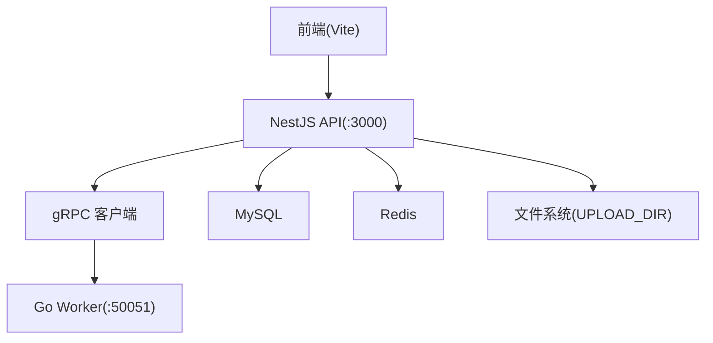
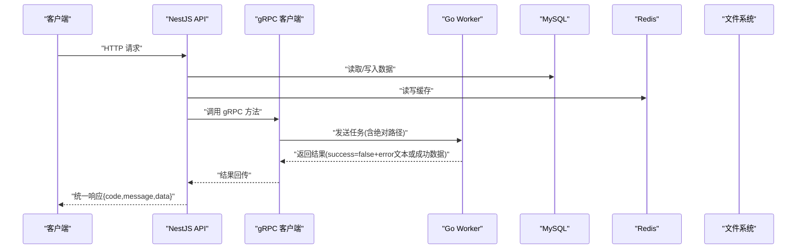
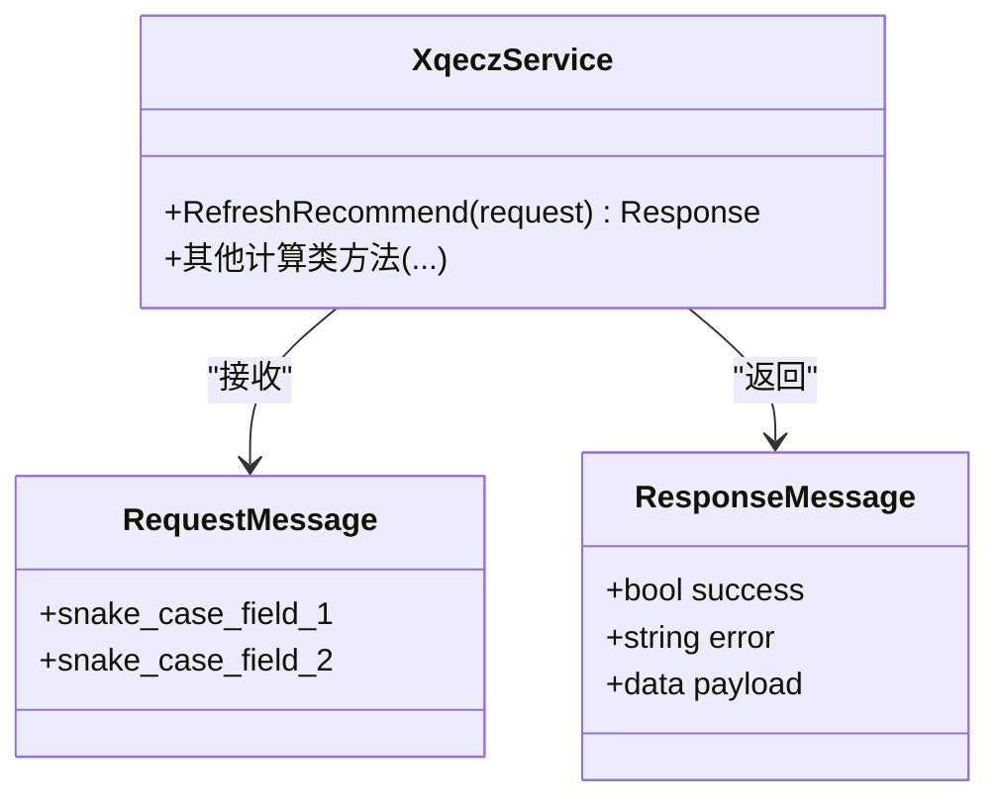
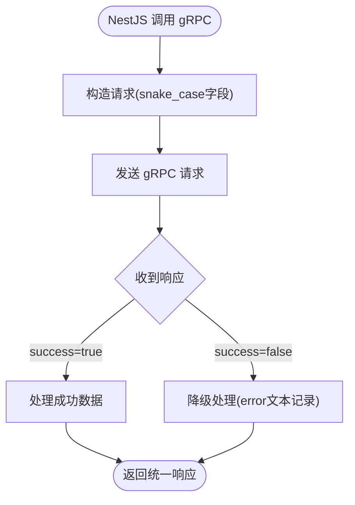
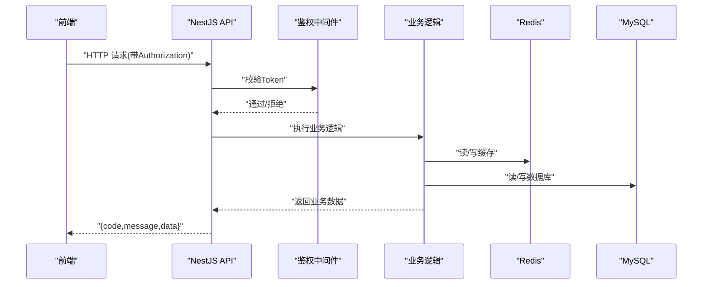
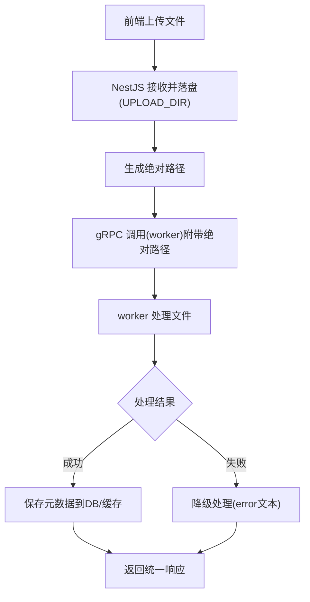
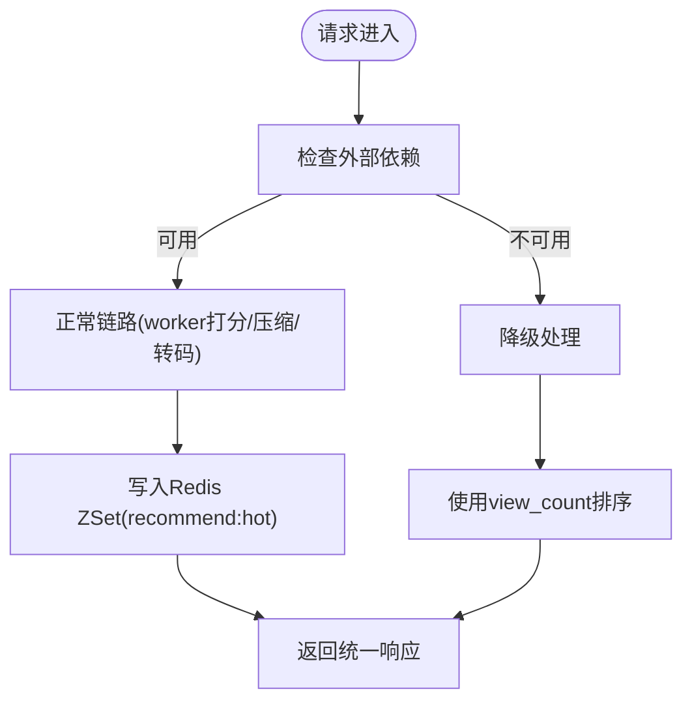
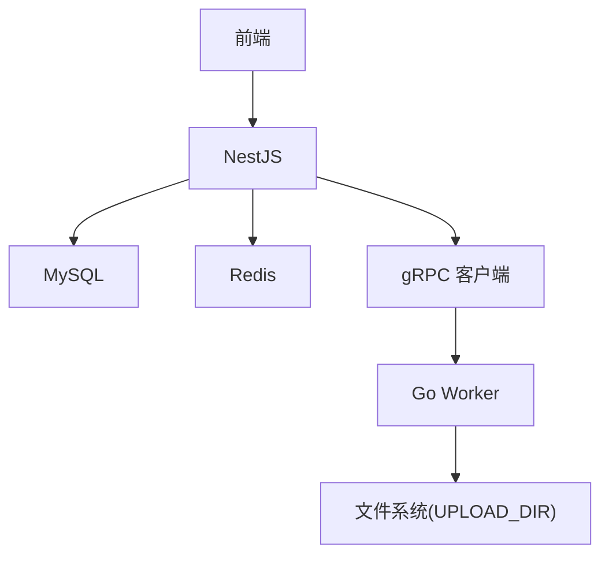

# 通信协议

<cite>
**本文引用的文件**   
- [proto/xqecz.proto](file://proto/xqecz.proto)
- [packages/api/.env](file://packages/api/.env)
- [scripts/run-worker.mjs](file://scripts/run-worker.mjs)
- [packages/frontend/src/api/index.ts](file://packages/frontend/src/api/index.ts)
</cite>

## 目录
1. [简介](#简介)
2. [项目结构](#项目结构)
3. [核心组件](#核心组件)
4. [架构总览](#架构总览)
5. [详细组件分析](#详细组件分析)
6. [依赖关系分析](#依赖关系分析)
7. [性能考虑](#性能考虑)
8. [故障排查指南](#故障排查指南)
9. [结论](#结论)
10. [附录](#附录)

## 简介
本文件面向 xqecz 平台（小泉动漫二创站）的通信协议，覆盖以下范围：
- gRPC 微服务间通信：基于 proto/xqecz.proto 的接口定义、消息格式与服务方法约定。
- NestJS gRPC 客户端配置：keepCase:true 与 snake_case 字段命名约定。
- 前后端 RESTful API 规范：请求头、认证方式、错误处理与统一状态码约定。
- 文件传输协议：UPLOAD_DIR 环境变量共享机制与绝对路径传递策略。
- 降级处理策略：外部依赖（Tinify/S3/FFmpeg/Worker）不可用时的可用性保障。
- 协议流程图与错误处理示例。

## 项目结构
xqecz 采用 monorepo 组织，关键目录与职责如下：
- packages/api：NestJS 后端服务，负责 HTTP 接口、数据库访问、缓存与 gRPC 客户端调用。
- packages/worker：Go 实现的无状态计算服务，通过 gRPC 接收任务并返回结果。
- packages/frontend：Vite 前端应用，唯一接口契约位于 packages/frontend/src/api/index.ts。
- proto：gRPC 协议定义与生成产物所在目录。
- scripts：运行脚本，如 run-worker.mjs 用于启动 worker 并注入环境变量。

[本图为概念性架构图，不直接映射具体源码文件]

## 核心组件
- gRPC 契约：proto/xqecz.proto 定义了微服务间的消息类型与服务方法。
- NestJS gRPC 客户端：在 NestJS 中通过 keepCase:true 保持字段名大小写，使用 snake_case 作为字段命名约定。
- 前端 API 契约：packages/frontend/src/api/index.ts 是前后端唯一接口契约，所有响应统一为 { code, message, data } 包装格式。
- 文件上传与共享目录：通过 packages/api/.env 中的 UPLOAD_DIR 指定单一共享目录；scripts/run-worker.mjs 启动 worker 时自动读取同一 .env 注入环境变量，确保 worker 能访问相同路径。

**章节来源**
- [proto/xqecz.proto](file://proto/xqecz.proto)
- [packages/frontend/src/api/index.ts](file://packages/frontend/src/api/index.ts)
- [packages/api/.env](file://packages/api/.env)
- [scripts/run-worker.mjs](file://scripts/run-worker.mjs)

## 架构总览
xqecz 的运行链路遵循“NestJS 独占 MySQL/Redis；Go worker 是无状态 gRPC 计算服务”的架构铁律：
- NestJS 提供 HTTP API，负责数据持久化与缓存管理。
- Go worker 仅执行纯计算任务（如推荐打分），通过 gRPC 接收输入、返回结果。
- 文件存储由统一的 UPLOAD_DIR 驱动，NestJS 与 worker 均通过绝对路径访问。

[本图为概念性序列图，不直接映射具体源码文件]

## 详细组件分析

### gRPC 协议与消息定义
- 契约位置：proto/xqecz.proto
- 设计要点：
  - 服务方法按功能划分，例如刷新推荐等计算型任务。
  - 消息体字段采用 snake_case 命名，便于跨语言一致性与可读性。
  - 错误语义：当外部依赖不可用时，gRPC 不返回 rpc error，而是以 success=false 与 error 文本形式返回，保证上层可降级处理。

**图表来源**
- [proto/xqecz.proto](file://proto/xqecz.proto)

**章节来源**
- [proto/xqecz.proto](file://proto/xqecz.proto)

### NestJS gRPC 客户端配置
- 配置要点：
  - keepCase:true：保持字段名原始大小写，避免框架自动转换导致的不一致。
  - snake_case 字段命名：在 proto 与 NestJS 之间保持一致，减少序列化/反序列化歧义。
- 行为说明：
  - 当 gRPC 调用失败或外部依赖不可用时，返回 success=false 与 error 文本，而非抛出 RPC 异常。
  - NestJS 层据此进行降级逻辑（如回退到 view_count 排序）。

**图表来源**
- [proto/xqecz.proto](file://proto/xqecz.proto)

**章节来源**
- [proto/xqecz.proto](file://proto/xqecz.proto)

### 前后端 RESTful API 规范
- 统一响应格式：{ code, message, data }
- 请求头与认证：
  - 建议携带 Authorization 头（如 Bearer Token），由 NestJS 鉴权中间件校验。
  - Content-Type 通常为 application/json。
- 错误处理：
  - 业务错误通过 code 与 message 表达，data 可为空或包含上下文。
  - 系统级错误应记录日志并返回通用错误码。
- 状态码约定：
  - HTTP 状态码反映传输层状态（200/4xx/5xx）。
  - 业务状态码由 code 字段表达，便于前端差异化处理。

**图表来源**
- [packages/frontend/src/api/index.ts](file://packages/frontend/src/api/index.ts)

**章节来源**
- [packages/frontend/src/api/index.ts](file://packages/frontend/src/api/index.ts)

### 文件传输协议与共享目录
- 共享目录：通过 packages/api/.env 中的 UPLOAD_DIR 指定单一目录。
- 路径传递：NestJS 与 worker 均通过绝对路径访问文件，避免相对路径歧义。
- 启动注入：scripts/run-worker.mjs 启动 worker 时自动读取同一 .env 注入环境变量，确保 worker 具备相同 UPLOAD_DIR 访问权限。
- 上传流程：
  - 前端将文件上传至 NestJS。
  - NestJS 落盘至 UPLOAD_DIR，并将绝对路径随 gRPC 请求传递给 worker。
  - worker 处理完成后返回结果（成功或失败文本）。

**图表来源**
- [packages/api/.env](file://packages/api/.env)
- [scripts/run-worker.mjs](file://scripts/run-worker.mjs)
- [proto/xqecz.proto](file://proto/xqecz.proto)

**章节来源**
- [packages/api/.env](file://packages/api/.env)
- [scripts/run-worker.mjs](file://scripts/run-worker.mjs)
- [proto/xqecz.proto](file://proto/xqecz.proto)

### 降级处理策略
- 外部依赖缺失场景：
  - Tinify/S3/FFmpeg/Worker 不可用时，一律降级。
  - gRPC 不返回 rpc error，而是 success=false + error 文本。
- 推荐链路降级：
  - 正常链路：ContentService.refreshRecommend() 读 MySQL → gRPC RefreshRecommend 由 worker 纯打分 → api 写 Redis ZSet recommend:hot（ioredis keyPrefix=xqecz:）。
  - 降级链路：读取时若推荐不可用，则回退到 view_count 排序。
- 软删除：
  - 所有删除均为软删除（deleted_at + TypeORM @DeleteDateColumn 自动过滤），确保历史数据可追溯。

**图表来源**
- [proto/xqecz.proto](file://proto/xqecz.proto)

**章节来源**
- [proto/xqecz.proto](file://proto/xqecz.proto)

## 依赖关系分析
- NestJS 依赖：
  - MySQL：数据持久化。
  - Redis：缓存与热点排行（ZSet）。
  - gRPC 客户端：与 worker 通信。
- Worker 依赖：
  - 无数据库连接，无 cron，纯计算。
  - 通过 gRPC 接收任务与返回结果。
- 前端依赖：
  - 唯一接口契约：packages/frontend/src/api/index.ts。
  - 统一响应格式：{ code, message, data }。

[本图为概念性依赖图，不直接映射具体源码文件]

## 性能考虑
- 缓存优先：热点数据优先从 Redis 读取，降低数据库压力。
- 异步计算：推荐打分等耗时任务交由 worker 处理，避免阻塞主线程。
- 文件路径优化：使用绝对路径避免重复解析，提升 I/O 效率。
- 软删除：利用数据库层过滤条件，减少查询复杂度。

## 故障排查指南
- gRPC 调用失败：
  - 检查 worker 是否启动且端口可达。
  - 确认 keepCase:true 与 snake_case 字段一致性。
  - 查看 success=false 的 error 文本定位问题。
- 文件访问异常：
  - 验证 UPLOAD_DIR 是否存在且权限正确。
  - 确认 scripts/run-worker.mjs 是否正确注入环境变量。
- 推荐链路异常：
  - 检查 Redis ZSet recommend:hot 是否写入成功。
  - 降级链路是否回退到 view_count 排序。
- 认证失败：
  - 检查 Authorization 头格式与 Token 有效性。
  - 查看鉴权中间件日志。

**章节来源**
- [proto/xqecz.proto](file://proto/xqecz.proto)
- [packages/api/.env](file://packages/api/.env)
- [scripts/run-worker.mjs](file://scripts/run-worker.mjs)
- [packages/frontend/src/api/index.ts](file://packages/frontend/src/api/index.ts)

## 结论
xqecz 平台的通信协议围绕 gRPC 与 RESTful API 构建，强调：
- 明确的契约定义与字段命名约定。
- 统一的响应格式与错误处理。
- 文件共享目录与环境变量注入的一致性。
- 外部依赖缺失时的降级策略，确保系统可用性。

## 附录
- 运行方式：pnpm dev 启动 NestJS API(:3000)、Go Worker(:50051)、Vite 前端(:5173)。
- 生产模式：pnpm start 一键构建+运行。
- 推荐链路键前缀：ioredis keyPrefix=xqecz:。