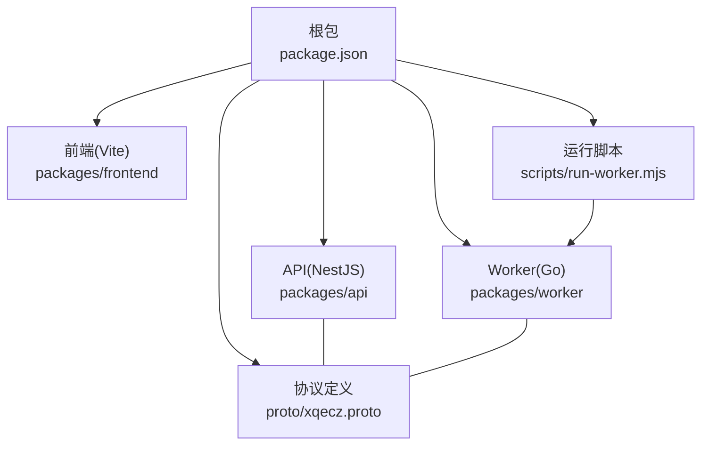
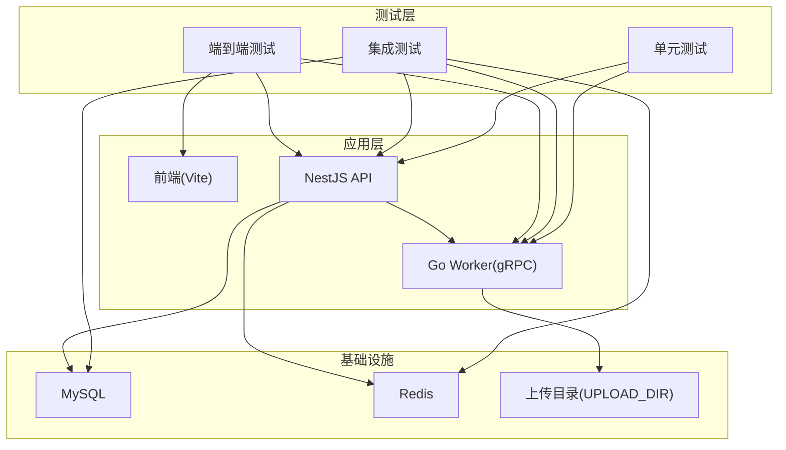
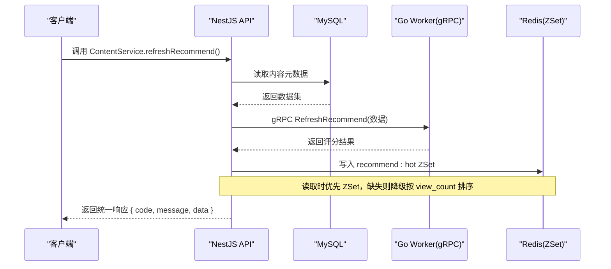
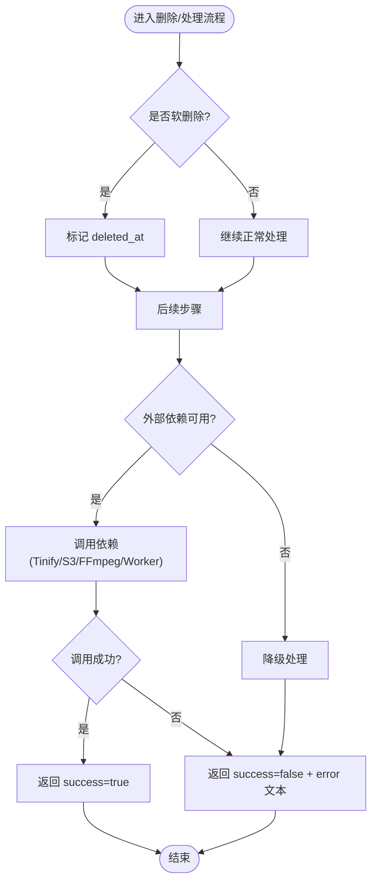

# 测试策略

<cite>
**本文引用的文件**   
- [plan.md](file://plan.md)
- [AGENTS.md](file://AGENTS.md)
- [package.json](file://package.json)
- [pnpm-workspace.yaml](file://pnpm-workspace.yaml)
- [xqecz.proto](file://proto/xqecz.proto)
- [packages/api/package.json](file://packages/api/package.json)
- [packages/frontend/package.json](file://packages/frontend/package.json)
- [packages/worker/package.json](file://packages/worker/package.json)
- [scripts/run-worker.mjs](file://scripts/run-worker.mjs)
</cite>

## 目录
1. [引言](#引言)
2. [项目结构](#项目结构)
3. [核心组件](#核心组件)
4. [架构总览](#架构总览)
5. [详细组件分析](#详细组件分析)
6. [依赖分析](#依赖分析)
7. [性能考虑](#性能考虑)
8. [故障排查指南](#故障排查指南)
9. [结论](#结论)
10. [附录](#附录)

## 引言
本测试策略面向 xqecz 平台（小泉动漫二创站），覆盖单元测试、集成测试与端到端（E2E）测试的层次结构与覆盖范围，明确 NestJS 后端、Go Worker 服务与前端的测试框架配置与编写规范。文档同时给出测试数据管理、Mock 策略、持续集成建议、覆盖率要求与性能测试指导原则，确保在本地直启（pnpm dev）与生产模式（pnpm start）下均可稳定验证系统行为。

## 项目结构
xqecz 为 monorepo，采用 pnpm workspace 组织 packages：api（NestJS）、frontend（Vite）、worker（Go）。根级 package.json 提供统一脚本入口；proto 定义 gRPC 契约；scripts 提供 worker 启动辅助。

图表来源
- [package.json](file://package.json)
- [pnpm-workspace.yaml](file://pnpm-workspace.yaml)
- [xqecz.proto](file://proto/xqecz.proto)
- [scripts/run-worker.mjs](file://scripts/run-worker.mjs)

章节来源
- [plan.md](file://plan.md)
- [AGENTS.md](file://AGENTS.md)
- [package.json](file://package.json)
- [pnpm-workspace.yaml](file://pnpm-workspace.yaml)

## 核心组件
- NestJS API：独占 MySQL/Redis，对外暴露 REST/GraphQL（以实际实现为准），通过 gRPC 客户端调用 Go Worker 进行纯计算任务。
- Go Worker：无状态 gRPC 服务，接收数据、执行打分/处理逻辑，返回结果给 NestJS 落库或写缓存。
- Vite 前端：消费 api 接口，遵循统一响应格式 { code, message, data }。

章节来源
- [plan.md](file://plan.md)
- [AGENTS.md](file://AGENTS.md)

## 架构总览
下图展示三层测试如何映射到运行时组件与外部依赖。

图表来源
- [xqecz.proto](file://proto/xqecz.proto)
- [scripts/run-worker.mjs](file://scripts/run-worker.mjs)

## 详细组件分析

### NestJS 后端测试策略
- 单元测试
  - 使用 Jest + supertest 对控制器与服务进行隔离测试。
  - 对 TypeORM 实体与查询使用内存数据库或事务回滚策略。
  - 对 Redis 操作使用 ioredis-mock 或内存替换。
  - 对 gRPC 客户端使用 jest.fn() 或自定义工厂注入 mock 实现。
- 集成测试
  - 使用 Test.createTestingModule() 构建完整模块图，连接真实 MySQL/Redis（容器或本地实例）。
  - 使用夹具与工厂生成测试数据，保证幂等与可重复。
  - 针对 gRPC 调用，使用 grpc-mock 或进程内 stub 模拟 Worker 响应。
- E2E 测试
  - 使用 supertest 发起 HTTP 请求，启动完整 NestJS 应用（含中间件、拦截器、管道）。
  - 通过环境变量切换至测试数据库与缓存前缀（ioredis keyPrefix=xqecz:）。
  - 校验统一响应格式 { code, message, data } 及业务断言。

章节来源
- [packages/api/package.json](file://packages/api/package.json)

### Go Worker 服务测试策略
- 单元测试
  - 使用标准 testing 包与 testify/assert 进行断言。
  - 对纯函数与算法逻辑进行白盒测试，覆盖边界与异常分支。
- 集成测试
  - 使用 grpc-go/testing 或自定义 server 启动 gRPC 服务，构造请求/响应流。
  - 对文件系统写入（上传目录）使用临时目录与清理钩子。
- Mock gRPC 调用
  - 对外部依赖（如 FFmpeg/Tinify/S3）使用接口抽象与内存实现。
  - 对 NestJS 侧回调使用 http-test 或内存队列模拟。

章节来源
- [packages/worker/package.json](file://packages/worker/package.json)
- [xqecz.proto](file://proto/xqecz.proto)

### 前端组件与 API 集成测试
- 组件测试
  - 使用 Vitest + Testing Library 渲染与交互断言，避免实现细节耦合。
  - 对路由、状态管理与副作用使用对应测试工具（如 react-router-dom/test-utils、zustand/jest）。
- API 集成测试
  - 使用 vitest-fetch-mock 或 MSW 拦截 fetch/axios 请求，基于 packages/frontend/src/api/index.ts 的契约构造响应。
  - 校验统一包装格式 { code, message, data } 与错误码语义。

章节来源
- [packages/frontend/package.json](file://packages/frontend/package.json)

### 关键流程时序：推荐刷新链路
该流程体现 NestJS 读取 MySQL、gRPC 调用 Worker 打分、写入 Redis ZSet 以及降级策略。

图表来源
- [xqecz.proto](file://proto/xqecz.proto)

### 删除与降级策略（流程图）
所有删除均为软删除；外部依赖缺失一律降级，gRPC 不抛 rpc error，仅返回 success=false + error 文本。

图表来源
- [xqecz.proto](file://proto/xqecz.proto)

## 依赖分析
- 测试框架与工具
  - NestJS：Jest、supertest、ioredis-mock、grpc-mock（或进程内 stub）。
  - Go：testing、testify、grpc-go/testing。
  - 前端：Vitest、Testing Library、MSW 或 fetch-mock。
- 外部依赖
  - MySQL、Redis、文件系统（UPLOAD_DIR）、gRPC 协议（proto/xqecz.proto）。
- 环境变量与配置
  - 单一配置源 packages/api/.env；scripts/run-worker.mjs 启动 worker 时自动注入同一 .env。
  - ioredis keyPrefix=xqecz: 用于隔离测试环境。

章节来源
- [packages/api/package.json](file://packages/api/package.json)
- [packages/worker/package.json](file://packages/worker/package.json)
- [packages/frontend/package.json](file://packages/frontend/package.json)
- [scripts/run-worker.mjs](file://scripts/run-worker.mjs)
- [xqecz.proto](file://proto/xqecz.proto)

## 性能考虑
- 基准测试
  - NestJS：使用 autocannon 对热点接口压测，关注 QPS、P95/P99 延迟与错误率。
  - Go Worker：使用 wrk/grpcurl 对 gRPC 端点压测，评估 CPU/内存峰值与吞吐。
- 缓存与降级
  - 验证 Redis ZSet 命中路径与降级路径的性能差异，确保降级不影响可用性。
- 资源隔离
  - 测试数据库与缓存使用独立实例或命名空间，避免污染生产数据。
  - 上传目录使用临时路径，测试后清理。

[本节为通用指导，无需引用具体文件]

## 故障排查指南
- 常见问题
  - gRPC 调用失败：检查 proto 字段命名（snake_case）、keepCase:true 设置与端口连通性。
  - 软删除未生效：确认 TypeORM @DeleteDateColumn 与查询过滤是否正确。
  - 缓存键冲突：核对 ioredis keyPrefix=xqecz: 与测试环境隔离。
  - 上传目录权限：确认 UPLOAD_DIR 存在且可写。
- 定位手段
  - 开启调试日志与结构化输出。
  - 使用浏览器网络面板与 Postman/gRPCurl 复现问题。
  - 在 CI 中保留测试产物与日志以便回溯。

章节来源
- [xqecz.proto](file://proto/xqecz.proto)

## 结论
本策略围绕 NestJS、Go Worker 与前端三端分别定义了单元、集成与 E2E 测试目标、工具链与最佳实践，结合统一的 gRPC 契约与降级策略，确保系统在开发与生产环境下具备高可靠的可观测性与稳定性。建议在 CI 中固化覆盖率门槛与性能基线，持续回归关键路径。

[本节为总结性内容，无需引用具体文件]

## 附录

### 测试环境与数据管理
- 环境隔离
  - 使用不同 .env 或环境变量区分测试与生产。
  - 数据库与缓存使用前缀或独立实例。
- 测试数据
  - 使用夹具与工厂方法生成一致数据。
  - 每个用例前后进行数据清理或事务回滚。
- Mock 策略
  - 外部依赖一律通过接口抽象与内存实现替代。
  - gRPC 使用 stub/mock 服务器或进程内实现。

章节来源
- [scripts/run-worker.mjs](file://scripts/run-worker.mjs)
- [xqecz.proto](file://proto/xqecz.proto)

### 持续集成建议
- 触发条件：PR 与主分支推送。
- 阶段划分：lint → 单元测试 → 集成测试 → E2E → 性能基准。
- 报告与归档：覆盖率报告、性能指标与测试日志归档。
- 门禁规则：覆盖率阈值、性能回归阈值与失败阻断。

[本节为通用指导，无需引用具体文件]

### 覆盖率要求与性能基线
- 覆盖率
  - 语句/分支/函数/行覆盖率均设定最低阈值（例如 ≥80%）。
  - 关键路径（认证、支付、推荐刷新）需更高阈值。
- 性能基线
  - 热点接口 P95 ≤ 指定毫秒数，错误率 ≤ 指定百分比。
  - Worker 吞吐与延迟在负载变化下的稳定性。

[本节为通用指导，无需引用具体文件]