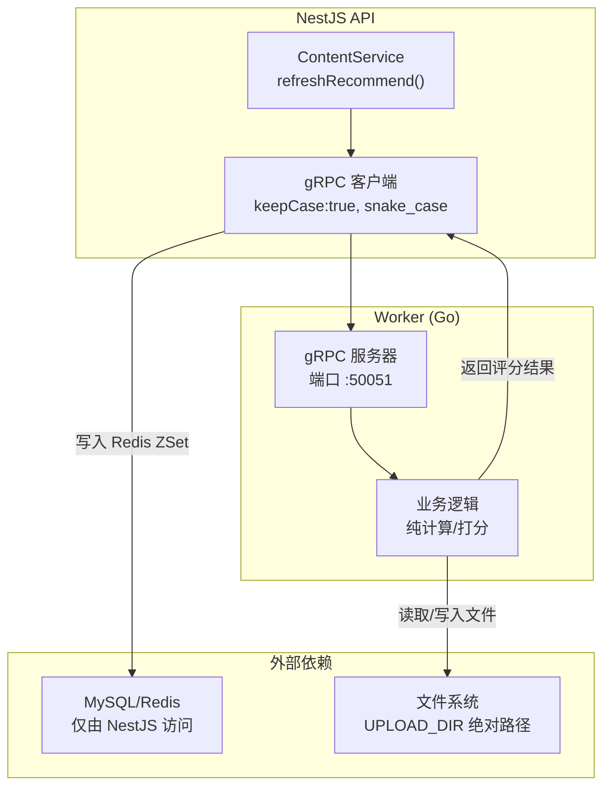
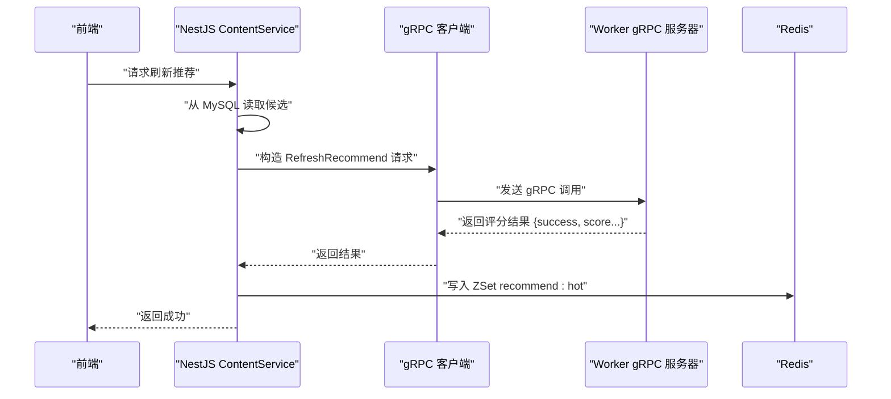
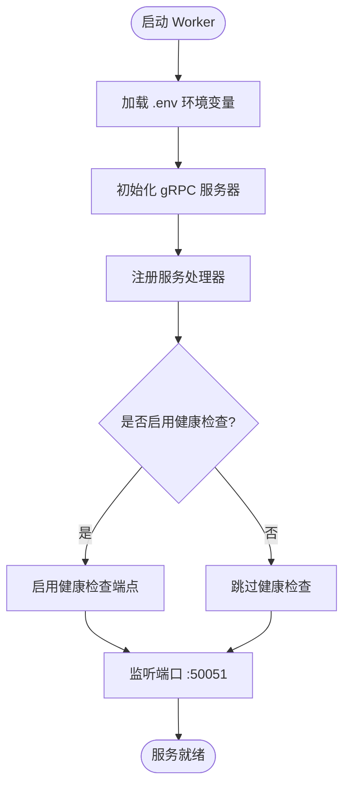
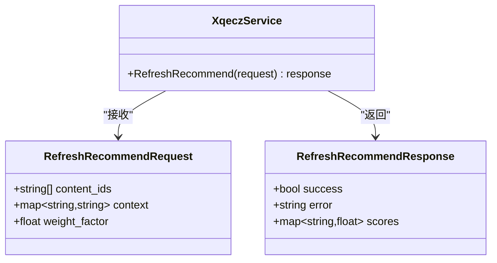
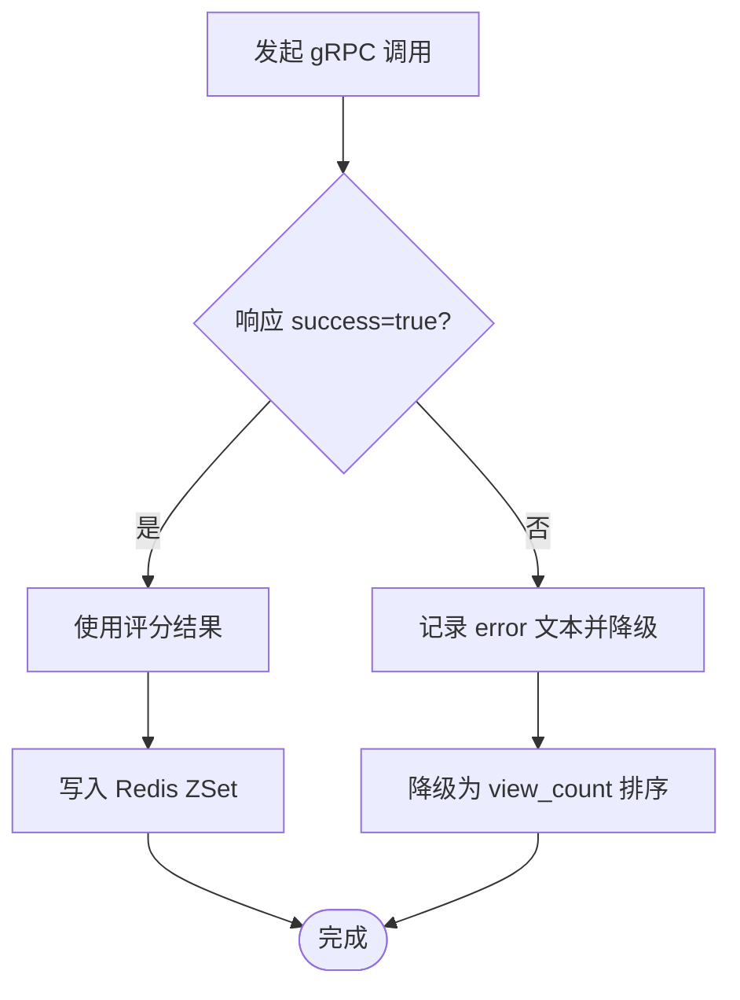
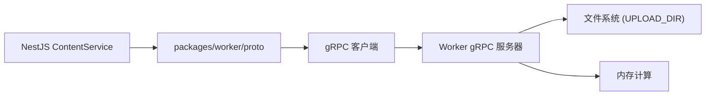

# gRPC 服务实现

<cite>
**本文引用的文件**   
- [scripts/run-worker.mjs](file://scripts/run-worker.mjs)
- [proto/xqecz.proto](file://proto/xqecz.proto)
- [packages/worker/proto](file://packages/worker/proto)
- [packages/api/src/modules/content/content.service.ts](file://packages/api/src/modules/content/content.service.ts)
- [packages/api/.env](file://packages/api/.env)
</cite>

## 目录
1. [简介](#简介)
2. [项目结构](#项目结构)
3. [核心组件](#核心组件)
4. [架构总览](#架构总览)
5. [详细组件分析](#详细组件分析)
6. [依赖关系分析](#依赖关系分析)
7. [性能考量](#性能考量)
8. [故障排查指南](#故障排查指南)
9. [结论](#结论)
10. [附录](#附录)

## 简介
本文件面向 xqecz Worker 的 gRPC 服务实现，聚焦以下目标：
- 说明 gRPC 服务器的启动流程与通过 scripts/run-worker.mjs 读取环境变量注入的方式。
- 解释 proto/xqecz.proto 中定义的接口契约，特别是 RefreshRecommend 等核心接口的参数处理与返回值格式。
- 强调无状态服务设计理念：不连接数据库、无 cron 任务，数据经 gRPC 从 NestJS 传入、结果回传 NestJS 落库/写缓存。
- 详细描述错误处理机制：gRPC 调用失败时返回 success=false 而非 rpc error。
- 包含服务注册、端口配置、健康检查等实现细节。
- 提供具体代码示例展示如何正确调用和响应 gRPC 接口（以路径引用代替代码片段）。

## 项目结构
xqecz 采用 monorepo 组织，Worker 为独立 Go 进程，通过 pnpm 脚本统一启动。关键位置如下：
- proto 定义：proto/xqecz.proto
- Worker 启动入口与环境变量注入：scripts/run-worker.mjs
- Worker 生成的 gRPC 客户端/服务端桩：packages/worker/proto
- NestJS API 侧调用 gRPC 的业务入口：packages/api/src/modules/content/content.service.ts
- 共享环境变量来源：packages/api/.env（UPLOAD_DIR 等）

图表来源
- [packages/api/src/modules/content/content.service.ts](file://packages/api/src/modules/content/content.service.ts)
- [proto/xqecz.proto](file://proto/xqecz.proto)
- [scripts/run-worker.mjs](file://scripts/run-worker.mjs)

章节来源
- [scripts/run-worker.mjs](file://scripts/run-worker.mjs)
- [proto/xqecz.proto](file://proto/xqecz.proto)
- [packages/api/src/modules/content/content.service.ts](file://packages/api/src/modules/content/content.service.ts)
- [packages/api/.env](file://packages/api/.env)

## 核心组件
- gRPC 协议定义：proto/xqecz.proto
  - 定义 Worker 对外暴露的服务方法与消息类型，例如 RefreshRecommend 请求/响应结构。
  - 字段命名约定：NestJS 客户端使用 keepCase:true，字段以 snake_case 传输。
- Worker 启动器：scripts/run-worker.mjs
  - 负责读取 .env 中的环境变量（如 UPLOAD_DIR），并注入到 Worker 进程环境。
  - 启动 gRPC 服务器，监听默认端口（通常为 :50051），注册服务处理器。
- NestJS 调用方：packages/api/src/modules/content/content.service.ts
  - 封装对 Worker 的 gRPC 调用，将 MySQL 查询结果转换为 gRPC 请求参数。
  - 接收 Worker 返回的评分结果，写入 Redis ZSet（keyPrefix=xqecz:），用于推荐排序。
- 生成产物：packages/worker/proto
  - 由 proto 编译生成的 gRPC 客户端/服务端桩，供 Go 端实现与 NestJS 端调用。

章节来源
- [proto/xqecz.proto](file://proto/xqecz.proto)
- [scripts/run-worker.mjs](file://scripts/run-worker.mjs)
- [packages/api/src/modules/content/content.service.ts](file://packages/api/src/modules/content/content.service.ts)
- [packages/worker/proto](file://packages/worker/proto)

## 架构总览
xqecz 的推荐链路遵循“API 读库 → gRPC 纯计算 → API 写缓存”的模式：
- ContentService.refreshRecommend() 从 MySQL 读取候选内容。
- 通过 gRPC 调用 Worker 的 RefreshRecommend，进行纯打分计算。
- Worker 返回评分结果，NestJS 将其写入 Redis ZSet recommend:hot（ioredis keyPrefix=xqecz:）。
- 读取降级策略：当推荐不可用时，按 view_count 排序作为降级。

图表来源
- [packages/api/src/modules/content/content.service.ts](file://packages/api/src/modules/content/content.service.ts)
- [proto/xqecz.proto](file://proto/xqecz.proto)

## 详细组件分析

### 启动流程与环境变量注入
- 启动入口：scripts/run-worker.mjs
  - 读取 packages/api/.env 中的环境变量（如 UPLOAD_DIR），注入到 Worker 进程环境。
  - 初始化 gRPC 服务器，绑定端口（默认 :50051），注册服务处理器。
  - 启动健康检查端点（可选），便于编排系统探测存活。
- 环境变量约定：
  - UPLOAD_DIR：共享上传目录，单一配置源为 packages/api/.env；Worker 通过 gRPC 接收绝对路径。
  - 其他运行时配置（如日志级别、并发限制）可按需扩展。

图表来源
- [scripts/run-worker.mjs](file://scripts/run-worker.mjs)
- [packages/api/.env](file://packages/api/.env)

章节来源
- [scripts/run-worker.mjs](file://scripts/run-worker.mjs)
- [packages/api/.env](file://packages/api/.env)

### 接口契约与参数处理（RefreshRecommend）
- 协议定义：proto/xqecz.proto
  - 定义 RefreshRecommend 的请求与响应结构。
  - 请求参数通常包括：内容标识列表、上下文信息（如用户偏好、时间窗口）、评分权重等。
  - 响应结构包含：success 布尔值、error 文本（失败原因）、score 列表或映射（内容ID→分数）。
- 字段命名：NestJS 客户端设置 keepCase:true，字段以 snake_case 传输。
- 参数处理：
  - NestJS 将 MySQL 查询结果转换为 gRPC 请求参数。
  - Worker 根据输入进行纯计算，不访问数据库，仅依赖内存与文件系统（UPLOAD_DIR）。

图表来源
- [proto/xqecz.proto](file://proto/xqecz.proto)

章节来源
- [proto/xqecz.proto](file://proto/xqecz.proto)

### 无状态服务设计
- 不连接数据库：Worker 仅做纯计算，避免持久化依赖，提升可伸缩性。
- 无 cron 任务：定时任务由 NestJS 或其他调度器承担，Worker 按需响应。
- 数据流：NestJS 负责读写 MySQL/Redis，Worker 仅处理计算密集型任务。
- 文件访问：通过 UPLOAD_DIR 绝对路径访问共享存储，确保多实例一致性。

章节来源
- [proto/xqecz.proto](file://proto/xqecz.proto)
- [scripts/run-worker.mjs](file://scripts/run-worker.mjs)

### 错误处理机制
- 原则：gRPC 调用失败时返回 success=false 与 error 文本，而非 rpc error。
- 实现要点：
  - Worker 捕获异常，构造标准响应 {success:false, error:"描述"}。
  - NestJS 客户端解析响应，若 success=false，则记录日志并降级处理（如按 view_count 排序）。
- 降级策略：
  - 推荐不可用时，回退至基于 view_count 的排序。
  - 文件缺失或外部依赖不可用，直接降级，不影响主流程。

图表来源
- [proto/xqecz.proto](file://proto/xqecz.proto)
- [packages/api/src/modules/content/content.service.ts](file://packages/api/src/modules/content/content.service.ts)

章节来源
- [proto/xqecz.proto](file://proto/xqecz.proto)
- [packages/api/src/modules/content/content.service.ts](file://packages/api/src/modules/content/content.service.ts)

### 服务注册、端口配置与健康检查
- 服务注册：scripts/run-worker.mjs 中注册 XqeczService 处理器。
- 端口配置：默认监听 :50051，可通过环境变量覆盖（建议保留默认）。
- 健康检查：可选实现 /health 或 gRPC 健康检查服务，便于容器编排探测。

章节来源
- [scripts/run-worker.mjs](file://scripts/run-worker.mjs)

### 调用与响应示例（路径引用）
- NestJS 调用 Worker：
  - 参考 packages/api/src/modules/content/content.service.ts 中 refreshRecommend() 的实现。
  - 构造 RefreshRecommendRequest，设置 keepCase:true，字段 snake_case。
- Worker 响应格式：
  - 参考 proto/xqecz.proto 中 RefreshRecommendResponse 的定义。
  - 成功：{success:true, scores:{...}}
  - 失败：{success:false, error:"错误描述"}

章节来源
- [packages/api/src/modules/content/content.service.ts](file://packages/api/src/modules/content/content.service.ts)
- [proto/xqecz.proto](file://proto/xqecz.proto)

## 依赖关系分析
- NestJS 依赖 Worker 的 gRPC 服务，通过 packages/worker/proto 生成的桩进行调用。
- Worker 依赖文件系统（UPLOAD_DIR）与内存计算，不依赖数据库。
- 环境变量由 scripts/run-worker.mjs 统一注入，确保配置一致性。

图表来源
- [packages/api/src/modules/content/content.service.ts](file://packages/api/src/modules/content/content.service.ts)
- [packages/worker/proto](file://packages/worker/proto)
- [scripts/run-worker.mjs](file://scripts/run-worker.mjs)

章节来源
- [packages/api/src/modules/content/content.service.ts](file://packages/api/src/modules/content/content.service.ts)
- [packages/worker/proto](file://packages/worker/proto)
- [scripts/run-worker.mjs](file://scripts/run-worker.mjs)

## 性能考量
- 无状态设计：Worker 可水平扩展，无需会话共享。
- 纯计算：避免 I/O 瓶颈，提升吞吐。
- 缓存优先：NestJS 写入 Redis ZSet，减少重复计算。
- 降级策略：外部依赖缺失时快速回退，保障可用性。

## 故障排查指南
- 常见问题：
  - 端口冲突：确认 :50051 未被占用。
  - 环境变量缺失：检查 packages/api/.env 中的 UPLOAD_DIR 是否正确注入。
  - 文件权限：确保 Worker 进程有 UPLOAD_DIR 的读写权限。
  - 网络连通：NestJS 与 Worker 间网络可达。
- 调试步骤：
  - 查看 Worker 日志，确认服务启动与请求处理。
  - 验证 gRPC 调用参数是否符合 proto 定义。
  - 检查 NestJS 降级逻辑是否生效。

## 结论
xqecz Worker 的 gRPC 服务实现了无状态、高内聚的计算能力，与 NestJS 形成清晰的职责边界。通过统一的协议定义与环境变量注入，确保了系统的可维护性与可扩展性。错误处理与降级策略保障了服务的健壮性，适合在生产环境中稳定运行。

## 附录
- 相关文档：
  - 前后端接口契约：packages/frontend/src/api/index.ts
  - 代码审查指南：docs/code-review.md
  - 项目计划：plan.md