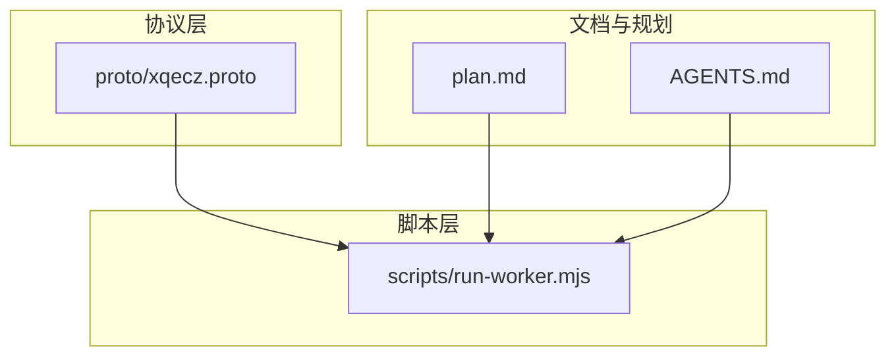
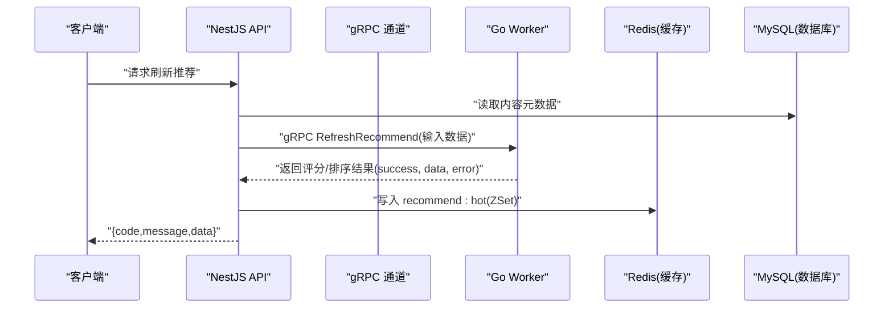
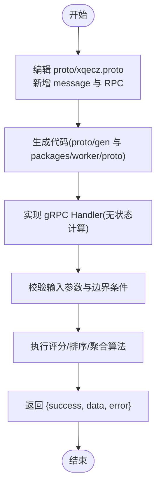
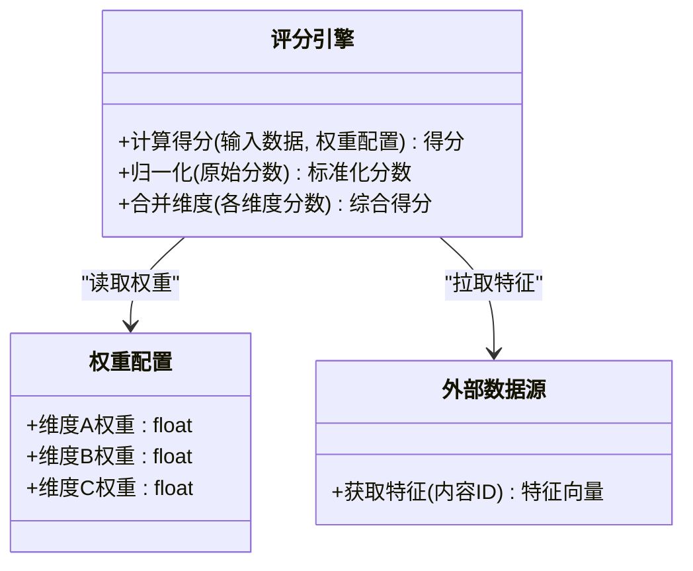
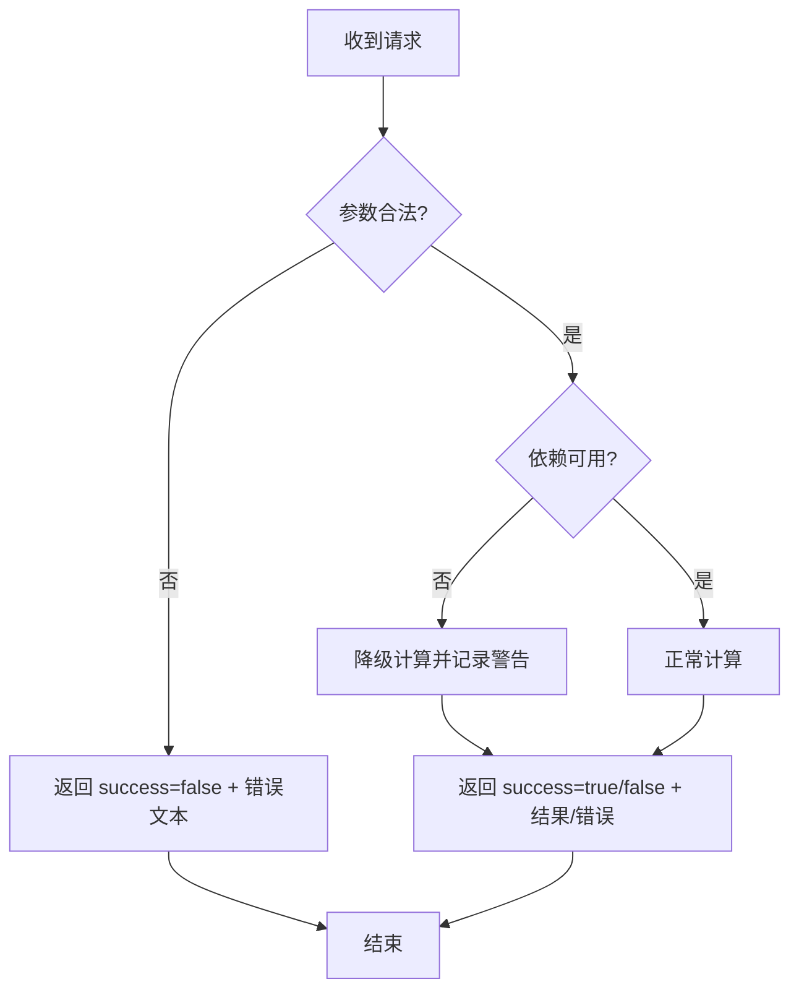
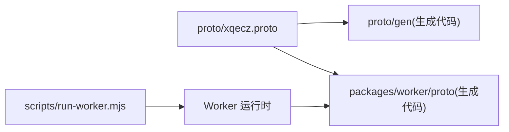

# 扩展开发指南

<cite>
**本文引用的文件**   
- [xqecz.proto](file://proto/xqecz.proto)
- [run-worker.mjs](file://scripts/run-worker.mjs)
- [plan.md](file://plan.md)
- [AGENTS.md](file://AGENTS.md)
</cite>

## 目录
1. [简介](#简介)
2. [项目结构](#项目结构)
3. [核心组件](#核心组件)
4. [架构总览](#架构总览)
5. [详细组件分析](#详细组件分析)
6. [依赖分析](#依赖分析)
7. [性能考虑](#性能考虑)
8. [故障排查指南](#故障排查指南)
9. [结论](#结论)
10. [附录](#附录)

## 简介
本指南面向希望在 xqecz Worker（Go gRPC 计算服务）中进行扩展开发的工程师，覆盖从接口定义、算法实现、错误处理到测试与版本兼容的完整流程。Worker 是无状态计算节点，不直连数据库或定时任务，所有数据通过 gRPC 由 NestJS API 传入，结果回传给 API 落库/写缓存。推荐链路为：API 读取 MySQL → gRPC RefreshRecommend 由 worker 纯打分 → API 写入 Redis ZSet recommend:hot；读取时若缓存不可用则降级为 view_count 排序。

## 项目结构
仓库采用 monorepo 组织，关键目录与职责如下：
- proto：gRPC 契约定义（xqecz.proto），生成产物位于 proto/gen 与 packages/worker/proto，二者均为自动生成代码，不应作为手写源码分析。
- scripts：运行脚本（run-worker.mjs），负责启动 worker 并注入环境变量（如 UPLOAD_DIR）。
- packages：前端、API、Worker 等子包（具体实现以生成代码和运行时逻辑为主）。
- docs 与根配置：包含协作规范、计划说明等。

图表来源
- [xqecz.proto](file://proto/xqecz.proto)
- [run-worker.mjs](file://scripts/run-worker.mjs)
- [plan.md](file://plan.md)
- [AGENTS.md](file://AGENTS.md)

章节来源
- [xqecz.proto](file://proto/xqecz.proto)
- [run-worker.mjs](file://scripts/run-worker.mjs)
- [plan.md](file://plan.md)
- [AGENTS.md](file://AGENTS.md)

## 核心组件
- gRPC 契约（proto）：定义所有对外暴露的计算接口、请求/响应消息、字段命名与版本演进规则。
- Worker 启动器（run-worker.mjs）：加载 .env 环境变量，启动 gRPC 服务，确保上传路径等关键配置可用。
- 计算模块（按 proto 生成的服务实现）：无状态算法实现，接收输入数据，执行评分/排序/聚合等计算，返回结构化结果。
- 错误处理策略：外部依赖缺失一律降级，gRPC 不抛 rpc error，仅返回 success=false 与错误文本，便于上层统一处理。

章节来源
- [xqecz.proto](file://proto/xqecz.proto)
- [run-worker.mjs](file://scripts/run-worker.mjs)

## 架构总览
下图展示 NestJS API 与 Go Worker 的交互关系及数据流向。API 独占 MySQL/Redis，Worker 仅做纯计算，通过 gRPC 交换数据。

图表来源
- [xqecz.proto](file://proto/xqecz.proto)
- [run-worker.mjs](file://scripts/run-worker.mjs)

## 详细组件分析

### 新增 gRPC 接口与消息定义
目标：在 proto 中新增一个计算接口，例如“批量评分”，并确保字段命名与版本兼容。

步骤要点
- 在 proto/xqecz.proto 中新增 message 与 service RPC 方法。
- 遵循 snake_case 字段命名约定（NestJS 客户端设置 keepCase:true）。
- 为新增字段添加注释与默认值，避免破坏已有调用方。
- 生成代码后，在 worker 侧实现对应 handler，保持无状态与幂等。

图表来源
- [xqecz.proto](file://proto/xqecz.proto)

章节来源
- [xqecz.proto](file://proto/xqecz.proto)

### 算法实现与权重调整
目标：扩展现有评分维度、调整权重参数、集成外部数据源（通过 gRPC 输入）。

步骤要点
- 将评分维度抽象为可插拔模块，便于新增/替换。
- 权重参数集中管理，支持热更新或配置化注入（由 API 传入）。
- 外部数据源以只读方式通过 gRPC 请求体提供，Worker 不直接访问数据库。
- 对异常与缺失数据进行降级处理，保证 success=true 且 error 文本描述问题。

图表来源
- [xqecz.proto](file://proto/xqecz.proto)

章节来源
- [xqecz.proto](file://proto/xqecz.proto)

### 错误处理与降级策略
原则
- 外部依赖缺失一律降级，不抛出 rpc error。
- 统一返回格式：success=false 时附带 error 文本，success=true 时 data 可为空但需明确语义。
- 对非法输入进行快速失败，减少无效计算。

图表来源
- [xqecz.proto](file://proto/xqecz.proto)

章节来源
- [xqecz.proto](file://proto/xqecz.proto)

### 启动与环境变量
- run-worker.mjs 负责读取 .env（UPLOAD_DIR 等），并以绝对路径传递给计算模块。
- 确保环境变量单一来源（packages/api/.env），worker 启动时自动注入。

章节来源
- [run-worker.mjs](file://scripts/run-worker.mjs)

## 依赖分析
- 契约依赖：proto/xqecz.proto 是所有调用方的唯一契约，变更需遵循向后兼容。
- 运行时依赖：Worker 不依赖数据库与 cron，仅依赖 gRPC 与文件系统（上传路径）。
- 生成代码依赖：proto/gen 与 packages/worker/proto 为自动生成，不应手动修改。

图表来源
- [xqecz.proto](file://proto/xqecz.proto)
- [run-worker.mjs](file://scripts/run-worker.mjs)

章节来源
- [xqecz.proto](file://proto/xqecz.proto)
- [run-worker.mjs](file://scripts/run-worker.mjs)

## 性能考虑
- 无状态设计：Worker 可水平扩展，避免共享状态。
- 计算隔离：每个请求独立计算，避免全局锁。
- 输入裁剪：仅传递必要字段，减少序列化开销。
- 缓存友好：结果结构利于 API 写入 Redis ZSet，提升读取性能。
- 降级优先：外部依赖不可用时快速降级，保障可用性。

[本节为通用指导，无需特定文件引用]

## 故障排查指南
常见问题与定位思路
- 接口不生效：检查 proto 是否重新生成，字段命名是否符合 snake_case。
- 路径错误：确认 UPLOAD_DIR 已正确注入，gRPC 传递的是绝对路径。
- 性能抖动：检查是否出现重复计算或未裁剪输入。
- 错误信息不明确：查看 error 文本，结合日志定位依赖缺失或输入非法。

章节来源
- [xqecz.proto](file://proto/xqecz.proto)
- [run-worker.mjs](file://scripts/run-worker.mjs)

## 结论
通过严格遵循 proto 契约、无状态计算与统一错误处理，xqecz Worker 能够稳定承载多样化评分与排序需求。扩展时应聚焦于模块化算法、可配置权重与健壮降级，确保向后兼容与高性能。

[本节为总结性内容，无需特定文件引用]

## 附录

### 版本兼容性管理
- 字段演进：新增字段必须带默认值，禁止删除或重命名已有字段。
- 方法演进：新增 RPC 方法不影响现有调用方；废弃方法保留一段时间。
- 生成代码：每次 proto 变更后需同步更新 proto/gen 与 packages/worker/proto。
- 测试验证：对旧版调用方进行回归测试，确保行为一致。

章节来源
- [xqecz.proto](file://proto/xqecz.proto)

### 完整扩展开发示例（从需求到实现）
- 需求分析：确定新增评分维度与权重策略。
- 接口定义：在 proto 中新增 message 与 RPC，明确输入输出。
- 代码生成：运行生成命令，确保两端代码一致。
- 算法实现：实现无状态计算模块，处理边界与降级。
- 联调测试：API 端到端验证，覆盖成功、失败、降级场景。
- 上线发布：灰度发布，监控指标与错误率。

章节来源
- [xqecz.proto](file://proto/xqecz.proto)
- [run-worker.mjs](file://scripts/run-worker.mjs)

### 最佳实践与常见陷阱
- 最佳实践
  - 单一配置源：所有环境变量通过 .env 统一管理。
  - 契约优先：先定义 proto，再实现服务。
  - 降级优先：外部依赖缺失时仍返回成功语义，附带错误文本。
- 常见陷阱
  - 直接修改生成代码：应修改 proto 并重新生成。
  - 忽略字段命名：务必使用 snake_case。
  - 未处理非法输入：应在入口处快速失败。

章节来源
- [xqecz.proto](file://proto/xqecz.proto)
- [run-worker.mjs](file://scripts/run-worker.mjs)