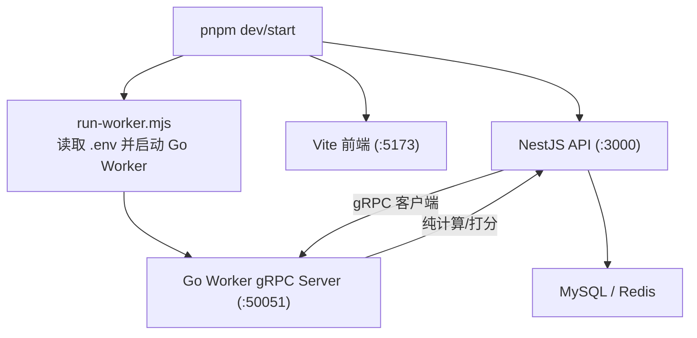
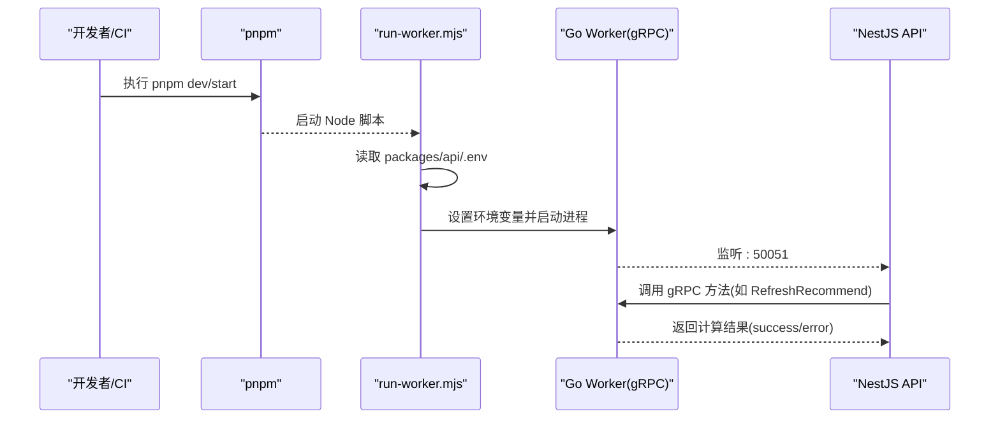
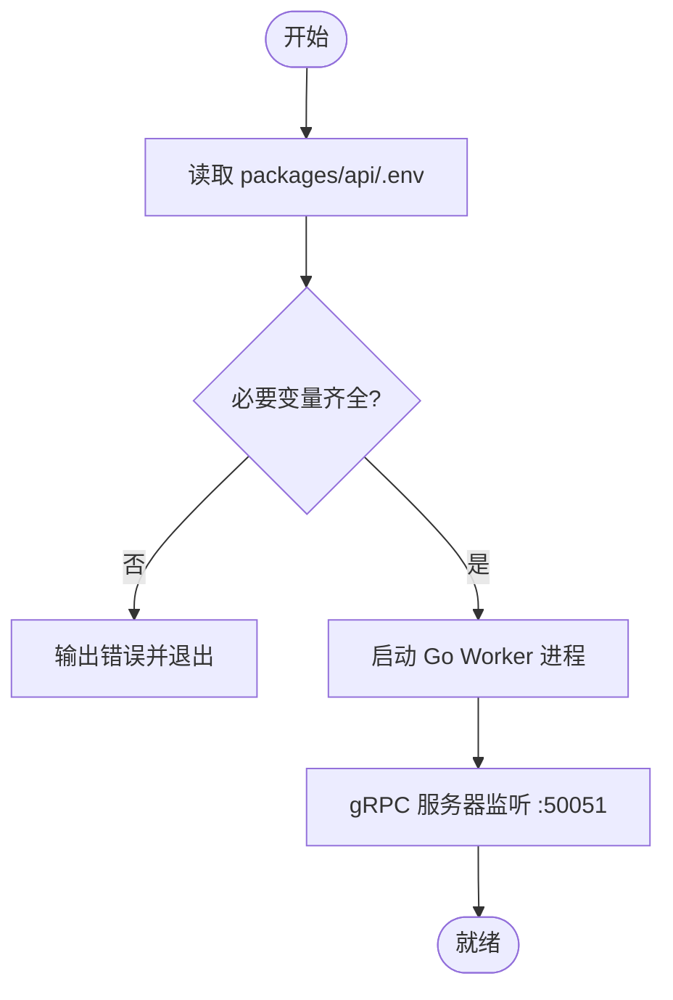
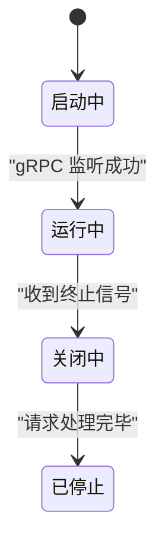
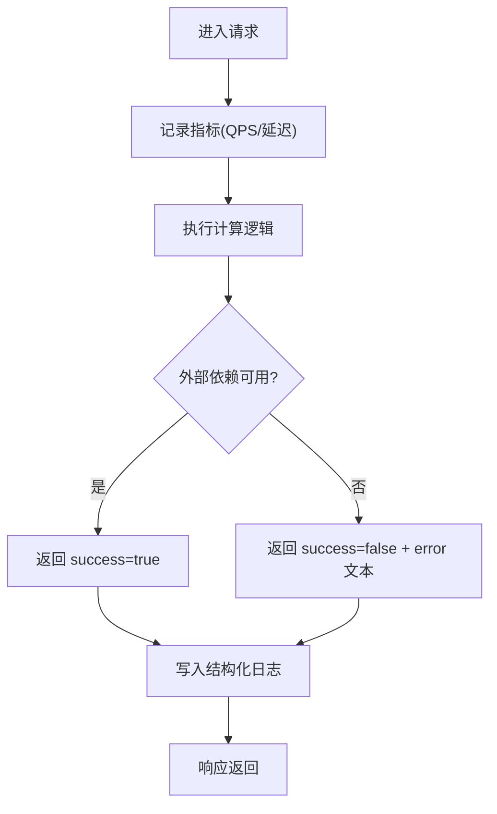
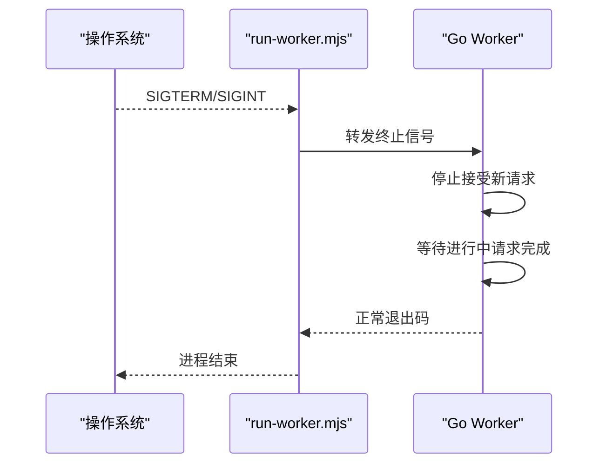
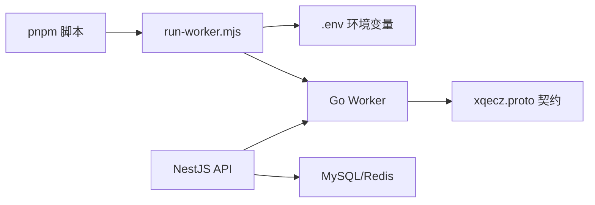

# 服务生命周期管理

<cite>
**本文引用的文件**   
- [packages/worker](file://packages/worker)
- [scripts/run-worker.mjs](file://scripts/run-worker.mjs)
- [proto/xqecz.proto](file://proto/xqecz.proto)
- [packages/api/.env](file://packages/api/.env)
- [package.json](file://package.json)
</cite>

## 目录
1. [简介](#简介)
2. [项目结构](#项目结构)
3. [核心组件](#核心组件)
4. [架构总览](#架构总览)
5. [详细组件分析](#详细组件分析)
6. [依赖关系分析](#依赖关系分析)
7. [性能考量](#性能考量)
8. [故障排查指南](#故障排查指南)
9. [结论](#结论)
10. [附录：配置与环境变量](#附录配置与环境变量)

## 简介
本文件面向 xqecz Worker 服务的生命周期管理，覆盖启动流程、运行期状态管理、监控与日志、优雅关闭、重启与故障恢复、部署与环境变量管理等关键主题。Worker 为无状态 gRPC 计算服务，不直连数据库或缓存，所有数据通过 NestJS API 经 gRPC 传入并回传结果；共享上传目录由环境变量统一约定，路径以绝对值在 gRPC 调用中传递。

## 项目结构
- packages/worker：Go 实现的 gRPC Worker 服务（生成代码位于 proto/gen 与 packages/worker/proto）。
- scripts/run-worker.mjs：Node 脚本，负责读取 .env、注入环境变量并启动 Go Worker。
- proto/xqecz.proto：gRPC 接口契约定义。
- packages/api/.env：唯一配置源，包含 UPLOAD_DIR 等环境变量，供 api 与 worker 共享。
- package.json：pnpm 工作区与脚本入口（dev/start）。

图表来源
- [package.json:1-200](file://package.json#L1-L200)
- [scripts/run-worker.mjs:1-200](file://scripts/run-worker.mjs#L1-L200)
- [packages/api/.env:1-200](file://packages/api/.env#L1-L200)
- [proto/xqecz.proto:1-200](file://proto/xqecz.proto#L1-L200)

章节来源
- [package.json:1-200](file://package.json#L1-L200)
- [scripts/run-worker.mjs:1-200](file://scripts/run-worker.mjs#L1-L200)
- [packages/api/.env:1-200](file://packages/api/.env#L1-L200)
- [proto/xqecz.proto:1-200](file://proto/xqecz.proto#L1-L200)

## 核心组件
- 启动器 run-worker.mjs：加载 .env、注入环境变量、拉起 Go Worker 进程。
- Go Worker：实现 gRPC 服务端，处理计算任务（如推荐打分），无状态、无持久化。
- gRPC 契约：xqecz.proto 定义接口与方法，NestJS 作为客户端调用。
- 配置中心：packages/api/.env 提供共享环境变量（如 UPLOAD_DIR）。

章节来源
- [scripts/run-worker.mjs:1-200](file://scripts/run-worker.mjs#L1-L200)
- [proto/xqecz.proto:1-200](file://proto/xqecz.proto#L1-L200)
- [packages/api/.env:1-200](file://packages/api/.env#L1-L200)

## 架构总览
Worker 的生命周期围绕“启动—运行—关闭”三阶段展开，配合外部守护与错误降级策略，确保高可用与可观测性。

图表来源
- [scripts/run-worker.mjs:1-200](file://scripts/run-worker.mjs#L1-L200)
- [proto/xqecz.proto:1-200](file://proto/xqecz.proto#L1-L200)

## 详细组件分析

### 启动流程与环境变量
- 环境变量来源：唯一配置源为 packages/api/.env，run-worker.mjs 启动时读取并注入到 Worker 进程环境。
- 关键变量：UPLOAD_DIR（共享上传目录）必须存在且为绝对路径；其他变量按需扩展。
- 启动顺序：pnpm 脚本 → run-worker.mjs → 注入 .env → 启动 Go Worker → gRPC 监听端口。

图表来源
- [scripts/run-worker.mjs:1-200](file://scripts/run-worker.mjs#L1-L200)
- [packages/api/.env:1-200](file://packages/api/.env#L1-L200)

章节来源
- [scripts/run-worker.mjs:1-200](file://scripts/run-worker.mjs#L1-L200)
- [packages/api/.env:1-200](file://packages/api/.env#L1-L200)

### 运行期状态与资源管理
- 无状态设计：Worker 不持有连接池、不写库、不定时任务；请求即算即返。
- 资源清理：进程退出时释放系统资源（句柄、内存），无需显式连接池管理。
- 优雅关闭：建议捕获 SIGTERM/SIGINT，停止接受新请求，等待进行中请求完成后再退出。

图表来源
- [scripts/run-worker.mjs:1-200](file://scripts/run-worker.mjs#L1-L200)

章节来源
- [scripts/run-worker.mjs:1-200](file://scripts/run-worker.mjs#L1-L200)

### 监控与日志
- 指标收集：建议在 Worker 内部暴露轻量指标（QPS、延迟、错误率），便于外部采集。
- 错误日志：对外部依赖缺失一律降级，返回 success=false + error 文本，避免 rpc error。
- 健康检查：可通过 gRPC 方法或 HTTP 探针暴露健康端点（如 /health），用于编排平台探测。

图表来源
- [proto/xqecz.proto:1-200](file://proto/xqecz.proto#L1-L200)

章节来源
- [proto/xqecz.proto:1-200](file://proto/xqecz.proto#L1-L200)

### 优雅关闭与进程守护
- 优雅关闭：捕获终止信号，拒绝新请求，等待进行中请求完成，再安全退出。
- 进程守护：建议使用容器或进程管理器（systemd/pm2）进行守护与自动重启。
- 状态恢复：由于无状态，重启后无需状态恢复；确保 .env 一致即可。

图表来源
- [scripts/run-worker.mjs:1-200](file://scripts/run-worker.mjs#L1-L200)

章节来源
- [scripts/run-worker.mjs:1-200](file://scripts/run-worker.mjs#L1-L200)

### 重启与故障恢复
- 自动重启：由进程管理器根据退出码决定是否重启；建议区分致命与非致命错误。
- 降级策略：外部依赖不可用时，Worker 返回 success=false + error 文本，NestJS 侧做降级（如按 view_count 排序）。
- 一致性保障：无状态设计避免重启导致的数据不一致问题。

章节来源
- [proto/xqecz.proto:1-200](file://proto/xqecz.proto#L1-L200)

## 依赖关系分析
- 运行时依赖：Node.js（用于 run-worker.mjs）、Go（编译后的 Worker 二进制）。
- 外部依赖：MySQL/Redis 仅由 NestJS 使用；Worker 不直连。
- 协议依赖：xqecz.proto 定义的 gRPC 接口。

图表来源
- [package.json:1-200](file://package.json#L1-L200)
- [scripts/run-worker.mjs:1-200](file://scripts/run-worker.mjs#L1-L200)
- [packages/api/.env:1-200](file://packages/api/.env#L1-L200)
- [proto/xqecz.proto:1-200](file://proto/xqecz.proto#L1-L200)

章节来源
- [package.json:1-200](file://package.json#L1-L200)
- [scripts/run-worker.mjs:1-200](file://scripts/run-worker.mjs#L1-L200)
- [packages/api/.env:1-200](file://packages/api/.env#L1-L200)
- [proto/xqecz.proto:1-200](file://proto/xqecz.proto#L1-L200)

## 性能考量
- 无状态优势：水平扩展简单，可按负载动态扩容 Worker 实例。
- I/O 最小化：Worker 只做计算，避免阻塞型 I/O；必要时使用异步与超时控制。
- 指标与限流：建议暴露 QPS、P95/P99 延迟、错误率；对热点接口实施限流。
- 资源隔离：容器化部署，限制 CPU/内存，避免相互影响。

[本节为通用指导，不直接分析具体文件]

## 故障排查指南
- 启动失败
  - 检查 packages/api/.env 是否存在且包含 UPLOAD_DIR。
  - 确认 run-worker.mjs 能正确读取 .env 并启动 Go Worker。
  - 查看端口 :50051 是否被占用。
- 运行异常
  - 观察 Worker 日志中的 success=false 与 error 文本，定位外部依赖问题。
  - 检查 NestJS 侧降级逻辑是否生效（如 fallback 排序）。
- 优雅关闭
  - 验证终止信号是否被捕获，进行中请求是否完成后再退出。
- 健康检查
  - 若未暴露健康端点，建议增加 gRPC 或 HTTP 健康探针。

章节来源
- [scripts/run-worker.mjs:1-200](file://scripts/run-worker.mjs#L1-L200)
- [proto/xqecz.proto:1-200](file://proto/xqecz.proto#L1-L200)

## 结论
Worker 采用无状态 gRPC 计算服务模式，生命周期简洁清晰：通过 run-worker.mjs 读取 .env 启动，运行期专注计算与指标/日志上报，支持优雅关闭与进程守护。结合 NestJS 的降级策略与外部依赖缺失时的 success=false 语义，整体具备高可用与易运维特性。

[本节为总结性内容，不直接分析具体文件]

## 附录：配置与环境变量
- 唯一配置源：packages/api/.env
- 关键变量
  - UPLOAD_DIR：共享上传目录，必须为绝对路径；Worker 通过 gRPC 接收绝对路径参数。
- 启动方式
  - pnpm dev：同时启动 NestJS API(:3000)、Go Worker(:50051)、Vite 前端(:5173)。
  - pnpm start：生产模式一键构建+运行。
- 最佳实践
  - 保持 .env 与部署环境一致；不同环境使用独立 .env 文件。
  - 在容器或进程管理器中设置环境变量，避免硬编码。

章节来源
- [packages/api/.env:1-200](file://packages/api/.env#L1-L200)
- [package.json:1-200](file://package.json#L1-L200)
- [scripts/run-worker.mjs:1-200](file://scripts/run-worker.mjs#L1-L200)