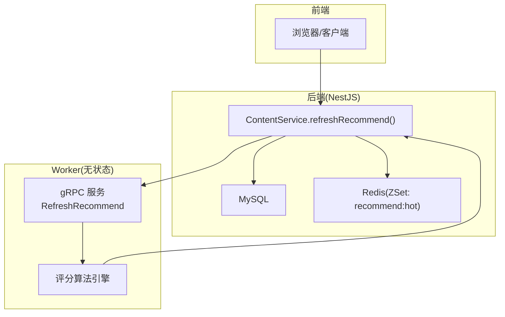
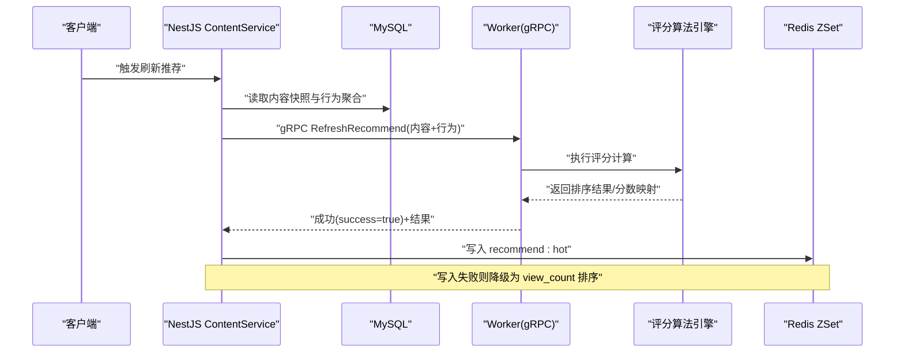
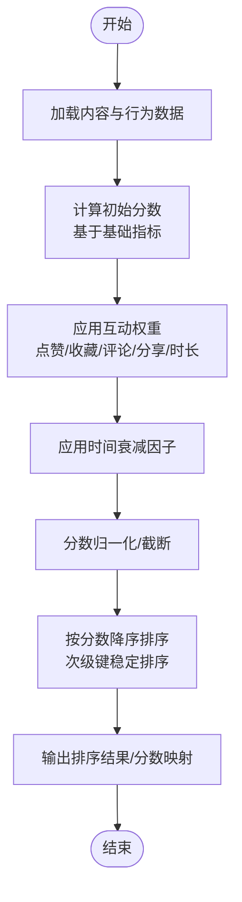
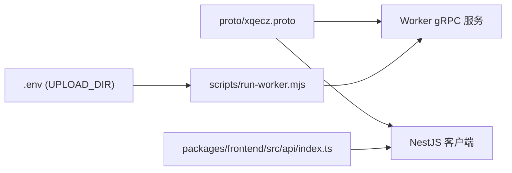

# 算法模块

<cite>
**本文引用的文件**   
- [xqecz.proto](file://proto/xqecz.proto)
- [run-worker.mjs](file://scripts/run-worker.mjs)
- [index.ts](file://packages/frontend/src/api/index.ts)
- [plan.md](file://plan.md)
</cite>

## 目录
1. [简介](#简介)
2. [项目结构](#项目结构)
3. [核心组件](#核心组件)
4. [架构总览](#架构总览)
5. [详细组件分析](#详细组件分析)
6. [依赖关系分析](#依赖关系分析)
7. [性能考量](#性能考量)
8. [故障排查指南](#故障排查指南)
9. [结论](#结论)
10. [附录](#附录)

## 简介
本文件为 xqecz Worker 的推荐算法模块提供系统化文档，聚焦评分算法的实现逻辑与扩展方法。内容涵盖：
- 内容热度计算、用户互动权重、时间衰减因子等核心算法要点
- 数据输入格式（NestJS 传入的内容与用户行为）
- 评分计算流程（初始分数、权重调整、排序规则）
- 性能优化策略（批量处理、缓存机制、内存管理）
- 算法扩展指导（新增维度、参数调优）
- 实现示例与调试方法

项目定位说明：xqecz 是“小泉动漫二创站”，支持图片、视频、图文、链接等内容类型，包含评论、投票与管理后台。推荐链路遵循“NestJS 独占数据库/缓存，Go Worker 无状态 gRPC 纯打分”的架构铁律。

## 项目结构
- proto/xqecz.proto：gRPC 契约定义，规定 NestJS 与 Worker 之间的请求/响应结构与字段命名约定（snake_case）。
- scripts/run-worker.mjs：Worker 启动脚本，负责读取 .env 环境变量并注入到 Worker 进程，确保上传目录等路径一致。
- packages/frontend/src/api/index.ts：前后端唯一接口契约，统一响应包装 { code, message, data }。
- plan.md：项目规划与关键约束说明，包括部署方式、推荐链路、软删除策略等。

图表来源
- [xqecz.proto](file://proto/xqecz.proto)
- [run-worker.mjs](file://scripts/run-worker.mjs)
- [index.ts](file://packages/frontend/src/api/index.ts)
- [plan.md](file://plan.md)

章节来源
- [xqecz.proto](file://proto/xqecz.proto)
- [run-worker.mjs](file://scripts/run-worker.mjs)
- [index.ts](file://packages/frontend/src/api/index.ts)
- [plan.md](file://plan.md)

## 核心组件
- gRPC 契约层：定义 RefreshRecommend 请求/响应消息，字段采用 snake_case，保持 NestJS 客户端 keepCase:true 的一致性。
- Worker 评分引擎：无状态纯函数式计算，接收内容快照与用户行为聚合，输出排序结果或分数映射。
- 启动与环境注入：通过 run-worker.mjs 将 .env 中的 UPLOAD_DIR 等变量注入 Worker，保证文件路径一致性。
- 前端契约：统一响应包装 { code, message, data }，便于前端解析与错误提示。

章节来源
- [xqecz.proto](file://proto/xqecz.proto)
- [run-worker.mjs](file://scripts/run-worker.mjs)
- [index.ts](file://packages/frontend/src/api/index.ts)

## 架构总览
推荐链路时序如下：
- NestJS ContentService.refreshRecommend() 从 MySQL 拉取内容快照与用户行为聚合
- 调用 Worker 的 gRPC RefreshRecommend，传入结构化数据
- Worker 执行评分算法，返回排序结果或分数映射
- NestJS 写入 Redis ZSet recommend:hot（ioredis keyPrefix=xqecz:），失败时降级为 view_count 排序

图表来源
- [xqecz.proto](file://proto/xqecz.proto)
- [plan.md](file://plan.md)

章节来源
- [plan.md](file://plan.md)

## 详细组件分析

### 数据输入格式（NestJS → Worker）
- 内容数据：每条内容需包含标识符、类型、基础统计（如浏览量）、发布时间等必要字段，用于后续热度与时间衰减计算。
- 用户行为数据：聚合后的互动计数（点赞、收藏、评论、分享、观看时长等），按内容分组，避免重复 IO。
- 字段命名：严格遵循 proto 定义的 snake_case 字段名，确保 NestJS 客户端 keepCase:true 下序列化/反序列化一致。
- 路径传递：上传目录绝对路径由 .env 注入并通过 gRPC 传递，Worker 不直接访问文件系统，仅做计算。

章节来源
- [xqecz.proto](file://proto/xqecz.proto)
- [run-worker.mjs](file://scripts/run-worker.mjs)

### 评分算法逻辑
- 初始分数设置：基于内容基础指标（如浏览量、发布时长）设定初始分，作为后续加权的基础。
- 权重调整：对互动指标（点赞、收藏、评论、分享、观看时长）赋予不同权重，体现用户参与度的差异价值。
- 时间衰减因子：随时间推移降低旧内容的得分，提升新鲜度；可采用指数衰减或分段衰减策略。
- 归一化与截断：对最终分数进行归一化处理，避免极端值影响排序稳定性；必要时进行分数截断。
- 排序规则：按分数降序排列，相同分数时可引入次级排序键（如发布时间、ID）保证稳定排序。

图表来源
- [plan.md](file://plan.md)

章节来源
- [plan.md](file://plan.md)

### 排序与降级策略
- 主排序：按算法分数降序。
- 次级排序：当分数相同时，使用发布时间或 ID 等稳定键排序。
- 降级策略：若 Redis 写入失败，回退至 view_count 排序，保障可用性。

章节来源
- [plan.md](file://plan.md)

### 性能优化策略
- 批量处理：将多条内容与其行为聚合一次性传入 Worker，减少 gRPC 往返与序列化开销。
- 内存管理：在 Worker 中避免大对象持久引用，及时释放中间结果，防止内存泄漏。
- 计算并行：对独立内容的评分可并行计算，利用多核 CPU 提升吞吐。
- 缓存机制：NestJS 侧将结果写入 Redis ZSet，读取时优先命中缓存，降低数据库压力。
- 增量更新：在条件允许时，仅对新增/变更内容进行重算，减少全量计算成本。

章节来源
- [plan.md](file://plan.md)

### 算法扩展指导
- 新增评分维度：在 proto 中扩展行为字段，并在评分引擎中增加对应权重与归一化逻辑。
- 参数调优：通过配置项动态调整权重与衰减系数，避免硬编码，便于 A/B 测试与灰度发布。
- 版本兼容：保持向后兼容的字段默认值，确保旧客户端与新 Worker 协同工作。
- 监控与观测：为每个维度添加埋点，记录贡献度与异常波动，辅助迭代优化。

章节来源
- [xqecz.proto](file://proto/xqecz.proto)
- [plan.md](file://plan.md)

### 具体实现示例与调试方法
- 示例流程：构造最小数据集（单条内容+少量行为），逐步验证初始分数、权重、衰减与排序结果。
- 调试步骤：
  - 打印中间结果：记录每步分数变化，定位异常维度。
  - 对比基准：与历史版本或离线计算结果比对，确保一致性。
  - 边界用例：空数据、极大/极小值、缺失字段等场景验证鲁棒性。
  - 日志与告警：在关键分支添加日志，配合错误文本返回（success=false + error 文本）快速定位问题。

章节来源
- [plan.md](file://plan.md)

## 依赖关系分析
- gRPC 契约依赖：NestJS 与 Worker 共享 proto 定义，字段命名与序列化策略必须一致。
- 环境依赖：UPLOAD_DIR 等环境变量由 run-worker.mjs 注入，确保路径一致。
- 前端契约：统一响应包装 { code, message, data }，便于前端解析与错误处理。
- 外部依赖降级：Tinify/S3/FFmpeg/Worker 缺失时一律降级，gRPC 不返 rpc error，只返 success=false + error 文本。

图表来源
- [xqecz.proto](file://proto/xqecz.proto)
- [run-worker.mjs](file://scripts/run-worker.mjs)
- [index.ts](file://packages/frontend/src/api/index.ts)

章节来源
- [xqecz.proto](file://proto/xqecz.proto)
- [run-worker.mjs](file://scripts/run-worker.mjs)
- [index.ts](file://packages/frontend/src/api/index.ts)

## 性能考量
- 批量化：合并多次请求为单次 gRPC 调用，减少网络与序列化开销。
- 并行计算：对独立内容评分启用并发，充分利用多核资源。
- 内存控制：避免持有大对象引用，及时清理中间结果，防止内存增长。
- 缓存命中：优先读取 Redis ZSet，未命中再触发刷新，降低数据库压力。
- 降级可用：写入失败时回退至 view_count 排序，保证服务可用性。

[本节为通用性能建议，不直接分析具体文件]

## 故障排查指南
- 常见错误：
  - 字段不一致：检查 proto 定义与 NestJS 客户端 keepCase:true 配置是否匹配。
  - 环境变量缺失：确认 .env 中 UPLOAD_DIR 已正确注入到 Worker。
  - 缓存写入失败：检查 Redis 连接与权限，必要时降级为 view_count 排序。
  - 外部依赖缺失：S3/Tinify/FFmpeg 不可用时应降级处理，不阻断主流程。
- 调试手段：
  - 启用详细日志：记录输入数据、中间分数与最终排序。
  - 单元测试：覆盖边界用例与异常路径。
  - 对比验证：与离线计算结果或历史版本对比，确保一致性。

章节来源
- [plan.md](file://plan.md)

## 结论
本模块以无状态 Worker 为核心，结合 gRPC 契约与 NestJS 的数据读写，实现了高效、可扩展的推荐评分系统。通过清晰的输入格式、灵活的权重与衰减策略、完善的性能优化与降级机制，保障了系统的稳定性与可维护性。未来可通过新增维度、参数调优与监控埋点持续优化算法效果。

[本节为总结性内容，不直接分析具体文件]

## 附录
- 术语表：
  - 内容快照：从数据库拉取的当前内容状态与基础统计。
  - 行为聚合：用户对内容的互动计数汇总。
  - 时间衰减：随时间推移降低旧内容得分的策略。
  - 降级：在主流程失败时切换至备用方案以保证可用性。
- 参考文件：
  - [xqecz.proto](file://proto/xqecz.proto)
  - [run-worker.mjs](file://scripts/run-worker.mjs)
  - [index.ts](file://packages/frontend/src/api/index.ts)
  - [plan.md](file://plan.md)

[本节为补充信息，不直接分析具体文件]