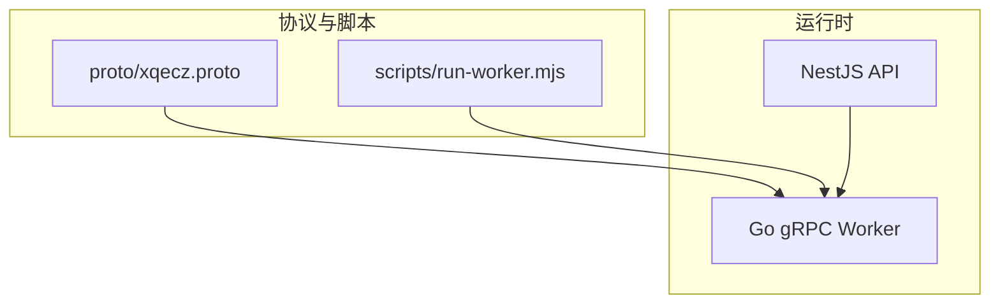
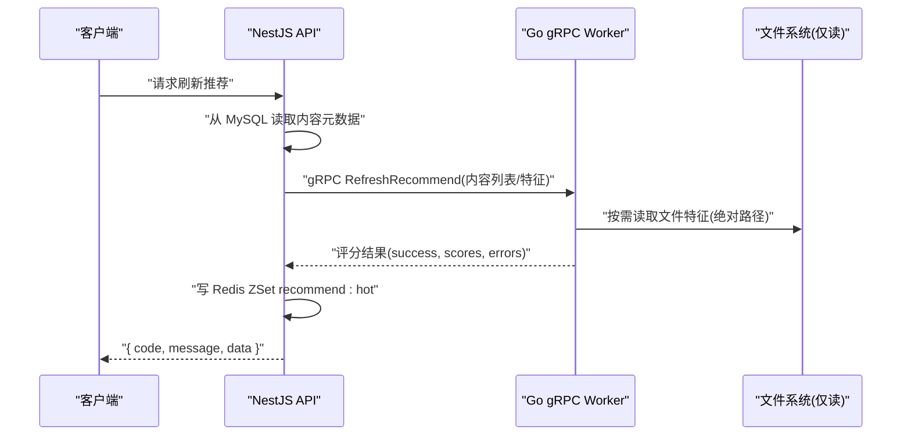
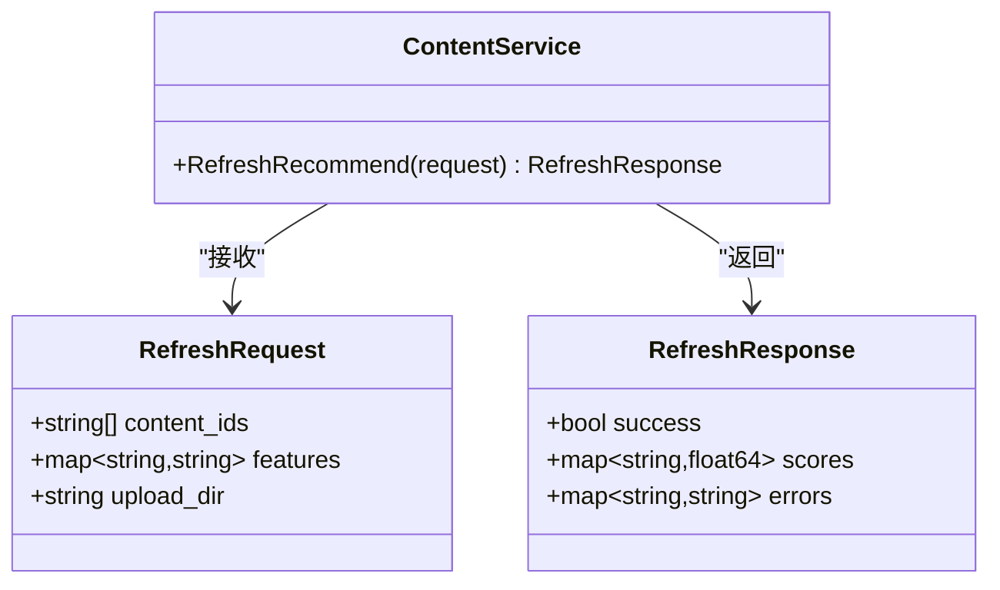
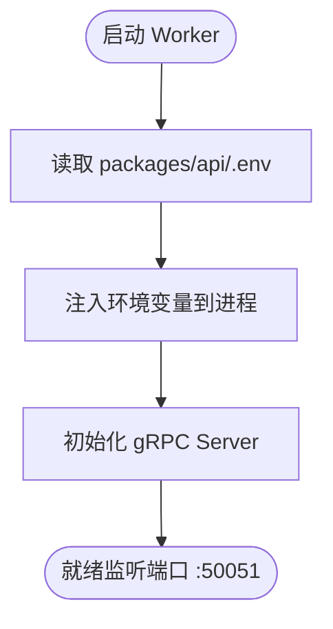
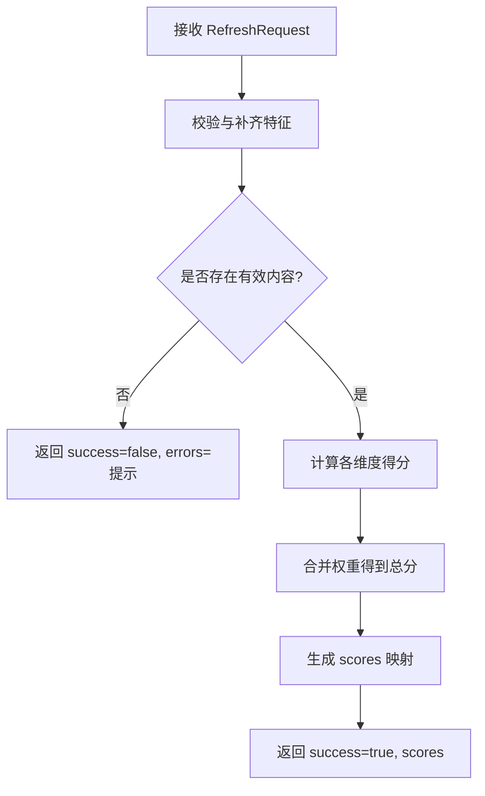
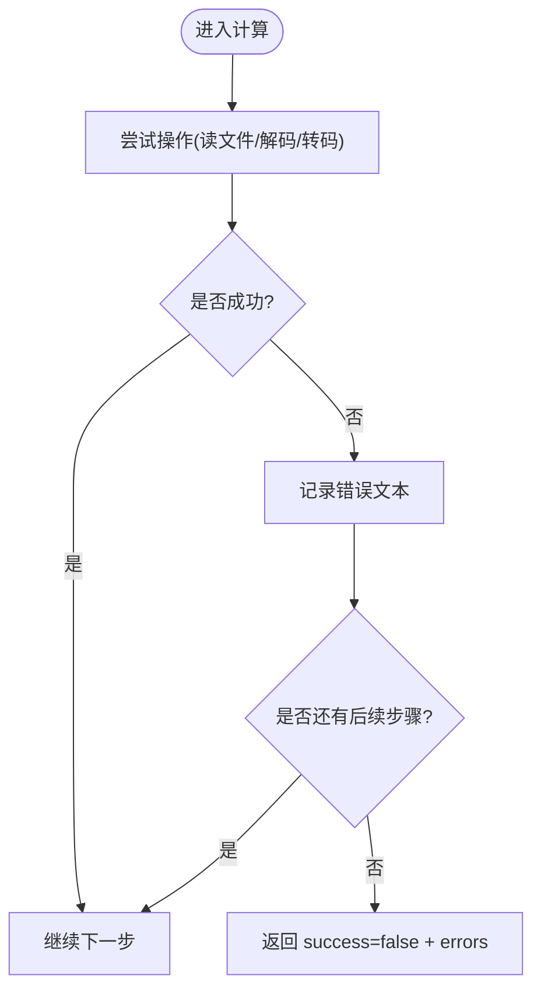
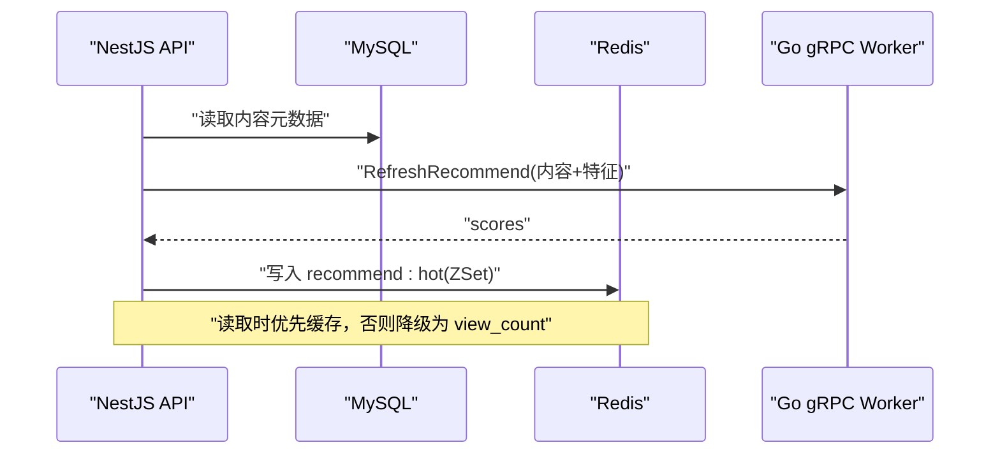
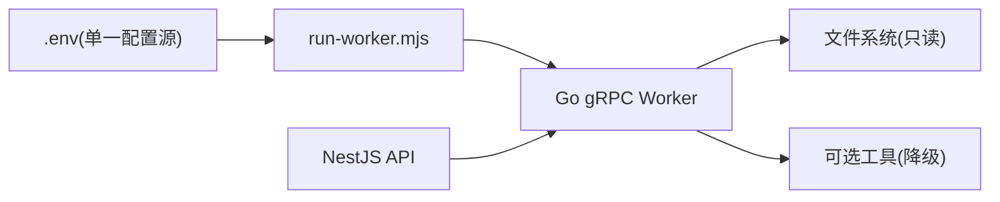

# 计算服务 (Go Worker)

<cite>
**本文引用的文件**   
- [xqecz.proto](file://proto/xqecz.proto)
- [run-worker.mjs](file://scripts/run-worker.mjs)
- [plan.md](file://plan.md)
</cite>

## 目录
1. [简介](#简介)
2. [项目结构](#项目结构)
3. [核心组件](#核心组件)
4. [架构总览](#架构总览)
5. [详细组件分析](#详细组件分析)
6. [依赖关系分析](#依赖关系分析)
7. [性能考量](#性能考量)
8. [故障排查指南](#故障排查指南)
9. [结论](#结论)
10. [附录](#附录)

## 简介
本文件面向 xqecz 平台的 Go gRPC Worker 计算服务，聚焦其“无状态、不连接数据库、无 cron”的设计原则。Worker 通过 gRPC 接收 NestJS API 传入的数据，执行纯计算（如推荐评分），将结果回传给 NestJS 进行持久化与缓存写入。文档涵盖接口定义、参数与返回值约定、推荐算法逻辑、错误处理策略、启动流程与环境变量注入方式，以及扩展新计算逻辑的指导原则与最佳实践。

## 项目结构
- proto/xqecz.proto：gRPC 契约定义，包含服务方法与消息结构。
- scripts/run-worker.mjs：Worker 启动脚本，负责读取环境变量并注入到 Worker 进程。
- plan.md：项目规划与约束说明，包括 Worker 的无状态定位与运行模式。

图表来源
- [xqecz.proto](file://proto/xqecz.proto)
- [run-worker.mjs](file://scripts/run-worker.mjs)

章节来源
- [plan.md](file://plan.md)

## 核心组件
- gRPC 服务契约：定义 RefreshRecommend 等计算接口，明确输入输出字段与语义。
- 计算引擎：纯函数式实现，基于内存数据完成打分与排序，不访问外部存储。
- 启动器：通过 Node.js 脚本加载 .env 环境变量，以绝对路径形式向 Worker 传递文件相关配置。
- 错误处理：对外统一返回 success=false 与错误文本，避免 rpc error 向上抛出。

章节来源
- [xqecz.proto](file://proto/xqecz.proto)
- [run-worker.mjs](file://scripts/run-worker.mjs)
- [plan.md](file://plan.md)

## 架构总览
Worker 作为无状态计算节点，位于 NestJS API 与外部资源之间。API 负责数据读写与缓存，Worker 专注计算。

图表来源
- [xqecz.proto](file://proto/xqecz.proto)
- [run-worker.mjs](file://scripts/run-worker.mjs)

## 详细组件分析

### gRPC 接口定义与调用约定
- 服务方法：RefreshRecommend（用于批量内容推荐打分）。
- 请求体：包含待打分的内容标识与必要特征（如标题、标签、时长、上传时间等）；文件路径以绝对路径传递。
- 响应体：success 布尔值表示整体成功与否；scores 为内容与分数的映射；errors 为失败项的错误文本集合。
- 字段命名：NestJS 客户端启用 keepCase:true，使用 snake_case 字段名。

图表来源
- [xqecz.proto](file://proto/xqecz.proto)

章节来源
- [xqecz.proto](file://proto/xqecz.proto)

### 启动流程与环境变量注入
- 启动入口：scripts/run-worker.mjs 负责读取 packages/api/.env 中的环境变量（如 UPLOAD_DIR）。
- 环境变量注入：Node 脚本将 .env 变量注入到 Worker 进程环境，确保 Worker 能获取统一的上传目录等配置。
- 路径约定：所有文件路径以绝对路径在 gRPC 请求中传递，避免相对路径歧义。

图表来源
- [run-worker.mjs](file://scripts/run-worker.mjs)

章节来源
- [run-worker.mjs](file://scripts/run-worker.mjs)

### 推荐算法与评分逻辑
- 输入特征：内容基础信息（标题、标签、分类）、媒体属性（时长、分辨率）、行为信号（点赞、收藏、评论数，若存在）、时间衰减因子等。
- 评分模型：加权线性组合或可配置的评分函数，支持按业务规则调整权重；对缺失特征提供默认值与降级策略。
- 排序与截断：根据分数生成 ZSet 候选集，按分数降序取 Top-N 作为推荐结果。
- 一致性保证：相同输入产生稳定输出，避免抖动；对边界条件（空输入、零特征）有明确处理。

图表来源
- [xqecz.proto](file://proto/xqecz.proto)

章节来源
- [xqecz.proto](file://proto/xqecz.proto)

### 错误处理机制
- 统一返回：对外一律返回 success=false 与具体错误文本，避免直接抛出 rpc error。
- 降级策略：当外部依赖（如文件读取、FFmpeg、Tinify、S3）不可用时，采用降级逻辑继续计算并记录错误。
- 错误聚合：errors 字段汇总每个内容的失败原因，便于上层定位问题。

图表来源
- [xqecz.proto](file://proto/xqecz.proto)

章节来源
- [xqecz.proto](file://proto/xqecz.proto)

### 与 NestJS 的协作与数据流
- 数据流向：NestJS 从 MySQL 读取内容元数据 → 经 gRPC 发送给 Worker 计算 → 将评分结果写回 Redis ZSet（keyPrefix=xqecz:）。
- 读取降级：当缓存不可用或为空时，NestJS 以 view_count 排序作为降级方案。
- 软删除：所有删除均为软删除，查询自动过滤 deleted_at 记录。

图表来源
- [xqecz.proto](file://proto/xqecz.proto)

章节来源
- [xqecz.proto](file://proto/xqecz.proto)

## 依赖关系分析
- 外部依赖：文件系统（只读）、可选的外部工具（FFmpeg/Tinify/S3）均做降级处理。
- 内部耦合：Worker 与 NestJS 通过 gRPC 解耦，职责清晰；Worker 不持有状态，无持久化依赖。
- 配置源：单一 .env 配置源，由 run-worker.mjs 注入，确保路径一致性与可移植性。

图表来源
- [run-worker.mjs](file://scripts/run-worker.mjs)
- [xqecz.proto](file://proto/xqecz.proto)

章节来源
- [plan.md](file://plan.md)

## 性能考量
- 无状态设计：Worker 不持状态，便于水平扩展与弹性伸缩。
- 批处理优化：RefreshRecommend 支持批量打分，减少网络往返与上下文切换。
- 内存计算：评分过程全内存执行，避免 I/O 瓶颈；必要时引入并发与并行度控制。
- 特征预取：对频繁使用的特征进行本地缓存（如字典表），降低重复解析成本。
- 超时与限流：设置合理的 gRPC 超时与并发限制，防止雪崩。

[本节为通用指导，无需引用具体文件]

## 故障排查指南
- 常见问题
  - 环境变量未注入：检查 run-worker.mjs 是否正确读取 .env 并注入进程。
  - 路径错误：确认 gRPC 请求中的文件路径为绝对路径且与 UPLOAD_DIR 一致。
  - 外部工具缺失：确认 FFmpeg/Tinify/S3 可用性，必要时走降级逻辑。
  - 评分异常：核对特征完整性与权重配置，检查边界条件处理。
- 诊断建议
  - 开启详细日志，记录每个内容的特征与中间分数。
  - 使用最小数据集复现问题，逐步缩小范围。
  - 监控 gRPC 错误率与延迟，定位热点与瓶颈。

章节来源
- [xqecz.proto](file://proto/xqecz.proto)
- [run-worker.mjs](file://scripts/run-worker.mjs)

## 结论
Go gRPC Worker 以无状态、纯计算为核心设计理念，通过与 NestJS 的解耦协作，实现了高内聚、低耦合的推荐计算链路。明确的接口契约、稳健的错误处理与可扩展的评分框架，使其能够灵活适配业务变化。遵循本文档的指导原则与最佳实践，可快速扩展新的计算逻辑并保持系统稳定性与性能。

[本节为总结，无需引用具体文件]

## 附录
- 扩展新计算逻辑的指导原则
  - 保持无状态：新增逻辑不应引入持久化或全局状态。
  - 接口先行：先在 proto 中定义请求/响应结构，再实现计算逻辑。
  - 降级优先：对外部依赖一律降级，确保 success=false 而非 rpc error。
  - 可配置化：评分权重与阈值应可通过配置动态调整。
  - 测试覆盖：为边界条件与异常路径编写单元测试与集成测试。
  - 性能回归：新增逻辑需评估复杂度与内存占用，避免性能退化。

[本节为通用指导，无需引用具体文件]