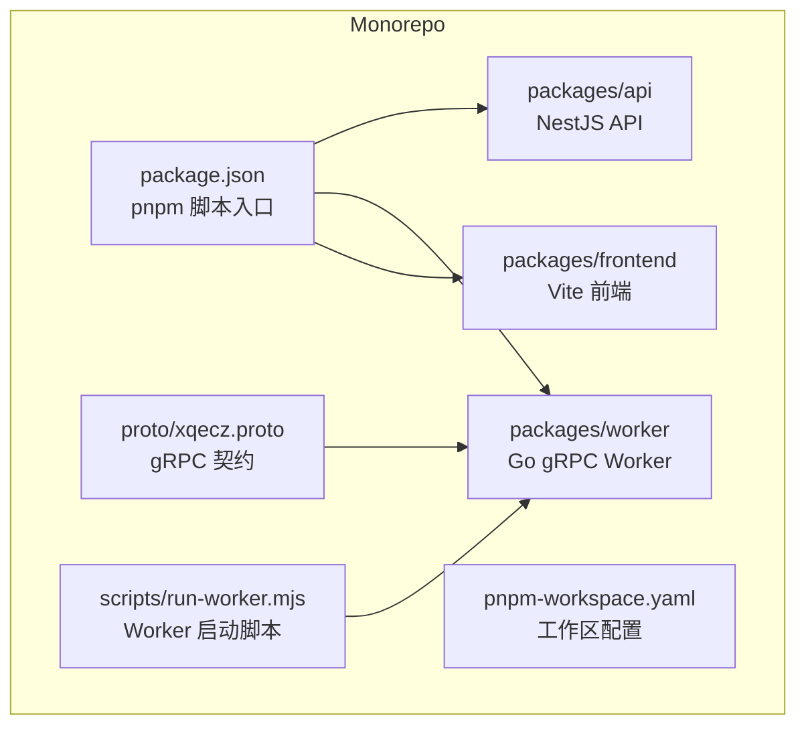
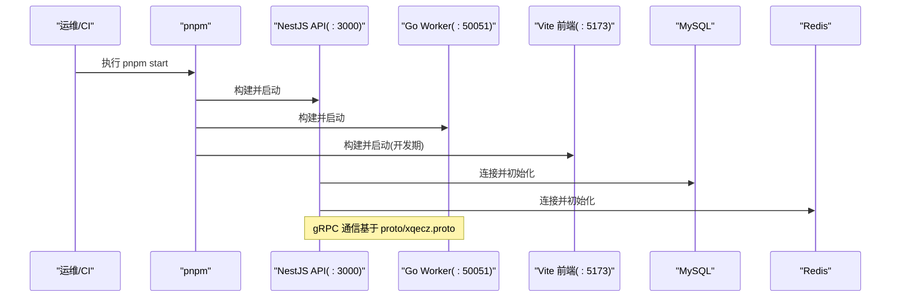
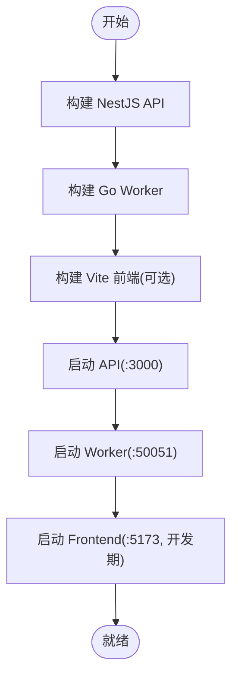
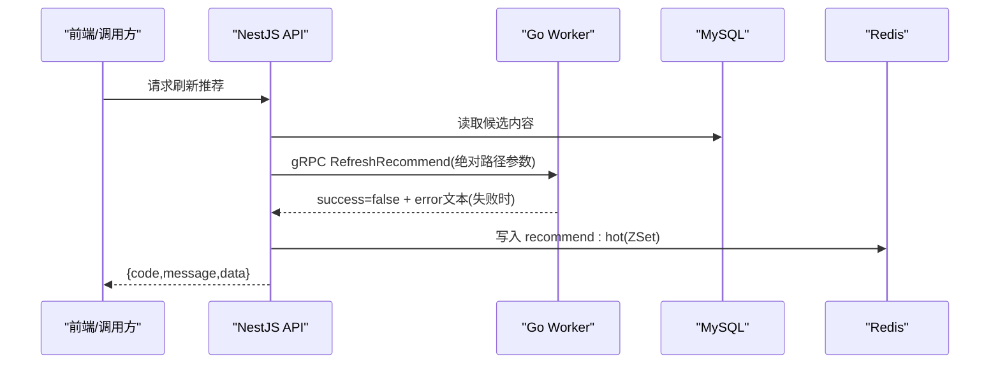
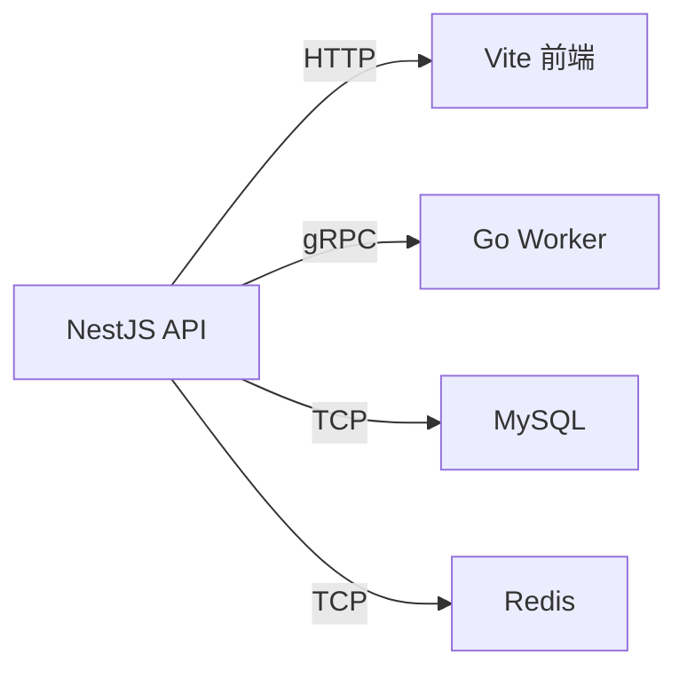

# 部署与生产环境

<cite>
**本文引用的文件**   
- [package.json](file://package.json)
- [pnpm-workspace.yaml](file://pnpm-workspace.yaml)
- [packages/api/.env](file://packages/api/.env)
- [scripts/run-worker.mjs](file://scripts/run-worker.mjs)
- [proto/xqecz.proto](file://proto/xqecz.proto)
- [packages/frontend/src/api/index.ts](file://packages/frontend/src/api/index.ts)
</cite>

## 目录
1. [简介](#简介)
2. [项目结构](#项目结构)
3. [核心组件](#核心组件)
4. [架构总览](#架构总览)
5. [详细组件分析](#详细组件分析)
6. [依赖关系分析](#依赖关系分析)
7. [性能考虑](#性能考虑)
8. [故障排查指南](#故障排查指南)
9. [结论](#结论)
10. [附录](#附录)

## 简介
本文件面向 xqecz 平台的生产环境部署，明确说明：项目已完全弃用 Docker/Nginx 部署，唯一运行方式为 pnpm 脚本本地直启。生产模式通过 pnpm start 一键构建并启动三个服务：NestJS API、Go Worker（gRPC）、Vite 前端。文档涵盖环境变量最佳实践（尤其是 UPLOAD_DIR 的安全设置）、日志收集、监控指标与健康检查、性能调优、资源限制与故障恢复策略，并提供生产部署检查清单与常见问题排查指引。

## 项目结构
仓库采用 monorepo 组织，核心目录如下：
- packages/api：NestJS API 服务，负责业务编排、MySQL/Redis 访问、对外 HTTP/gRPC 客户端调用
- packages/worker：Go gRPC 计算服务，无状态、不连数据库，接收任务并返回结果
- packages/frontend：Vite 前端应用，开发时由 Vite 提供静态资源与服务
- proto：gRPC 契约定义（xqecz.proto），生成产物位于 proto/gen 与 packages/worker/proto
- scripts：辅助脚本，如 run-worker.mjs 用于以 Node 方式启动 Go worker 进程并注入环境变量
- package.json：工作区根脚本入口，包含 dev/start 等命令
- pnpm-workspace.yaml：pnpm 工作区配置

**图表来源**
- [package.json:1-200](file://package.json#L1-L200)
- [pnpm-workspace.yaml:1-200](file://pnpm-workspace.yaml#L1-L200)
- [proto/xqecz.proto:1-200](file://proto/xqecz.proto#L1-L200)
- [scripts/run-worker.mjs:1-200](file://scripts/run-worker.mjs#L1-L200)

**章节来源**
- [package.json:1-200](file://package.json#L1-L200)
- [pnpm-workspace.yaml:1-200](file://pnpm-workspace.yaml#L1-L200)

## 核心组件
- NestJS API（端口 3000）：HTTP API 网关、MySQL/Redis 数据层、gRPC 客户端调用 Worker
- Go Worker（端口 50051）：纯计算 gRPC 服务，按契约处理打分/推荐等任务
- Vite 前端（端口 5173）：开发期静态资源服务；生产构建后由 API 或反向代理提供静态文件（若需要）

关键约定：
- 前后端接口契约统一在 packages/frontend/src/api/index.ts 中维护
- gRPC 契约定义在 proto/xqecz.proto，字段命名 snake_case，客户端 keepCase:true
- 共享上传目录由 UPLOAD_DIR 环境变量指定，单一配置源为 packages/api/.env；worker 经 scripts/run-worker.mjs 启动时自动读取同一 .env 注入，路径以绝对路径传递

**章节来源**
- [packages/frontend/src/api/index.ts:1-200](file://packages/frontend/src/api/index.ts#L1-L200)
- [proto/xqecz.proto:1-200](file://proto/xqecz.proto#L1-L200)
- [packages/api/.env:1-200](file://packages/api/.env#L1-L200)
- [scripts/run-worker.mjs:1-200](file://scripts/run-worker.mjs#L1-L200)

## 架构总览
生产模式下，pnpm start 会依次完成构建与启动：
1. 构建阶段：编译 NestJS API、Go Worker 二进制、Vite 前端产物
2. 运行阶段：启动 NestJS API（:3000）、Go Worker（:50051）、Vite 前端（:5173，仅开发期）

**图表来源**
- [package.json:1-200](file://package.json#L1-L200)
- [scripts/run-worker.mjs:1-200](file://scripts/run-worker.mjs#L1-L200)
- [proto/xqecz.proto:1-200](file://proto/xqecz.proto#L1-L200)

## 详细组件分析

### 生产构建与运行流程（pnpm start）
- 入口脚本：package.json 中的 start 命令负责串联构建与启动
- 启动顺序：API → Worker → Frontend（开发期）
- 端口分配：API :3000、Worker :50051、Frontend :5173（开发期）
- 环境变量：从 packages/api/.env 加载，并通过 scripts/run-worker.mjs 注入到 Worker 进程

**图表来源**
- [package.json:1-200](file://package.json#L1-L200)
- [scripts/run-worker.mjs:1-200](file://scripts/run-worker.mjs#L1-L200)

**章节来源**
- [package.json:1-200](file://package.json#L1-L200)
- [scripts/run-worker.mjs:1-200](file://scripts/run-worker.mjs#L1-L200)

### 环境变量与上传目录安全（UPLOAD_DIR）
- 单一配置源：packages/api/.env
- 关键变量：
  - UPLOAD_DIR：上传根目录的绝对路径，需确保进程可读写且不可被外部直接访问
  - 其他数据库/缓存/第三方服务凭据与连接信息
- 安全建议：
  - 使用系统级隔离的用户运行进程，最小权限原则
  - 将 UPLOAD_DIR 置于非 Web 根目录，避免直接暴露
  - 对敏感变量使用操作系统密钥管理或受控的环境注入机制
  - 定期审计目录权限与访问日志

**章节来源**
- [packages/api/.env:1-200](file://packages/api/.env#L1-L200)
- [scripts/run-worker.mjs:1-200](file://scripts/run-worker.mjs#L1-L200)

### gRPC 契约与调用链路
- 契约位置：proto/xqecz.proto
- 字段规范：snake_case，客户端 keepCase:true
- 典型链路：ContentService.refreshRecommend() 读 MySQL → gRPC RefreshRecommend 由 Worker 纯打分 → API 写 Redis ZSet recommend:hot（ioredis keyPrefix=xqecz:）→ 读取降级为 view_count 排序

**图表来源**
- [proto/xqecz.proto:1-200](file://proto/xqecz.proto#L1-L200)
- [packages/frontend/src/api/index.ts:1-200](file://packages/frontend/src/api/index.ts#L1-L200)

**章节来源**
- [proto/xqecz.proto:1-200](file://proto/xqecz.proto#L1-L200)
- [packages/frontend/src/api/index.ts:1-200](file://packages/frontend/src/api/index.ts#L1-L200)

### 日志收集、监控指标与健康检查
- 日志收集：
  - API：结构化日志输出至 stdout/stderr，便于容器化或进程管理器采集
  - Worker：gRPC 调用链路与错误文本回传，便于 API 侧聚合记录
- 监控指标：
  - 建议在 API 暴露 /metrics 端点（Prometheus 抓取），覆盖 QPS、延迟、错误率、缓存命中率
  - Worker 可通过内部计数器上报关键指标（如任务吞吐、失败率）
- 健康检查：
  - API：/healthz 或 /ready 探针，检查 MySQL/Redis 连通性
  - Worker：/healthz 探针，检查 gRPC 监听端口与依赖可用性

[本节为通用指导，不直接分析具体文件]

### 性能调优建议
- API：
  - 合理设置 Node.js 内存上限（--max-old-space-size）
  - 启用连接池（MySQL/Redis），调整超时与重试策略
  - 对热点查询增加 Redis 缓存，ZSet 排序键前缀统一为 xqecz:
- Worker：
  - 控制并发度，避免 IO/CPU 瓶颈
  - 输入校验与快速失败，减少无效计算
- 前端：
  - 生产构建开启压缩与缓存策略
  - 静态资源 CDN 加速

[本节为通用指导，不直接分析具体文件]

### 资源限制与故障恢复
- 资源限制：
  - 使用系统级 cgroup/systemd 限制 CPU/内存，防止单实例占用过多资源
  - 设置进程重启策略（自动重启、退避重试）
- 故障恢复：
  - 依赖缺失（Tinify/S3/FFmpeg/Worker）一律降级，gRPC 不返 rpc error，只返 success=false + error 文本
  - 删除操作均为软删除（deleted_at + TypeORM @DeleteDateColumn 自动过滤）
  - 关键任务支持幂等与重试，避免重复副作用

**章节来源**
- [proto/xqecz.proto:1-200](file://proto/xqecz.proto#L1-L200)
- [packages/frontend/src/api/index.ts:1-200](file://packages/frontend/src/api/index.ts#L1-L200)

## 依赖关系分析
- 运行时依赖：
  - NestJS API 依赖 MySQL、Redis、gRPC 客户端
  - Go Worker 无数据库依赖，仅实现 gRPC 服务
  - Vite 前端依赖 Node.js 构建工具链
- 构建依赖：
  - pnpm workspace 统一管理依赖安装与脚本执行
  - proto 生成产物位于 proto/gen 与 packages/worker/proto（生成产物，非手写源码）

**图表来源**
- [package.json:1-200](file://package.json#L1-L200)
- [pnpm-workspace.yaml:1-200](file://pnpm-workspace.yaml#L1-L200)
- [proto/xqecz.proto:1-200](file://proto/xqecz.proto#L1-L200)

**章节来源**
- [package.json:1-200](file://package.json#L1-L200)
- [pnpm-workspace.yaml:1-200](file://pnpm-workspace.yaml#L1-L200)

## 性能考虑
- 连接与缓存：
  - 合理设置连接池大小与超时，避免连接耗尽
  - 使用 Redis ZSet 缓存热门推荐，降低数据库压力
- I/O 优化：
  - 上传目录使用高性能磁盘或对象存储后端（通过 S3 兼容接口）
  - 大文件分块上传与断点续传（若适用）
- 并发与限流：
  - 对热点接口进行限流与熔断
  - Worker 并发度根据 CPU/IO 特性调优

[本节为通用指导，不直接分析具体文件]

## 故障排查指南
- 常见症状与定位：
  - API 无法连接 MySQL/Redis：检查网络、凭据、防火墙与连接池配置
  - Worker 启动失败：确认端口 :50051 未被占用，环境变量注入正确
  - 上传失败：检查 UPLOAD_DIR 权限与磁盘空间
- 日志与指标：
  - 查看 API/Worker 标准输出日志
  - 检查 /metrics 与 /healthz 端点响应
- 降级与恢复：
  - 外部依赖缺失时，确认降级逻辑生效（success=false + error 文本）
  - 软删除数据一致性检查（deleted_at 字段）

**章节来源**
- [scripts/run-worker.mjs:1-200](file://scripts/run-worker.mjs#L1-L200)
- [packages/api/.env:1-200](file://packages/api/.env#L1-L200)

## 结论
xqecz 平台的生产部署以 pnpm 脚本为核心，统一构建与启动 API、Worker 与前端。通过严格的环境变量管理（特别是 UPLOAD_DIR）、健壮的错误降级与软删除策略、以及完善的日志与监控体系，可在单机或多实例环境下稳定运行。建议结合系统级资源限制与自动化运维手段，进一步提升可靠性与可观测性。

[本节为总结性内容，不直接分析具体文件]

## 附录

### 生产部署检查清单
- 环境与依赖
  - Node.js、pnpm、Go 工具链版本一致
  - MySQL、Redis 可用且凭据正确
- 构建与启动
  - pnpm install 成功
  - pnpm start 构建与启动无报错
  - API :3000、Worker :50051、Frontend :5173（开发期）端口正常
- 安全与权限
  - UPLOAD_DIR 绝对路径存在且权限最小化
  - 敏感变量未泄露，日志脱敏
- 监控与健康
  - /healthz 与 /metrics 端点可达
  - 日志采集正常
- 降级与恢复
  - 外部依赖缺失时降级逻辑生效
  - 软删除数据一致性验证

[本节为通用指导，不直接分析具体文件]

### 常见问题排查
- 端口冲突：检查 :3000/:50051/:5173 占用情况
- 环境变量未注入：确认 scripts/run-worker.mjs 正确读取 packages/api/.env
- 上传失败：检查 UPLOAD_DIR 权限与磁盘空间
- gRPC 调用失败：核对 proto 契约与字段命名（snake_case），确认 keepCase:true
- 缓存不一致：检查 ioredis keyPrefix=xqecz: 是否统一

**章节来源**
- [scripts/run-worker.mjs:1-200](file://scripts/run-worker.mjs#L1-L200)
- [packages/api/.env:1-200](file://packages/api/.env#L1-L200)
- [proto/xqecz.proto:1-200](file://proto/xqecz.proto#L1-L200)
- [packages/frontend/src/api/index.ts:1-200](file://packages/frontend/src/api/index.ts#L1-L200)