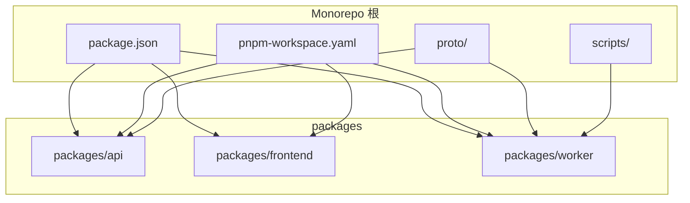
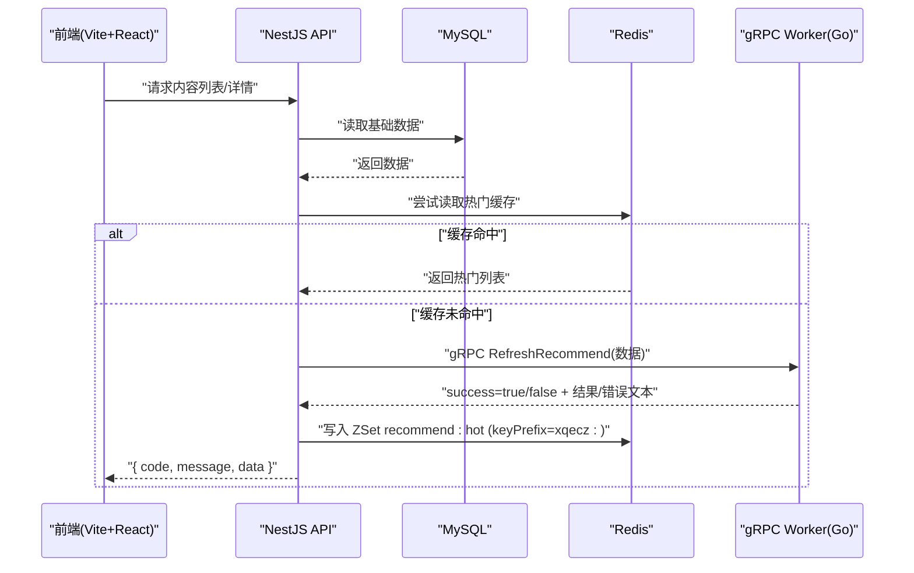
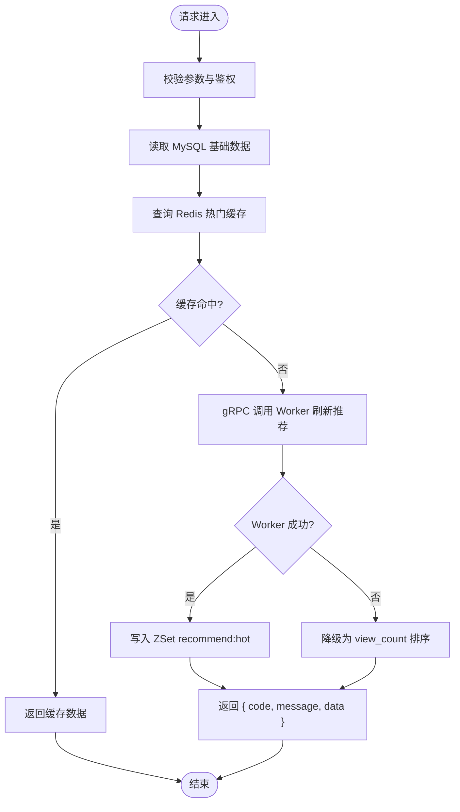
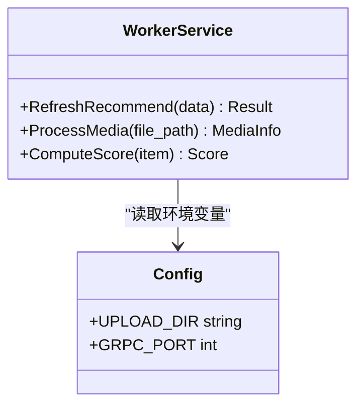
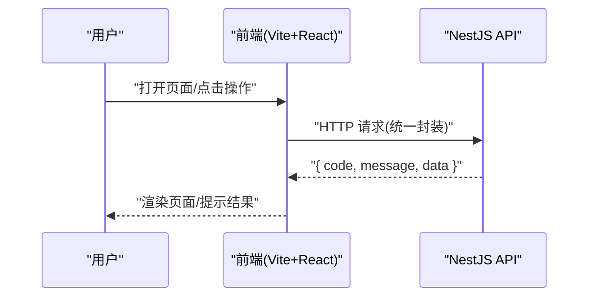
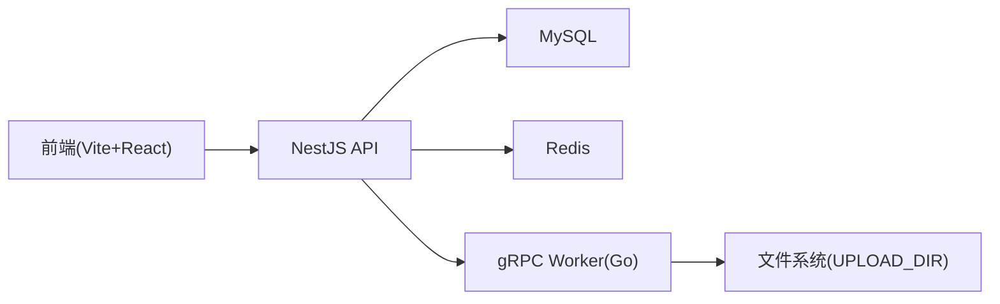

# 项目概述

<cite>
**本文引用的文件**   
- [package.json](file://package.json)
- [pnpm-workspace.yaml](file://pnpm-workspace.yaml)
- [plan.md](file://plan.md)
- [AGENTS.md](file://AGENTS.md)
- [proto/xqecz.proto](file://proto/xqecz.proto)
- [scripts/run-worker.mjs](file://scripts/run-worker.mjs)
- [packages/api/package.json](file://packages/api/package.json)
- [packages/frontend/package.json](file://packages/frontend/package.json)
- [packages/worker/package.json](file://packages/worker/package.json)
</cite>

## 目录
1. [简介](#简介)
2. [项目结构](#项目结构)
3. [核心组件](#核心组件)
4. [架构总览](#架构总览)
5. [详细组件分析](#详细组件分析)
6. [依赖关系分析](#依赖关系分析)
7. [性能考量](#性能考量)
8. [故障排查指南](#故障排查指南)
9. [结论](#结论)
10. [附录：快速开始](#附录快速开始)

## 简介
xqecz（小泉动漫二创站）是一个以“二次创作内容”为核心的社区平台，支持用户上传与浏览图片、视频、图文与链接类内容，并提供评论、投票与管理后台等能力。本项目采用 monorepo 架构，通过 pnpm workspace 统一管理 NestJS 后端 API、Go gRPC Worker 计算服务与 Vite + React 前端应用，三者协作完成从内容上传、推荐计算到前端展示的全链路流程。

## 项目结构
仓库采用典型的 monorepo 组织方式，根目录包含工作区配置、脚本与协议定义，业务代码位于 packages 下：
- packages/api：NestJS 后端 API，负责 HTTP 接口、数据库访问、缓存与对外暴露的 gRPC 客户端
- packages/worker：Go 实现的无状态 gRPC 计算服务，专注纯计算任务（如推荐打分）
- packages/frontend：Vite + React 前端应用，提供用户交互与管理后台界面
- proto：gRPC 契约定义（.proto），供前后端与服务间通信使用
- scripts：运行脚本，如启动 worker 并注入环境变量
- 根配置文件：pnpm-workspace.yaml、package.json 等用于统一工作区与脚本管理

图表来源
- [package.json:1-200](file://package.json#L1-L200)
- [pnpm-workspace.yaml:1-50](file://pnpm-workspace.yaml#L1-L50)
- [proto/xqecz.proto:1-200](file://proto/xqecz.proto#L1-L200)
- [scripts/run-worker.mjs:1-200](file://scripts/run-worker.mjs#L1-L200)

章节来源
- [package.json:1-200](file://package.json#L1-L200)
- [pnpm-workspace.yaml:1-50](file://pnpm-workspace.yaml#L1-L50)

## 核心组件
- NestJS 后端 API
  - 职责：HTTP 接口、MySQL/Redis 数据访问、gRPC 客户端调用、统一响应包装 { code, message, data }
  - 关键约定：独占 MySQL/Redis；删除为软删除（deleted_at + TypeORM @DeleteDateColumn）；外部依赖缺失降级处理
- Go gRPC Worker
  - 职责：无状态计算服务，接收来自 NestJS 的数据进行纯计算（如推荐打分），结果回传 NestJS 落库或写缓存
  - 关键约定：不连接数据库、无 cron；错误以 success=false + error 文本返回，避免 rpc error
- Vite + React 前端
  - 职责：用户交互、内容浏览、评论与投票、管理后台
  - 关键约定：唯一接口契约在 packages/frontend/src/api/index.ts；统一响应格式 { code, message, data }

章节来源
- [packages/api/package.json:1-200](file://packages/api/package.json#L1-L200)
- [packages/worker/package.json:1-200](file://packages/worker/package.json#L1-L200)
- [packages/frontend/package.json:1-200](file://packages/frontend/package.json#L1-L200)
- [plan.md:1-200](file://plan.md#L1-L200)
- [AGENTS.md:1-200](file://AGENTS.md#L1-L200)

## 架构总览
系统由三部分组成：前端通过 HTTP 调用 NestJS API；NestJS 作为数据与业务编排中心，读写 MySQL/Redis，并通过 gRPC 将计算任务委派给 Go Worker；Worker 完成后将结果回传给 NestJS，由 NestJS 持久化或更新缓存。

图表来源
- [proto/xqecz.proto:1-200](file://proto/xqecz.proto#L1-L200)
- [scripts/run-worker.mjs:1-200](file://scripts/run-worker.mjs#L1-L200)
- [packages/api/package.json:1-200](file://packages/api/package.json#L1-L200)
- [packages/worker/package.json:1-200](file://packages/worker/package.json#L1-L200)

## 详细组件分析

### NestJS 后端 API
- 角色定位：HTTP 网关与数据编排中心
- 数据访问：直接操作 MySQL（TypeORM）与 Redis（ioredis，keyPrefix=xqecz:）
- 对外契约：统一响应格式 { code, message, data }
- 错误与降级：外部依赖（Tinify/S3/FFmpeg/Worker）缺失时降级；删除均为软删除
- gRPC 客户端：keepCase:true，字段 snake_case；调用 Worker 进行纯计算

图表来源
- [packages/api/package.json:1-200](file://packages/api/package.json#L1-L200)
- [proto/xqecz.proto:1-200](file://proto/xqecz.proto#L1-L200)

章节来源
- [packages/api/package.json:1-200](file://packages/api/package.json#L1-L200)
- [plan.md:1-200](file://plan.md#L1-L200)
- [AGENTS.md:1-200](file://AGENTS.md#L1-L200)

### Go gRPC Worker
- 角色定位：无状态计算服务，专注纯计算（如推荐打分）
- 输入输出：从 NestJS 接收数据，计算后返回 success 标志与结果/错误文本
- 部署与运行：通过 scripts/run-worker.mjs 启动，自动读取同一 .env 注入环境变量（如 UPLOAD_DIR）
- 错误策略：不抛 rpc error，仅返回 success=false + error 文本，便于 NestJS 降级处理

图表来源
- [scripts/run-worker.mjs:1-200](file://scripts/run-worker.mjs#L1-L200)
- [proto/xqecz.proto:1-200](file://proto/xqecz.proto#L1-L200)
- [packages/worker/package.json:1-200](file://packages/worker/package.json#L1-L200)

章节来源
- [packages/worker/package.json:1-200](file://packages/worker/package.json#L1-L200)
- [scripts/run-worker.mjs:1-200](file://scripts/run-worker.mjs#L1-L200)
- [proto/xqecz.proto:1-200](file://proto/xqecz.proto#L1-L200)

### Vite + React 前端
- 角色定位：用户交互层，提供内容浏览、评论、投票与管理后台
- 接口契约：唯一入口 packages/frontend/src/api/index.ts，统一响应格式 { code, message, data }
- 开发体验：Vite 提供快速热重载与构建优化

图表来源
- [packages/frontend/package.json:1-200](file://packages/frontend/package.json#L1-L200)

章节来源
- [packages/frontend/package.json:1-200](file://packages/frontend/package.json#L1-L200)
- [plan.md:1-200](file://plan.md#L1-L200)

## 依赖关系分析
- Monorepo 管理：pnpm workspace 统一安装与工作区脚本
- 服务间通信：gRPC 契约定义于 proto/xqecz.proto，NestJS 与 Worker 共享该契约
- 环境变量：单一配置源 packages/api/.env，worker 启动脚本自动注入
- 外部依赖：Tinify/S3/FFmpeg/Worker 缺失时一律降级，保证系统健壮性

图表来源
- [pnpm-workspace.yaml:1-50](file://pnpm-workspace.yaml#L1-L50)
- [proto/xqecz.proto:1-200](file://proto/xqecz.proto#L1-L200)
- [scripts/run-worker.mjs:1-200](file://scripts/run-worker.mjs#L1-L200)

章节来源
- [pnpm-workspace.yaml:1-50](file://pnpm-workspace.yaml#L1-L50)
- [package.json:1-200](file://package.json#L1-L200)

## 性能考量
- 缓存优先：热门内容通过 Redis ZSet 缓存（recommend:hot，keyPrefix=xqecz:），减少数据库压力
- 计算外移：推荐打分等重计算交由无状态 Worker 执行，提升 API 响应速度
- 降级策略：外部依赖缺失时自动降级，保障可用性
- 软删除：数据库层面通过 deleted_at 过滤，避免物理删除带来的性能与一致性风险

[本节为通用性能建议，不直接分析具体文件]

## 故障排查指南
- 常见问题
  - Worker 无法启动：检查 scripts/run-worker.mjs 是否正确读取 .env 中的 UPLOAD_DIR 与端口配置
  - gRPC 调用失败：确认 proto 契约一致，NestJS 客户端 keepCase:true 与字段命名规范
  - 缓存未命中：检查 Redis keyPrefix 是否为 xqecz:，确认 ZSet 写入逻辑
  - 外部依赖缺失：确认 Tinify/S3/FFmpeg 是否可用，必要时查看降级日志
- 调试建议
  - 启用 NestJS 与 Worker 的详细日志
  - 使用浏览器开发者工具检查前端统一响应格式 { code, message, data }
  - 验证数据库软删除字段 deleted_at 是否存在且正确设置

章节来源
- [scripts/run-worker.mjs:1-200](file://scripts/run-worker.mjs#L1-L200)
- [proto/xqecz.proto:1-200](file://proto/xqecz.proto#L1-L200)
- [packages/api/package.json:1-200](file://packages/api/package.json#L1-L200)

## 结论
xqecz 通过 monorepo 与 pnpm workspace 实现了前后端与计算服务的统一管理与高效协作。NestJS 作为数据与业务编排中心，Go Worker 专注纯计算，前端提供良好用户体验。整体架构清晰、扩展性强，适合持续迭代与团队协作。

[本节为总结性内容，不直接分析具体文件]

## 附录：快速开始
- 环境要求
  - Node.js（与 package.json 中版本兼容）
  - pnpm（用于 monorepo 管理）
  - MySQL、Redis（本地或远程）
  - Go（用于编译/运行 Worker，可选）
- 安装步骤
  - 克隆仓库并进入根目录
  - 安装依赖：pnpm install
  - 配置环境变量：编辑 packages/api/.env，设置数据库、Redis、UPLOAD_DIR 等
- 基本使用示例
  - 开发模式：pnpm dev（同时启动 NestJS API(:3000)、Go Worker(:50051)、Vite 前端(:5173)）
  - 生产模式：pnpm start（一键构建并运行）
  - 单独启动 Worker：scripts/run-worker.mjs（自动读取 .env 注入环境变量）

章节来源
- [package.json:1-200](file://package.json#L1-L200)
- [pnpm-workspace.yaml:1-50](file://pnpm-workspace.yaml#L1-L50)
- [scripts/run-worker.mjs:1-200](file://scripts/run-worker.mjs#L1-L200)
- [plan.md:1-200](file://plan.md#L1-L200)
- [AGENTS.md:1-200](file://AGENTS.md#L1-L200)